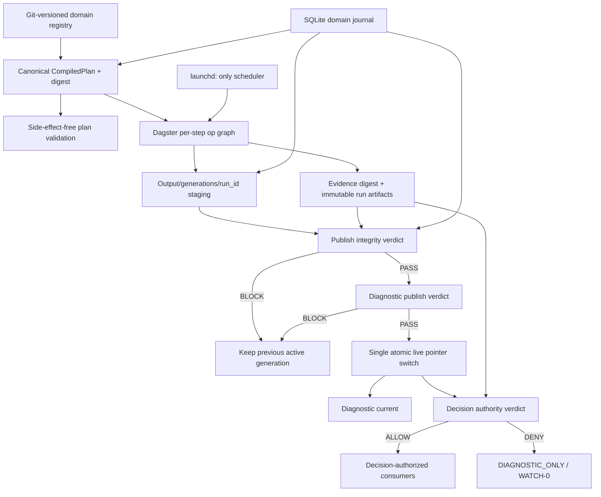

# System 项目系统性优化总清单

> 文档状态：综合审计与实施提案，不是新的运行时权威或投资判断授权。
>
> 汇总日期：2026-08-12（Asia/Singapore）
>
> 工作区：`/Users/a1/System`
>
> 当前本地分支/基线：`codex/system-stabilization` / `f410a7a`
>
> 目的：把此前架构运行时、数据治理、工程质量、安全、CI/GitHub、成熟替代方案、迁移顺序、验收标准、回滚条件和非目标收进一份不丢项的主清单。

---

## 0. 文档边界与使用方法

### 0.1 本文与现有权威文件的关系

本文是优化工作的总索引和执行蓝图，不覆盖以下现有权威：

- `governance/system_constitution.yaml`
- `governance/architecture_cleanup_decisions.md`
- `governance/architecture_reality_decisions.md`
- `governance/daily_pipeline_registry.yaml`
- `governance/output_routing_policy.yaml`
- 已接受的 `governance/routing_decisions/*.yaml`

如果本文建议改变运行权威、判断语义、数据准入、promotion、仓位或调度，必须先形成单独 routing decision，再修改执行面。

本文吸收但不替代：

- `SYSTEM_LARGE_SCALE_VALIDATION_ROADMAP.md`
- `P0_4_COMPUTE_DEVICE_HANDOFF.md`
- `PROJECT_PROGRESS.md`
- `docs/branch_protection.md`

### 0.2 状态标签

为避免把“代码存在”误写成“生产闭环”，所有事项使用以下状态：

| 标签 | 含义 |
|---|---|
| `CONFIRMED_CURRENT` | 本轮在当前工作区或当前运行产物中重新确认 |
| `CONFIRMED_PRIOR_SNAPSHOT` | 在前序审计快照中确认，本轮未重复动态验证 |
| `INCIDENT_NOT_CURRENTLY_REPRODUCED` | 曾形成完整故障链，但当前表面症状已恢复；回归风险仍在 |
| `PARTIAL_MITIGATION` | 已有局部控制，但结构性风险或默认路径验收未关闭 |
| `SOURCE_ONLY` | 源码/配置存在，尚未证明进入默认路径 |
| `PROPOSED` | 建议方案，尚未实施 |
| `DEFERRED` | 有明确触发条件前不实施 |
| `COMPUTE_DEVICE_REQUIRED` | 只能在计算设备或干净环境完成的验证 |

每条事实还应记录证据来源，避免把不同控制面混为一谈：

| 证据类别 | 含义 |
|---|---|
| `HEAD_TRACKED` | 当前 Git HEAD 中的 tracked source/config |
| `WORKTREE_UNCOMMITTED` | 当前未提交代码；不是 deployed source，也不能归入 HEAD |
| `RUNTIME_ARTIFACT` | 带 path、mtime/generated_at、run/release ID 和 hash 的本地产物 |
| `REMOTE_AT_TIME` | 在明确 `remote_checked_at` 读取的 GitHub/外部状态；后续可能漂移 |

本轮 capture manifest：`captured_at=2026-08-12 Asia/Singapore`，`HEAD=f410a7ab60b9e39bd207bed946938e45beeacee6`，branch=`codex/system-stabilization`。创建本文前已存在的 `WORKTREE_UNCOMMITTED` 路径为：

- `packages/orchestration/orchestration/cli.py`
- `packages/orchestration/orchestration/daily_pipeline.py`
- `packages/orchestration/orchestration/sequence_executor.py`
- `scripts/daily_run.py`
- `system_runtime/pipeline.py`
- `system_runtime/run_outcome.py`
- `tests/test_run_outcome.py`

本文自身也是新增未跟踪文件。若开始实施，应重新生成 capture manifest，并给关键 runtime artifacts 记录 SHA-256；不能只复用这里的 commit 短 SHA。

### 0.3 完成证据的四层

任何工作项都必须明确停在哪一层：

1. **Source existence**：文件、类、配置或测试存在。
2. **Shadow validation**：隔离 fixture、focused test 或 shadow comparison 通过。
3. **Default-path closure**：launchd/CLI/Dagster/发布者的真实默认路径执行并阻断正确。
4. **Runtime evidence**：真实数据、连续 scheduled runs、故障注入、恢复和长窗口证据通过。

不得用前一层替代后一层。

### 0.4 初始 capture 证据边界

以下条目记录的是本文创建时的审计快照；实施后的当前状态见 0.5，不应把本节的“未修改”描述当作当前工作树状态。

- 核验命令和外部状态检查均为只读；唯一写入是新增本计划文档，没有改变源码、运行数据、部署配置或远程状态。
- 初始只读审计阶段没有运行全量或长时测试、真实 refresh、回测、校准、release rebuild、动态 SSRF 攻击或 OTel benchmark；后续授权步骤已执行一次真实 provider refresh，但未接受发布。
- 初始只读审计阶段没有修改 `Data/`、`Output/`、运行代码、GitHub ruleset、launchd 配置或远程 PR；后续仅按授权修改了本地 `Data/` 与 `Output/` 运行面，未触碰远程状态。
- 当前工作区在本文创建前已有未提交代码改动；本文不将这些改动认定为完成，也不覆盖它们。
- 安全工程静态审计原快照未确认 P0；运行时和数据链审计随后确认了 P0 级默认路径/数据真实性问题。两者范围不同，不构成矛盾。
- 工程/安全原始静态快照对应 PR #21 头 `27117d510ad5e36414ee33e83fdc72d0c28db43d`；当时工作树干净、上游差异 0/0。当前本地快照已前进到 `f410a7a` 且有既存未提交改动，因此原始结论只能作为分层证据，不能覆盖当前复核。

### 0.5 执行中状态（2026-08-13，Asia/Singapore）

本轮已按 critical path 推进到 WS5/M8 前置验证，状态按证据层记录如下：

| 工作包 | 当前状态 | 已有证据 | 尚未宣称 |
|---|---|---|---|
| E0、WS0、WS1、WS2A | `DEFAULT_PATH_CLOSED_FOR_TEST` | root classification、always-run merge aggregator、Dagster 默认边界、RunOutcome、单一 CompiledPlan、`system pipeline validate`/generate check；tracked/installed launchd manifest 已 PASS，legacy records disabled/not loaded；canonical scheduled slot 已接入 SQLite 唯一键 claim，隔离并发/完成/崩溃回收测试通过 | clean main、远程 required check、真实 scheduled runtime 和长期运行证据 |
| WS3、WS4A、WS4B | `PARTIAL_RUNTIME_EVIDENCE` | provider outcome/quality contracts、真实 provider refresh candidate `2026-08-13-r1`、promotion fail-closed、generation transaction、lineage/admission digest、恢复探针、writer inventory、真实 Output baseline migration | 真实 accepted provider release、真实 accepted generation、Yahoo rate-limit recovery、远程/独立设备运行证据 |
| WS5/M8 minimum slice | `PARTIAL_MITIGATION` | 编译计划逐 step Dagster graph、四资产 pilot、default-path fail-closed、minimum monitoring、feedback eligibility tests；artifact monitoring registry 已刷新，当前 required coverage gap=0、ownerless=0；反馈/监控专项回归继续通过 | minimum monitoring 全部 PASS、两次 scheduled run、14 日窗口 |
| P1-03、P1-06、P1-12、P1-14 | `SHADOW_VALIDATED` | 单一 `uv.lock`/locked CI/wheel matrix、strict DTO/owned gateway、Python support contract、仓库治理文件和测试；P1-06 的 Framework/Harvester 数据 gateway 与 root/Workbench 非数据 gateway 均使用单次 DNS 快照 + pinned `httpcore` dialer，动态边界回归通过；provider refresh candidate 的外部 egress 已执行并按 outcome fail-closed | clean-room installed wheel/SBOM、动态安全攻击验证、远程 ruleset；LLM/notification egress、accepted provider release 仍未执行/证明 |
| WS2B、WS7、WS8 | `PARTIAL_MITIGATION` | side-effect-free `system plan/apply` contract、stale-plan rejection、full operator-tree hash guard、pre-push source-digest + main/feature behavior tests、pinned `sast` job、`uv build --no-sources` clean-room CI job、lock/installed 双 SBOM、artifact exclusion/release manifest、vulnerability ledger binding tooling；根 lint 与 packages E/F/W lint 已本机 PASS，并已接入 CI；新增 `package-type-boundaries` job 对 owner 明确的 runtime/API/gateway/orchestration typed surface 做 locked mypy，并纳入 merge-gate；release inventory fixture 现要求 wheel+sdist 双集合、拒绝 artifact symlink，并把 commit/lock/Python/platform 写入双 SBOM；历史 requirements lock/dev 文件与 generator 均明确非 workspace authority、裸 legacy `--write` 继续拒绝；本轮 `uv sync --locked --all-packages`、`uv pip check` 和 installed-only import/sys.path smoke 通过，`mypy packages` broad audit 亦返回 0 | CI 尚未在远程执行；当前 ledger 明确 `NOT_ASSESSED`/fail-closed；双次 clean build hash、真实 vulnerability assessment、完整独立环境 imports、真实六 distribution wheel/sdist、`uv.lock` 进入 clean/remote checkout 仍待证据 |
| WS9 | `CONFIRMED_CURRENT` | restore manifest 明确当前同盘 local DVC remote，验证器只读并 fail-closed；现要求逐文件 owner/URI/content hash/size/encryption/access 字段，且会报告实际 remote path 不存在（当前 `REMOTE_PATH_NOT_FOUND`）；DVC release/snapshot pointer 现只有在 add、限定目标 push、remote status 和 pointer digest 校验均通过后才保留，失败会恢复旧 pointer；相关 orchestration/Harvester 回归通过；snapshot selector 默认 Harvester Parquet，legacy DuckDB/dual 需显式 backend，renderer 已复用 selector，未知 backend fail-closed | 异机完整 bytes owner、content hash 对账和 restore drill |

当前真实工作区仍存在以下明确阻塞：

- `Output/` 已完成真实可恢复迁移：active generation 为 `Output/generations/legacy_baseline_20260812_170057`；七个旧 surface、`live/`、`ledgers/` 均为兼容 symlink，`reconcile_generation.py --require-complete` 返回 `complete_legacy_baseline`，迁移 journal 不存在。
- migration implementation 已在临时根完成 apply、重复 apply 拒绝、原子 journal claim、普通异常自动回滚、进程中断后 `--recover` 回滚以及 `PublishTransaction.reconcile` 验证，generation migration/transaction focused suite 为 `32 passed`；真实 `Output/` `--apply` 也已在授权后执行并完成结构核验。
- 2026-08-13（Asia/Singapore）初始只读复核：`./sys pipeline validate` 仍为 `valid=true`、83 steps/38 edges、digest `91a3717d34eb2d7cb6e5989fb20cabc2816589ad94dfa0449b5c3821e82bcb19`；`pipeline generate --check` 通过；Output migration dry-run `preflight.ready=true` 且当时未改动 surface；随后已按授权执行 migration/provider refresh，`git status --short -- Data Output` 仍为空（这些运行面为 ignored bytes）。
- ignored artifact 边界需单独诚实记录：此前一次未加 `--no-write` 的 `artifact_monitoring_audit` 曾重写 `Output/system_learning/latest/monitoring_coverage.json|md`；本轮 promotion routing 旧测试也曾把 authority trace 写入真实 `Output/`，现已改为 tmp trace，重跑后真实 trace mtime 未变化。没有回写、清理或恢复这些既有 ignored artifacts；因此 `git status` 的 Data/Output 为空不等于 ignored bytes 从未变化，后续只使用 `--no-write` 与临时 workspace。
- 本轮首次调用 `scripts/commands/weekly/build_authority_graph.py` 时发现该审计命令默认会写入 `Output/system_learning/latest/authority_graph.json`，因此在 2026-08-13 00:22:59 刷新了这一 ignored artifact（约 218 KB）。没有旧副本可供安全恢复，也没有执行删除、覆盖或伪造恢复；随后已加入 `--no-write` 只读模式，`tests/test_e2e_pipeline.py::test_authority_graph_builds` 以字节快照守卫其不改真实 Output，writer inventory 仍为 `226 files / 0 findings`。这次发现进一步证明 `git status` 为空不等于 ignored bytes 未变化。
- 当前治理冻结仍为 `FAIL`：`external_route_inventory.yaml`、`restore_manifest.yaml`、`vulnerability_exception_ledger.yaml` 未出现在 freeze baseline/approved additions，且缺少 attention shape；另有 7 个 baseline hash mismatch。已有 routing decisions 未明确授权这 3 个文件，本轮没有擅自补登记或改写冻结基线；`tests/test_e2e_pipeline.py` 因此保留 1 项真实阻断，其余 7 项通过。
- minimum monitoring 当前仍为 `BLOCKED`：benchmark/cross-asset provider outcome 未知、publish authority evidence 缺失、Learning Hub source ahead of ledger（当前 `-23.54h`）、旧告警缺有效 dedup key、alert/run/release/generation lineage 不完整；6424 条历史 feedback sample 仍未授权 apply，且缺 lifecycle evidence。最近一次只读 artifact monitoring audit 为 `FAIL` 但 required coverage gap=0、ownerless=0、unresolved blindspots=0；剩余原因是 16 个 non-daily stale/missing、13 个无 content clock、768 个已分类 blindspots/53 个 family（矩阵 884 行）和 Learning Hub watermark，不把历史产物误报为 PASS。本轮 freshness 与 minimum monitoring 均将完整 release 的 benchmark/cross-asset 缺失 provider outcome 明确升级为 `BLOCKED`，但没有回写旧产物。
- 已在授权后执行真实 provider/release refresh：受限网络尝试生成失败草稿 `2026-08-12-r1`；移除失效本机代理并启用外部网络后，`2026-08-13-r1` 生成 benchmark `299,384` 行和 cross-asset `195,372` 行，但 benchmark 有 9 个系列 provider-failure reuse、cross-asset 33/33 ticker 触发 Yahoo rate limit 后 reuse，promotion gate 返回 `rejected/DENY/BLOCKED`，因此未切换 `latest`。raw cache、manifest、provenance、quality 和失败证据已写入；未执行全量 pipeline、回测、校准、clean-room release、clean-device recovery 或 14 日运行窗口。
- 本机已对既有 wheel 目录执行 artifact exclusion/release evidence scan（PASS）；这不是 `uv build --no-sources` 的远程 clean-room 结果，且不能替代独立设备恢复。
- 调度边界已切换到 Dagster 默认入口；旧的失效/非权威 daily/post-close LaunchAgent 已停用，但未提交或推送任何改动。
- scheduled slot 幂等已完成 source/shadow validation：launchd wrapper 现在显式传递 `SYSTEM_SCHEDULE_LABEL`/`SYSTEM_SCHEDULE_CALENDAR=XNYS`，`completed_session_slot_key` 以最近一个已完成 exchange session 作为稳定唯一键；周末、睡眠补跑和 DST 前后会收敛到同一 session identity，SQLite 事务保证并发只允许一个 owner，死亡 PID 可回收；8 项 schedule/session 回归通过，尚未用真实 scheduled run 宣称 runtime evidence。
- feedback eligibility migration 当前仅完成只读 dry-run：6424/6424 条待分类，apply 未执行，不授予 calibration 或 core judgment 权限；新样本与 migration 已补稳定 lifecycle transition event、owner、时间、evidence，并由 minimum monitoring 校验连续状态链；本轮又补了 source-level `accepted` 生命周期状态、`accepted != golden` 和版本化 golden adjudication contract 回归；真实 manifest 仍待授权 apply。
- Learning Hub improvement queue 已补报告级 fail-closed metadata contract：承载 `owner/deadline/evidence/decision`，只接受显式 `accepted|rejected|deferred` decision，不把 `approved` 自动改写成 accepted；当前只读 parquet 为 37 条，其中 owner 仅 2 条非空，deadline/decision 列仍缺失，故未授予 closure 或 authority。
- WS10 monitoring cleanup 已完成只改治理契约的安全段：静态 registry/current pointer 已有 owner/class/mode/target 合同；真实 producer 的 freshness、as-of、Learning Hub ledger/report、Harvester DVC pointer 和归档 proxy 输出路径已对账；`tests/test_artifact_monitoring_audit.py` 14 passed，反馈/monitoring 专项合计 24 passed，治理/安全/架构回归 40 passed。
- WS7 pre-push source-digest、feature-branch contract subset、main-branch merge-gate 行为已在临时 Git 仓库通过；root lint 与 package E/F/W lint 已本机 PASS 并接入 CI；CI、nightly、weekly 的 pytest 入口均有 job timeout 和 `--durations=25` 慢测试证据，operator runner 另有默认 5400 秒硬超时并拒绝覆盖慢测试输出，compute-device handoff 已声明同一预算和超时失败语义；相关 operator/governance 回归 21 项通过。WS8 clean-room CI 已补充独立 venv freeze 与第二份 installed-environment SBOM，但远程运行和设备运行证据尚未取得。
- WS7 测试配置已完成根权威收敛：删除根 `pytest.ini` 与 package 重复 pytest 配置，根 `pyproject.toml` 统一 markers、默认排除、norecursedirs、pythonpath；当前根默认 collect-only 为 `1331/1413`（`82` deselected），operator collect-only 为 `82/1413`，且新增 marker/classification/实际 root test file 三方一致性回归；根/Workbench/Framework/Harvester/Learning Hub collection 与 focused suites 均通过。CI integration 的 root contract tests 现有 `Data/Output` 前后边界守卫与临时状态证据，相关治理/边界回归 15 项通过；远程 Actions、完整 operator suite 和实际 clean-checkout 运行仍未证明。
- WS7 operator 隔离 source contract 已闭合：`scripts/run_operator_tests.py --allow-operator-workspace` 在临时根复制 dirty checkout，macOS Data/Output 使用 copy-on-write clone，子进程只在临时根运行，原 checkout Data/Output 前后完整 fingerprint 不变；无 flag 或直接 `pytest -m operator` 会 fail-fast。6 项 runner contract、entrypoint registry/classification/handoff 回归通过；完整 stateful operator suite 尚未运行。
- WS8 authoring entrypoints 已继续收敛：`Makefile`、`scripts/bootstrap.sh` 和 `P0_4_COMPUTE_DEVICE_HANDOFF.md` 不再指导独立 pip/per-package venv 或旧 `Workbench` 路径，统一使用 `uv sync --locked --all-packages` 与 `uv run --locked`；这只修正文档/本地入口合同，不替代 compute-device clean-room build/install 证据。
- 本机 Semgrep 自有规则对当前 dirty worktree 已重新运行：`5` rules、`898` targets、`0` findings、`0` errors；因本机默认 CA/log 路径受限，运行时显式指定了 `/etc/ssl/cert.pem` 与 `/private/tmp` log path，这不替代远程 SAST job。生产/框架/harness 的 silent-except-pass 已持续改为日志或显式失败语义，force-accountability 规则已收窄到 promotion-like 路径，`promote_snapshot` 的 `--force` 由运行时 `--authorized-by`/`--reason` 校验和责任链测试覆盖；依赖漏洞扫描工具未安装/未运行，不能将此结果写入 vulnerability ledger。
- P1-15 通知边界已补齐一段可验证闭环：webhook/observability sink 失败只记录异常类型、不回显 URL/query/credential；`NOTIFY_DISABLE` 同时阻止 webhook、桌面通知和 observability 外联；notification/observability/external-gateway 专项回归通过。该结果不等于所有 optional backend、Sentry SDK 或研究下载器已完成真实运行态验证。
- WS12 observability facade 本轮补了 source-level attribute allowlist：仅保留 bounded run/release/generation/step/status 等运行元数据，未知键、credential、URL/query 和 JSON/raw payload 不进入 sink；Sentry/Datadog sink failure 只记录异常类型且返回 false，fixture 19 项通过。未引入 OTel/OpenLineage exporter，计算设备时延/内存/丢 span 与收益/开销窗口仍未测量。
- notification producer 也已核验：`scripts/daily_run.py::write_alert` 默认写入 run/release/generation lineage 与 `notification_dedup_key`；`tests/test_daily_run_execution.py` + `tests/test_minimum_monitoring.py` 合计 21 项通过。当前 `Output/alerts/latest_alert.json` 仍是旧 artifact，故 minimum monitoring 继续如实返回 `INVALID_NOTIFICATION_DEDUP_KEY`，没有回写旧产物制造 PASS。
- FRED/H41 secret redaction 动态边界测试已加入 `packages/harvester/tests/test_provider_secret_redaction.py`：2 个 provider failure/fallback 场景均证明 secret 只到 transport request，不进入结果、日志或 fallback reason；provider-focused suite 24 项通过。
- Harvester cross-asset producer 已核验会把 typed `provider_outcome` 写入 release manifest；`packages/harvester/tests/test_cross_asset_panel.py` + `tests/test_ops.py` 共 24 项通过。真实 `2026-08-13-r1` release 也已记录 `reused_after_provider_failure`（33/33 yfinance ticker failed/empty），并由 promotion gate 拒绝；没有回写旧 Data 产物伪造成功刷新。
- Harvester official registry acquisition 现也写入 schema-constrained `provider_outcome`；carry-forward 补回旧序列时会改为 `reused_after_provider_failure`，并把同一 outcome 同步到 benchmark manifest、provenance 和 quality report。`data_root()`/release workspace 已统一从 `WorkspacePaths` 解析到 canonical `/System/Data`，避免真实刷新写入 `packages/harvester/data` shadow tree；Harvester registry/carry-forward/staging 回归 12 项通过，source lint 通过。
- Workbench freshness 现从 release manifest/catalog 读取 provider outcome；完整 release 的 benchmark 与 cross-asset manifest 任一缺失、unknown、all-failed 或 provider-failure reuse 均不能因日期新鲜而 PASS。当前 authoritative latest 仍为 release `2026-08-11-r1`、`model_input_validity=usable_with_lag`、`provider_gate=BLOCKED`；本次真实 refresh 的 candidate release `2026-08-13-r1` 同样因 benchmark/cross-asset provider-failure reuse 被 promotion gate 拒绝。Workbench freshness 43 项、root freshness/governance/minimum-monitoring 19 项通过。
- 当前 authoritative latest 的旧 bytes 对账仍未闭合：`cross_asset_daily_panel` 为 195,372 行/33 symbols，实际 max date `2026-08-07`，manifest end `2026-08-11`；`benchmark_panel` 为 309,654 行/68 series，实际 max date 与 manifest end 均为 `2026-08-11`。授权 refresh 已生成 candidate `2026-08-13-r1`（benchmark 实际 max date `2026-08-12`、cross-asset 实际 max date `2026-08-07`），但因 provider-failure reuse 被拒绝，故没有切换 authoritative latest。
- P1-06 research-only raw HTTP 路径已迁移：`BrevanHowardProvider` 与 historical FRED replay 不再直接调用 `urlopen/curl`，改为 `src.data_access.http_gateway` 的 provider/endpoint ID、严格 host/path 参数、redirect/size/timeout 约束；Framework/Harvester 数据 gateway 与 root/Workbench 非数据 gateway 均有 pinned transport、fake DNS、redirect/size/脱敏回归，研究/边界/框架/非数据 sink 专项均通过。validator 到实际 socket connect 的 DNS TOCTOU 已在默认 gateway 路径关闭；仍不等于真实 provider/LLM/notification egress 或多租户 egress proxy 证据。
- P1-06 route boundary 本轮已补齐：`governance/external_route_inventory.yaml` 现逐项覆盖 FastAPI OpenAPI 的 22 条公开路由；`/snapshots/run`、`/hub/structural`、`/hub_lite/structural` 改用 strict DTO，`/data`、`/snapshots`、各结构化查询统一使用 bounded `DateRangeQuery`，并拒绝自由字段/超长批次/非法日期。OpenAPI/inventory、DTO、SSRF 负向回归合计 35 项通过；所有 input-bearing public routes 的 invalid-input fixture 已同时断言 Framework/Harvester owned gateway 调用数为零；数据 gateway 的 `fetch(provider, endpoint_id, params)` surface、registered path/query split 与固定 instance timeout 也已回归。上述仍不是 live provider egress 或远程动态攻击证明。
- P1-08 snapshot selector 与 ML provenance 已对齐：LSTM anomaly training manifest 现在记录实际 `snapshot_store_interface`、backend、concrete store class 和路径，Harvester Parquet/dual-write 临时回归通过；真实 accepted release 删除 DuckDB 后的 row/hash 重建仍未执行。
- P1-16 当前入口文档已按 monorepo 现实修正：README、`governance/repo_layout_map.md`、`governance/pipeline_schedule.md` 不再把 submodule/旧路径/旧 step count 当作现行执行入口；旧布局被保留为历史迁移记录，`scripts/bootstrap.sh` 现验证全部五个 workspace package，`./sys pipeline docs --check` 已绑定到 CI lint，`tests/test_workspace_docs_contract.py` 固化当前声明。schedule 仍是历史快照；已完成 registry/CompiledPlan 驱动的只读文档校验，但不把它误写成自动重生成历史参考文档。
- P1-16 本轮再修正 active package/protocol/policy/handoff 入口：`packages/workbench/README.md`、`protocols/README.md`、`governance/ml_validation_policy.yaml`、`scripts/orchestrate.sh` 和 `P0_4_COMPUTE_DEVICE_HANDOFF.md` 统一引用 `packages/` 与锁定 `uv` workspace；文档/入口合同回归 13 项通过，历史归档文档仍不被自动重写。
- P1-16 当前路由与治理索引也已对齐：`module_contexts/*`、harness `task_router`、`governance/authority_registry.yaml`、daily registry 的 active package paths 已切换到 `packages/*`；security/routing/workbench 回归 55 项通过。明确保留的 submodule/deformation-v1/legacy launchd 文本仍属于历史或禁用边界，未作为当前执行入口。
- P1-16 本轮继续收口 active runtime path：Framework API、assembly、admitted-evidence、dual-path compare 的 Harvester contract 默认值统一解析到 `packages/harvester/contracts`；根 `scripts/dual_path_compare.py` 只作 canonical package implementation 的兼容入口；两个 harness 审计 skill 和 operator 文档同步消除旧路径。根治理/文档 15 项、Framework boundary/dual-path 86 项通过；未宣称真实 release 或 dual-path runtime evidence。
- Workbench LLM optional backend 已补充显式 fallback/error logging、`LLM_BASE_URL` 结构校验、显式 host allowlist 和 2 MB request/response budget；无 key/非法 host/query 均在 network call 前返回无候选，LLM boundary 4 项通过，仍保持 candidate-only、非核心判断权限。
- P1-15 optional backend 的一段静默降级已收敛：Workbench `Embedder`、`VectorStore` 和 `CaseSimilarityEngine` 现在暴露 `backend_status={backend,fallback,error}`；模型加载/编码、LanceDB 保存/加载/查询、可选 graph/text signal 失败会记录异常类型并进入可识别 fallback，LanceDB 失败仍会持久化 FAISS/NumPy 本地索引；LLM、webhook、Datadog 的独立外联也已转入非数据 owned gateway；Harvester derived-series 计算失败现在记录 series ID/异常类型，不再静默缺列；`verify_only` 的 verification event writer 缺失/非零退出现在会使 runner `FAIL`，`post_verify` 会显式标记 non-durable degradation；benchmark baseline-rank 不再由 `print("PASS")` 伪造，Markdown link check 改为实际校验本地目标；新增状态/边界/harness/derived regression 均本机通过。该段不等于 Qlib 真实执行、baseline-rank evidence、Sentry SDK 或全量 observability rollout 已验证。
- P1-15 本轮再关闭两处 fail-open：ML constitution rule evaluator 异常不再返回“未违规”，`pollution_monitor` 会将评估失败标为 `passed=false` 并在 `raise_on_red` 下阻断；promotion routing decision 的非法 timestamp 不再放行，而是写入 `ROUTING_DECISION_INVALID_TIMESTAMP` authority/decision trace 后阻断；LLM candidate response validation、历史 judgment 读取、Framework data-source discovery 和 Harvester DataHub 构建失败均记录 bounded exception type。相关 Learning Hub 3 项、promotion routing 6 项、Framework 21 项和 root boundary/governance 33 项回归通过。
- vulnerability ledger 当前明确为 `NOT_ASSESSED`，只读验证器返回 `BLOCKED / VULNERABILITY_SCAN_NOT_RUN`；没有伪造扫描结果或 exception。
- WS9 restore manifest 已补逐文件证据结构：每条 accepted-release 文件必须声明 owner、URI、content hash、size、encryption/access class；当前 `files: []` 会 fail-closed 为 `FILE_INVENTORY_EMPTY`，没有把 scope-level metadata 当成 bytes evidence。
- WS9 DVC pointer writer 已改为 add → target push → remote status/digest 验证后才保留 pointer，失败恢复旧 pointer；配置 URI 也不再被默认路径覆盖，orchestration regression 当前 6 passed。
- P1-10 authority graph drift 已修复：graph 现在同时读取 `ml_validation_policy.yaml` 的逐 artifact `can_affect_core_judgment=false`，不会把 `Output/quality/` 目录前缀误当成所有输出均具 authority；`tests/test_authority_graph.py`、治理 runtime 和 ML validation hardening 合计 82 项通过，当前 `drift_count=0`、`exempt_drift_count=16`。
- P1-09 work-cycle 边界已收紧：quick/standard 仍从唯一 CompiledPlan projection 取步骤，默认在 `RunBundle` 下建立 `PublishTransaction` candidate、seed 既有 read baseline、写 lineage 且不更新 live/latest pointer；full refresh 默认退回 scheduled Dagster owner，旧直写仅接受 `SYSTEM_USE_LEGACY_WORK_CYCLE=1`。work-cycle/compiler/generation/authority 专项 92 项通过，generation writer inventory 当前 226 files PASS。
- WS4B 本轮继续收口：generation admission 现在绑定 selected `release_id` 与候选显式 run/release identities；transaction 会拒绝与当前 plan/evidence digest 不一致的 token；generation manifest 保留 release identity；provider all-failed、publish verdict、authority denial 统一进入稳定 `system.operator_event.v1`，early-failure 与 daily runtime event 共用同一 run/release/generation IDs。新增 focused contract 48 项通过；真实 accepted generation/现场 event stream 尚未运行。
- WS4B provider-to-authority 也已接通：generation admission 在 pre-publish 读取只读 provider monitor，将 `PASS/WARN/FAIL/BLOCKED` 分别映射为 `ALLOW/CONDITIONAL/DENY/DENY`；provider status 不再只影响告警而绕过 decision authority。相关 admission/transaction/monitoring 回归现为 48 项通过。
- P0-05 emergency legacy path 已修复 Context 契约缺口并补隔离 fixture：归档 executor 现在可以完成 step dispatch，随后与 Dagster 默认分支共享同一个 `RunOutcome`、bundle、runtime event、alert 和 notification sink；该 fixture 只证明本地分支/消费者合同，不替代真实 emergency launchd/Dagster failure injection。
- P0-06 本轮补足 transaction crash-boundary fixture：prepare、generation materialization、journal boundary、compatibility-link 和 final live-pointer failure 均验证旧 live generation 保持可读，reconcile 不再把带 `RECOVERY_REQUIRED` journal 的旧代状态误报为 complete；真实 production crash/accepted generation 仍未执行。旧 Output 迁移命令也补上独立的 preflight、原子 journal claim + 持久化 migration journal：逐 surface 移动或兼容链接创建被进程中断后可用 `--recover` fail-closed 回滚，成功后重复 apply 会拒绝；真实 `Output` baseline migration 已在授权后执行并核验为 `complete_legacy_baseline`，但真实 accepted generation 仍未执行。RunBundle 的 decision/signal/feedback evidence 现在在 generation pointer commit 前 finalize，finalize 幂等且禁止之后继续 capture；daily source-order 与 bundle 回归通过，真实 scheduled generation 仍未执行。
- WS7 远程治理状态已显式化：merge-gate manifest 与 private-repo routing decision 现在写入 `remote_enforcement_status=COMPENSATING_CONTROL_ONLY`；这证明补偿控制边界，不声称 GitHub ruleset/direct-push enforcement 已存在。
- monitoring audit 增加 `--no-write` 只读模式；当前工作区审计默认使用该模式，回归确认既有 `Output/system_learning/latest/monitoring_coverage.*` hash 不变。该工具的 scheduled producer 写入路径仍保留，不能把当前 FAIL 的真实 artifact 状态误报为 PASS。
- 公开治理/迁移命令的 entrypoint registry 对账已补齐：registry completeness 12 tests PASS；Output/feedback 迁移命令默认仍保持 `blocked`，本次真实 Output apply 仅因用户明确授权而执行。
- 当前 `origin/main...HEAD` 为 `0 11`，工作树仍为既有 dirty checkout；本轮新增/修改涉及源码、测试、治理 routing decision 和本主清单，`git diff --check` 通过且 `git status --short -- Data Output` 为空；`gh auth status` 显示 GitHub token 无效，因此本轮无法读取 PR/check/ruleset 的当前远程证据，也没有执行任何远程写操作。迁移相关聚焦回归为 `36 passed`，writer inventory 仍为 `226 files / 0 findings`；真实工作区已 apply 为 generation `legacy_baseline_20260812_170057`，`reconcile --require-complete` 返回 `complete_legacy_baseline`。provider candidate `2026-08-13-r1` 已生成但未 finalized，latest 仍为 `2026-08-11-r1`。

Output migration 的授权步骤已完成；下一实质 blocker 是 Yahoo 33/33 ticker rate limit 与 benchmark provider-failure reuse。需要在 provider 可用/限流恢复后重新取得一个 gate-accepted release，才可继续 M8、scheduled runs 和 14-day window；不能通过手工 finalize 当前 rejected candidate。

---

## 1. 总结论

项目已经拥有较强的领域治理、模块边界、审计文件、运行产物和测试基础。主要瓶颈不是“缺少更多模块”，而是以下四个控制面尚未统一：

1. **计划真相不统一**：registry、raw YAML loader、第二套 DAG、Dagster wrapper 和 quick/standard/full 路径并存。
2. **结果真相不统一**：步骤可记录 warning/partial failure，但进程、Dagster、launchd、bundle、通知可能给出不同结论。
3. **数据/发布真相不统一**：绿色步骤可以复用旧数据，manifest 可写成当天，current/shadow/judgment/position 也不在同一事务边界。
4. **工程证明不统一**：生产 Dagster 路径、锁文件、operator tests、clean-room build 和远程 merge enforcement 没有形成一条不可绕过的证据链。

推荐目标不是“全自研继续堆叠”，也不是立刻安装完整 SQLMesh、dbt、Airbyte、OpenLineage、GX Cloud 或分布式平台，而是：

> 保留项目特有的 domain registry；以唯一 `CompiledPlan` 编译政策；用 Dagster 做逐 step 执行和可观测；用 immutable generation + 单指针完成 current/position/NAV 的可见性提交；用 SQLite 记录本地状态机和恢复；用稳定的 run artifacts 形成可复核证据；launchd 暂时保持唯一 scheduler。

最优先的不是 UI、向量库或新模型，而是：

```text
生产调度边界
  → RunOutcome
  → CompiledPlan
  → 数据真实性与 QualityResult
  → generation transaction
  → pre-publish admission
  → 逐 step Dagster graph
  → hermetic CI + remote merge gate
  → clean-room release
```

### 1.1 项目后续方向

建议把项目定位为“单机优先、证据驱动、权限可审计的研究与决策运行系统”，而不是扩张成通用数据平台。三个阶段分别是：

| 阶段 | 主目标 | 进入条件 | 退出/验收 |
|---|---|---|---|
| A. Trustworthy Runtime | 关闭调度、计划、结果、数据和发布的事实分叉 | 立即开始 | E0–M7 通过；默认路径 fail-closed；clean-room/recovery 可证明 |
| B. Governed Research Factory | 在可信运行面上扩大 replay、feedback、calibration、scenario 和研究复用 | M7 + minimum monitoring PASS | sample lifecycle 完整；accepted/golden 分离；决策权限、PIT 和证据账本可复核 |
| C. Selective Scale & Interop | 只为已量化瓶颈增加 daemon、OTel/OpenLineage、对象存储或分布式执行 | M8 及第 12 节触发条件 | 新平台有 owner、SLO、成本/收益、故障演练和明确回滚 |

单人维护时的粗略投入区间是：A 阶段约 4–8 个工程周，另加至少 14 个自然日运行证据；B 阶段约 4–10 个工程周；C 阶段不预排。它们是容量估算，不是承诺；真实排期须按 PR 粒度重估，计算设备验证时间另计。

---

## 2. 当前快照：已确认事实

### 2.1 当前正向基础

- [x] `./sys check` 当前返回 0，并显示 research-only 状态。
- [x] `./sys doctor` 当前返回 `status=ok`、`missing=[]`。
- [x] Harvester、Framework、Workbench、Learning Hub 已形成 monorepo packages，而不是空壳设计。
- [x] `daily_pipeline_registry.yaml` 已包含 owner、schedule、contracts、failure/authority 等有价值的领域语义。
- [x] 已存在 `system_runtime.pipeline` compiler、SHA-bound merge manifest、stale manifest 检查、多个 hermetic/incident regression tests。
- [x] API public bind 已有 API-key guard。
- [x] 当前分支已有 raw URL 边界拒绝和 SSRF 负向测试，属于有价值的 Phase A containment。
- [x] Parquet canonical、Harvester manifests/provenance、RunBundle JSON/JSONL、Learning Hub ledgers 等基础资产可继续复用。
- [x] `CONFIRMED_PRIOR_SNAPSHOT @ 27117d5`：原静态安全范围未发现 tracked credential literal、主路径 `shell=True` 或裸 `except:` 证据；这只是该 source snapshot 的静态正向信号，不等于当前 dirty worktree 或动态网络/secret 安全闭环。
- [x] 状态型测试已经有 marker/classification 和多轮 hermeticization 基础，说明可继续收敛，不必删除 operator tests。

这些正向项不能抵消后续 P0/P1 缺口，但说明项目不需要推倒重来。

### 2.2 执行前基线：当时确认的阻塞或失真

本节保留执行前审计的 `CUR-*` 证据锚，不应在本轮实施后直接解读为当前源码或默认路径状态。执行后的逐项状态以 0.5、下方“当前对账”和命令/测试证据为准；未重新核验的 runtime artifact 仍保留原始 blocker。

本节证据锚：

- 复核时间：2026-08-13（Asia/Singapore）。
- current latest run：`daily_pipeline_20260811_133001_433d0f`。
- latest Harvester release：`2026-08-11-r1`。
- freshness artifact generated_at：`2026-08-11T17:59:48.147655+00:00`。
- governance artifact generated_at/source run：`2026-08-11T13:34:29.116844+00:00` / `daily_pipeline_20260811_133001_433d0f`。
- 本地 source：`f410a7a`，分支 `codex/system-stabilization`，工作树有既存未提交改动。
- 运行 artifacts 没有完整 producer SHA，因此只能证明当前 operator filesystem 的 latest pointer，不能证明这些 bytes 来自当前 dirty source 或某一已部署 commit。

关键 `RUNTIME_ARTIFACT` 锚（mtime 为 Asia/Singapore；hash 为本轮读取时 SHA-256）：

| Artifact | mtime | SHA-256 |
|---|---|---|
| `Output/current/latest_run_id.txt` | `2026-08-11T21:34:27+0800` | `384cea8c8ccde282aa162dd6093788bf6a131747b719b5f0820292e06ecb5f23` |
| `Output/quality/freshness_report.json` | `2026-08-12T01:59:48+0800` | `0c360651bbf7f91f35f28254ac003a59f66b31cdff5aeb9da97f92dfc5477aeb` |
| `Output/system_learning/latest/governance_status.json` | `2026-08-11T21:34:29+0800` | `2ccec26bf9fdd6f8990ad84a035d4e93154c5d9a1df45c63a369913a019cf630` |
| `Output/runs/daily_pipeline_20260811_133001_433d0f/manifest.json` | `2026-08-11T21:34:27+0800` | `82a008e1f522ec04f466f8b1c411662ada876616370c9c0569529cc9a1fabc18` |
| `Data/harvester/exports/2026-08-11-r1/manifests/cross_asset_daily_panel.manifest.json` | `2026-08-11T15:44:08+0800` | `5c75cb892a1241980f662a38acd1aec975ba7e36370c22833d9e5eed80d5873d` |
| `Data/harvester/exports/2026-08-11-r1/quality_reports/cross_asset_daily_panel.quality.json` | `2026-08-11T15:44:08+0800` | `bd51d862ccec62cd0c31adb3e32845db36ef9f766a02b416d735723640359323` |

| ID | 优先级 | 当前事实 | 状态 |
|---|---:|---|---|
| CUR-01 | P0 | `./sys pipeline validate` 返回 2：duplicate active order，且 `current_status` 在其 producer `hmm_stability_audit` 之前 | `CONFIRMED_CURRENT` |
| CUR-02 | P0 | 已安装 `com.system.daily-run-harvester` 指向不存在的 `scripts/run_harvester_scheduled.sh`，launchd `last exit code=127` | `CONFIRMED_CURRENT` |
| CUR-03 | P0 | current latest run 仍指向 2026-08-11 的 31/31 success；其中 33 个 ETF 全部抓取失败，复用 195,372 行旧面板，实际截止 2026-08-07 | `CONFIRMED_CURRENT` |
| CUR-04 | P0 | current latest release 仍为 `2026-08-11-r1`；panel manifest 写 `time_coverage.end/as_of_date/vintage_date=2026-08-11`，quality report 写实际 max date 2026-08-07 | `CONFIRMED_CURRENT` |
| CUR-05 | P0 | launchd 正在引用的 production checkout 当前位于 `codex/system-stabilization`，而 workspace policy 要求 working copy 保持 clean `main` | `CONFIRMED_CURRENT` |
| CUR-06 | P1 | 当前 Python 为 3.14.3；CI 为 3.12/3.13；Framework mypy 仍声明 3.11 | `CONFIRMED_CURRENT` |
| CUR-07 | P1 | 最新持久化 governance artifact（2026-08-11 13:34Z）为 `BLOCKED`；允许 diagnostic current，但不能影响 core judgment/trade；三项合同为 `RUN_MISMATCH`。本轮未重新执行 governance job | `CONFIRMED_CURRENT` |
| CUR-08 | P1 | canonical Dagster `daily_job` 仍只有一个 `daily_job_entry` op，内部执行整条自研 sequence | `CONFIRMED_CURRENT` |
| CUR-09 | P1 | 仓库没有真正的单一 `uv.lock`；root lock 未被 CI 消费，Framework 仍把自身 lock 当动态 package dependency | `CONFIRMED_CURRENT` |
| CUR-10 | P1 | 当前 DVC remote 为同盘 local filesystem path（配置解析到 `/Users/a1/Data/.dvc_cache`，当前不存在），不构成异机恢复 | `CONFIRMED_CURRENT` |
| CUR-11 | P0 | freshness artifact 于 `2026-08-11T17:59:48Z` 输出 `PASS`，但同一现场有 33/33 ETF fetch failure、旧 bytes 复用和 manifest observation-end 失真；该 PASS 是 evaluator/control failure，不是 refresh evidence | `CONFIRMED_CURRENT` |

### 2.2.1 执行后当前对账

- `CUR-01`、`CUR-02`、`CUR-09` 的控制面缺口已完成本地 source/shadow closure：`./sys pipeline docs --check` 与 `./sys pipeline validate` 均 `valid=true`；Dagster 为默认入口，旧失效 LaunchAgent 已停用；root `uv.lock` 已被 locked workflow 消费。它们仍未取得远程 CI/真实 scheduled runtime 证据。
- `CUR-03`、`CUR-04`、`CUR-07`、`CUR-10`、`CUR-11` 仍是当前数据/运行/恢复 blocker：旧 provider artifact、manifest observation-end 失真、minimum monitoring `BLOCKED`、同盘且不存在的 DVC remote、以及 freshness PASS 与 acquisition failure 不一致均未通过真实刷新修复。
- `CUR-05` 仍不能关闭：当前工作树有未提交改动且未切换到 clean `main`；本轮没有执行 commit、push 或远程规则变更。
- `CUR-06`、`CUR-08` 只完成部分 contract closure，仍不能宣称完整 runtime/release 兼容性；以当前 Python、逐步 Dagster 可见性和远程 CI 证据复核为准。

### 2.3 曾出现、当前表面恢复但设计风险仍在的事故

#### README/current 删除链

前序审计曾确认：

```text
README writer 直写 live
→ candidate 中没有 README
→ freshness WARN
→ WARN 被 freshness_assumed_ok 放行
→ current 整目录替换
→ README 消失
→ ./sys check / doctor 失败
```

当前 `./sys check` 和 `./sys doctor` 已恢复，`00_READ_ME_FIRST.md` 当前存在，因此不能继续描述成“现在仍坏”。但只要 writer、candidate 和 publish admission 没有统一，该链仍应保留为必测 regression。

状态拆分：

- 空白/缺失 README 症状：`INCIDENT_NOT_CURRENTLY_REPRODUCED`。
- `build_readme_first.py` 仍读取/写入 live 路径，且 `_current_publish.py` 仍保留 `freshness_assumed_ok` 放行语义：`CONFIRMED_CURRENT / PARTIAL_MITIGATION`。这两个源码控制未关闭前，不得把事故写成已根治。

#### OFR/CISS stale 旧结论

旧 routing decision 记录过 OFR/CISS 冻结；当前报告显示 OFR 截止 2026-08-05、CISS 截止 2026-08-04，在现有 10-session 预算内。旧事实不能继续当现场事实，但配置里的旧冻结描述必须更新或版本化，避免政策与现实分叉。

状态：`INCIDENT_NOT_CURRENTLY_REPRODUCED`。

#### daily_run / ETF panel 重复告警的历史因果链

前序事故不是单一“通知太敏感”，而是三类根因叠加：

- Harvester 同日 `reused` 曾被映射为 exit 1，引发 nightly cascade。
- OFR/CISS acquisition/cache 曾长期未刷新。
- `refresh_cross_asset_panel` 曾是 `on_demand`，却承担 3-session decision-critical freshness budget，形成不可满足的运行合同。

后续虽然恢复 daily schedule 和部分 provider 刷新，但当前又出现“33/33 fetch failure + reuse old panel + step success”，说明必须继续沿以下全链验证，而不是只改通知：

```text
source acquisition
→ Harvester release/panel
→ content freshness + provider availability
→ admission
→ judgment/readout
→ current publish
→ notification/deduplication
```

告警抑制、数据恢复和发布恢复必须分别验收。

### 2.4 当前 GitHub 快照

证据类型：`REMOTE_AT_TIME`；`remote_checked_at=2026-08-12 audit session`。它不是永久事实，实施或合并前必须重新读取精确 check contexts、ruleset 与 PR head。

- 仓库：`xubo15384751795-sys/system-workspace`，private。
- Draft [PR #21](https://github.com/xubo15384751795-sys/system-workspace/pull/21) 同时混入 Dagster、Pandera/GX、DVC、Streamlit、Qlib、LanceDB 等多项替换。
- PR 头 SHA 为 `27117d510ad5e36414ee33e83fdc72d0c28db43d`；本地当前为 `f410a7a`，存在漂移。
- [Actions run 31356074608](https://github.com/xubo15384751795-sys/system-workspace/actions/runs/31356074608) 失败：integration 3.12/3.13 成功，但 pre-commit/lint 失败，后续 package jobs 和 merge-gate 被跳过。
- 直接失败点为 `caselab_context/embeddings_core.py` 的 import sorting/unused variable，以及 `scripts/_daily_run_executor.py` 的 import sorting。
- 直接 Ruff 失败不等于架构方案失效；但 downstream skipped 意味着 PR 没有完整服务端验收证据。
- 当前远程缺少 Dependabot 配置、CODEOWNERS 和 SECURITY.md。

决策：PR #21 可作为方案/代码素材，不应原样成为最终合并载体。

### 2.5 后续实现必须遵守的不变量

- `failure_behavior` 只是 metadata，直到 executor 阻断 descendants、publisher 拒绝提交并留下证据。
- `INVALID_FOR_DECISION`、WATCH、diagnostic current 是证据/权限状态，不是 promotion permission。
- registration、focused test、dry-run、UI green、mergeable PR 都不能单独证明 default-path enforcement。
- 任何 canonical producer 都必须有唯一 owner；任何 consumer 都必须能追溯 producer、release、run 和 code/policy hash。
- alert suppression 永远不能替代 acquisition、freshness 或 publish repair。
- governance 只拥有 veto/review/record 权限；不能因为“治理偏好”自动授予模型、artifact 或 experiment authority。
- experimental/ML/Qlib/LanceDB 输出可以支持 explanation、calibration、feedback 和 shadow，不得直接写 core judgment/trade authority。
- clean-checkout evidence 与 operator-workspace evidence 必须分开记录，二者都不能伪装成对方。

---

## 3. 主问题清单

### 3.1 P0：先关闭默认路径和事实真实性

#### P0-01：canonical registry 当前非法，但生产仍可绕过 compiler 执行

**现象**

- compiler 会检查 duplicate order 和 producer-before-consumer。
- 当前 registry 存在 duplicate active order，并让 `current_status` 先于 `hmm_stability_audit`。
- scheduled loader 仍可直接读取 raw YAML、过滤和排序，绕过 authoritative compiler。
- `_pipeline_dag.py` 仍形成第二套边和 failure semantics。
- `refresh_output_current.py` 与 Dagster `refresh_chain` op 还各自维护 producer sequence/legacy 分叉，构成另一套独立执行计划。
- domain operator registry 具有治理、展示和人工审阅价值，但不能成为独立 execution authority；运行边仍只能来自 `CompiledPlan`。

**风险**

- “有 canonical compiler”不等于“生产由它约束”。
- 无效 spec 仍可在默认路径启动步骤，造成 registry、CLI、Dagster 和 authority graph 不一致。

**必须修复**

- registry 增加显式 `depends_on`，不再仅靠路径重叠推边。
- CLI、Dagster、旧 executor adapter、authority graph、generated YAML 全部只接收同一个 immutable `CompiledPlan`。
- refresh CLI、refresh Dagster op 与所有模式投影也必须消费同一 `CompiledPlan`，不得自己维护 producer list。
- invalid plan 时，在任何 step 启动前失败。

#### P0-02：生产调度入口分叉，且存在确定性失效任务

**现象**

- 已安装三个相关 LaunchAgents：canonical daily、post-close、legacy Harvester。
- legacy Harvester 指向不存在的脚本，退出 127。
- installed plist 与 tracked template 的命令和时间不同。
- 仓库存在不止一个 installer/部署入口。
- 21:30/22:30 注释涉及“美股收盘”，但 `StartCalendarInterval` 是本地时区；Asia/Singapore 下不等于美国市场 session。
- launchd 在机器睡眠时可能醒来后补跑，存在重复 slot 风险。
- `orchestrate.sh daily` 会先同步运行 Horizon；历史日志显示单次可消耗数十万 tokens，System core run 会被与其准入无关的长任务阻塞。
- post-close 任务只传 `--skip-harvester`，没有跳过 `refresh_cross_asset_panel`，因此可能再次进行 ETF acquisition 并再次发布 authoritative current。

**必须修复**

- 只保留一个 authoritative scheduled publisher；其他任务明确 warm-up、non-authoritative 或卸载。
- installed manifest 必须由 tracked/rendered manifest 校验，不能手工漂移。
- 所有 ProgramArguments 路径在安装前验证。
- 生产 checkout 固定 clean `main`，开发改用独立 worktree。
- 用 market/session gate 表达市场时序，不靠注释或本地整点。
- SQLite `scheduled_slot UNIQUE` 实现补跑/重复启动幂等。
- Horizon 改成独立、异步、带 timeout/budget 的输入 producer；System core 不同步等待无关长任务。
- post-close 必须明确三选一：read-only consumer、增量 candidate producer、或具有独立 slot/admission 的第二 publisher；默认不得重复 acquisition 或 current publish。

#### P0-03：绿色 step 可以代表“抓取完全失败并复用旧数据”

**现象**

- `refresh_cross_asset_panel` 的 33 个 ticker 全部失败。
- 旧 panel 被复用，步骤仍返回 success。
- freshness 恰好在 3-session budget 边界内，因此总 run 仍可绿色。
- 当前 `_admission_gate.py` 的 public content checks 只覆盖 OFR、CISS、benchmark，没有在 consumer 执行前检查 decision-critical ETF panel。
- 当前 `latest_alert.json` 只报告 coverage degraded，没有暴露 ETF acquisition 全量失败、governance BLOCKED 或 publish degradation。

**风险**

- 运行成功、数据刷新成功和数据仍可接受是三种不同状态，目前被压成一个 `success`。
- 当 budget 再前进一天，系统才表现 stale；在此之前会误导 operator。

**必须修复**

引入至少以下 provider/result 状态：

- `refreshed`
- `reused_same_content`
- `reused_after_provider_failure`
- `partial_provider_success`
- `provider_failed_no_acceptable_fallback`
- `no_release_expected`

步骤、freshness、admission 和 notification 分别消费这些状态，不再用进程 0/1 承载全部语义。

同时定义 eligibility matrix，逐状态决定：

- 是否可构建 diagnostic candidate；
- 是否可构建 decision candidate；
- 是否可发布同 run WATCH/0 safety generation；
- 是否可进入 feedback/calibration；
- 触发何种 operator alert。

推荐的默认矩阵如下；最终数值阈值仍由版本化 provider policy 决定，且任何可发布路径都先要求 publish integrity PASS：

| Provider status | Diagnostic candidate | Decision candidate | WATCH/0 | Feedback/calibration | Operator signal |
|---|---|---|---|---|---|
| `refreshed` | 是 | 其他 hard gates PASS 后是 | 通常不需要 | reviewed 后可 eligible | info |
| `reused_same_content` | 是 | 仅在 release calendar 与 freshness budget 明确允许时 | 条件性 | 标记 reuse，reviewed 后条件性 | notice |
| `reused_after_provider_failure` | 是 | 默认否，除非有显式、限时 fallback policy | 是，`DIAGNOSTIC_ONLY` | 否 | warning/error + dedup |
| `partial_provider_success` | 是 | 只按 completeness/critical-series policy | denied 时是 | 默认否，人工 review 后重判 | warning |
| `provider_failed_no_acceptable_fallback` | 仅失败诊断 | 否 | generation 完整时是 | 否 | error/page |
| `no_release_expected` | 是 | 仅按 provider calendar 允许的上一 accepted vintage | 条件性 | 标记 no-release 后条件性 | info |

ETF stale、all-fetch-failed 或不可接受 reuse 时，judgment/paper consumer 必须在调用前被 admission 阻断或进入明确的 WATCH/0 合法降级路径。

**本轮执行状态（2026-08-13）**

- Harvester promotion gate 已对 `reused_after_provider_failure` 和 `provider_failed_no_acceptable_fallback` 硬阻断，并对 `partial_provider_success` / `reused_same_content` 留下显式降级告警；对应 provider 回归 49 项通过。
- `_admission_gate.py` 已把 `etf_panel` 纳入 `refresh_current`、`paper_portfolio` 和 shadow 相关 consumer 的内容准入检查；临时 stale fixture 验证为阻断，admission 回归 10 项通过。
- `packages/harvester/src/harvester/official.py` 现将 registry 级 provider success/failure 和 carry-forward 事实写入 typed outcome；`packages/workbench/src/workbench/freshness.py` 现把缺失 outcome 作为显式 blocker。相关 Harvester 38 项、Workbench 42 项和 root 19 项 focused tests 通过。
- 授权步骤已重新 acquisition 并完成 `Output` baseline migration；但 33/33 当前 ETF provider failure 使 candidate release 被拒绝，真实 live release 和同 run alert 仍以现场 BLOCKED/旧 authoritative artifact 为准，不能把这次 candidate 写成刷新完成。

#### P0-04：release metadata 可与真实 observation end 不一致

**现象**

- manifest 将当天 retrieval/release date 写入 `time_coverage.end`。
- quality report 记录真实 max observation date 更早。

**必须修复**

- `retrieved_at`、`release_id`、`vintage_date`、`available_at`、`observation_end` 分开。
- `time_coverage.end` 必须由已发布 bytes 实际计算。
- 任何 manifest/Parquet/quality/provenance 日期不一致均阻止 accepted release。

**本轮执行状态（2026-08-13）**

- 新增 Harvester 共享 observation coverage reader；对 parquet/csv/tsv/json/jsonl/feather 的非空数据直接从发布 bytes 计算实际 `start/end`，无法读取或无法解析时 fail closed。
- `finalize_release` 现在要求非空 time-series 的 manifest、quality report、provenance 三份 coverage 与实际 bytes 的 `start/end/time_column` 完全一致；缺少任一 coverage 或路径逃逸也阻断 finalize。空数据集不虚构 observation interval，保留 `row_count=0` 的显式例外。
- official/benchmark/proxy/ETF staging 和 quality/provenance builder 已写入同一 coverage contract；provenance schema 新增可选 `observation_coverage`，manifest/provider outcome 为 `available_at` 保留独立字段，不把 `retrieved_at` 冒充可用时间。
- manifest 篡改、quality 篡改、provenance 篡改各有 regression；Harvester 包级回归 `206 passed`。本轮又确认 authoritative latest 的 cross-asset 旧 manifest `time_coverage.end=2026-08-11` 与 Parquet 实际 max date `2026-08-07` 不一致；candidate `2026-08-13-r1` 已重新 acquisition 但因 provider reuse 未 accepted，且本地 `Data/Output` 已按授权变更，不能把失败 candidate 写成 accepted release。
- provider release calendar、真实 `available_at`/vintage causal 证据和当前现场 release 重建仍归 WS3/后续真实运行验收，暂不勾选为现场完成。

#### P0-05：RunOutcome 仍未被所有入口证明统一

**前序风险**

- `partial_failure` 可写入 bundle/notification，但 `daily_run.main()`、Dagster outer op 或 launchd 可能仍得到 exit 0 / RUN_SUCCESS。
- 当前工作区已有 `system_runtime/run_outcome.py` 等未提交改动，说明此项正在处理，但尚未完成验收。

**必须修复**

统一结果合同：

```text
step results
    ↓
RunOutcome
├─ process exit code
├─ Dagster run status
├─ launchd exit status
├─ RunBundle verdict
├─ notification severity
└─ runtime event status
```

任何 required failure/blocked 必须在上述六处一致。

**本轮执行状态（2026-08-12）**

- `RunOutcome.status` 已由同一 `exit_code` 派生并进入序列化；daily final bundle、runtime event、alert、notification 和 Learning Hub ingestion 使用同一状态。runtime event 顶层 `run_id` 与 bundle/outcome 同源，旧时间型标识保留为 `schedule_run_id`。
- 修复了 late admission/transaction commit 失败时 `RunOutcome` 已非零、但 `run_status` 仍为 `success` 的旁路；现在以最终 typed outcome 决定 bundle manifest、event、alert 和 notification。所有 step 成功但 admission BLOCK 的回归已覆盖。
- 进一步修复 generation commit 异常被降级成普通 admission BLOCK 的旁路：daily runner 现在按事务状态写入 `TRANSACTION_FAILED`、`TRANSACTION_ROLLED_BACK` 或 `RECOVERY_REQUIRED`，`RunOutcome` 统一返回 transaction failure exit code；`ADMITTED`/rollback/recovery/committed 状态映射回归已覆盖。文件级故障注入和真实 launchd/Dagster 现场仍未执行。
- `orchestrate.sh`、Dagster CLI、launchd wrapper 使用 `exec`/typed exit propagation；outcome 已生成但 mandatory sink 尚未完成的异常窗口现在 fail-closed 为 typed `MANDATORY_SINK_FAILED`/exit code 6，并重写 bundle、alert、追加失败 runtime event；相关入口/通知/bundle 合同回归通过。
- pre-outcome 配置/恢复异常现在由 direct daily、Dagster wrapper 和 CLI fallback 生成 typed `EARLY_RUN_FAILURE`/exit code 3；临时隔离 fixture 已验证 bundle、alert、runtime event 使用同一 `run_id` 和 outcome。异常原文不进入通知，仅保留异常类型。
- 尚未宣称 P0-05 完成：真实 launchd/Dagster failure injection 和跨设备运行现场证据尚未执行；不把本地回归当成运行现场证据。

#### P0-06：current、judgment、trade、position、shadow 不在同一事务边界

**现象**

- judgment/trade/paper portfolio 可在 late freshness/publish 前写 live 路径。
- shadow candidate 在 sequence 完成后才创建；未设置 candidate env 时 writer 会回退 live position。
- `work-cycle` 可在任务开始时提前更新权威 `latest_run_id.txt`，quick/standard 可直接写 live；PARTIAL 又可能 exit 0。这是 P0 pointer/write containment，不等待全部 mode 重构。
- current publisher 通过多次目录 rename 更新；current 与 shadow 没有共同的原子提交点。
- publish 后仍可能补写 `decision_trace`。
- system index 读取 live current、judgment、trade 和旧 freshness，可能跨 run 聚合。
- 前序 run 的 `Output/judgment/latest.json` 与 `Output/trade_decision/latest.json` 缺少完整 `run_id/source_run_id/provenance`，无法仅靠文件内容证明同源。
- README 事故快照中，实际文件缺失而 `artifact_registry.json` 仍写 `exists=true`，说明 registry projection 也可能跨 candidate/live 时点失真。

**风险**

- admission failure 后仍可能留下新 ledger/NAV/judgment。
- current 与 position/NAV 可来自不同 run。
- “原子 current”不能推导“跨 current/shadow 的原子事务”。

**必须修复**

- run 一开始就创建同一个 immutable generation staging。
- 所有 candidate writer 只写该 generation。
- admission 前 live current/position/NAV/ledgers 零写入，或使用明确 append-only pending ledger。
- `current/position/judgment/trade_decision/ledgers/latest_run_id` 全部属于同一 generation；`latest_run_id` 不能被任何入口独立提前更新。
- 成功时只切换一个 active generation 指针。
- 建立 writer inventory 和静态禁止规则：第一方代码不得硬编码写入 live compatibility paths，也不得绕过 generation API 更新 latest pointer。

**本轮执行状态（2026-08-12）**

- candidate-only `run_work_cycle` 不再更新全局 `Output/runs/latest_work_cycle.txt`；只有显式 `SYSTEM_USE_LEGACY_WORK_CYCLE=1` 才保留旧 pointer 行为。
- work-cycle `PARTIAL` 现在返回非零，不能以进程 0 伪装成功；generation/transaction、candidate boundary、RunOutcome 相关回归合计 52 项通过。
- generation commit 现在先准备并校验全部稳定 `live/<surface>` compatibility links，最后才替换 `Output/live`；兼容链接准备阶段失败不会先暴露新 generation，新增故障注入回归通过。
- 本轮在临时根补充并通过 35 项事务/准入回归：所有 compatibility surfaces 与 `latest_run_id` 同属 accepted generation；完整性 PASS 且 `diagnostic_verdict=PASS` 时才允许提交 `DIAGNOSTIC_ONLY` generation；pointer/link 故障、lineage/digest 篡改和 active generation 保留均有 fixture evidence。`check_generation_writer_inventory.py --json` 扫描 225 个第一方文件，direct live surface、unguarded latest pointer、syntax failure 均为 0；generation migration 已有真实 baseline 证据，但仍不是 accepted production generation 证据。
- 这只关闭了 work-cycle pointer/exit 旁路；当前现场已完成旧 `Output` compatibility surface 到 `legacy_baseline_20260812_170057` 的可恢复迁移，因而 baseline generation 结构已闭合；真实 live 零写入、生产崩溃注入和 accepted generation 仍未完成。

#### P0-07：freshness/quality evaluator 多套并存，当前 GX 是伪集成

**现象**

- `scripts/freshness_validator.py` 与 orchestration `pandera_checks.py` 都执行 content clocks。
- Pandera 版本把自然日差命名为 trading-day budget。
- `ge_suite.py` 只调用 Pandera；GX 是否可 import 仅改变 `engine` 字符串。
- 当前 freshness artifact 的 `ge_content_freshness` 明确为 `engine=great_expectations+pandera`、`success=null`、`error="No module named 'orchestration'"`，但总 freshness 仍 PASS；这证明 engine 标签和真实执行状态不一致。

**必须修复**

- 每条规则只有一个 evaluator owner。
- 建立唯一 `QualityResult` / `FreshnessResult` schema。
- Pandera 只负责 schema/shape/null/range/uniqueness。
- trading sessions、provider availability 和 revisions 进入独立 domain engine。
- 删除或重命名伪 GX artifact；真实 GX 延期。

**本轮执行状态（2026-08-12）**

- `content_freshness.py` 现在是唯一 content-clock evaluator；`freshness_validator.py`、质量 suite 和旧 `pandera_checks` 导入均收敛到该 owner。
- `pandera_checks.py` 只保留表读取和 Pandera shape/null 校验；`calendar_engine.py` 使用 `exchange_calendars` 的 `XNYS` session，周末、2026-07-03 NYSE 假日、2026-11-27 早收市以及 UTC→纽约/新加坡跨日回归通过；真实 provider publication calendar 仍独立 fail-closed。
- `QualityResult` / `FreshnessResult` 已固定为 `quality_result.v1` / `freshness_result.v1`；GX 可用性被显式忽略，不能改变 engine 或 hard-gate 语义；质量专项 17 项通过，`uv.lock --check` 通过。
- 新增版本化 `configs/provider_release_policy.yaml` 与唯一 `orchestration.quality.provider_release` evaluator；契约显式区分 `observation_date`、`available_at`、`retrieved_at`、revision/vintage、outage/reuse 状态，并以 `available_at <= decision_time` 做 causal 检查。
- 当前 authoring host 的 11 条 provider 规则全部标记为 `calendar_status: unconfigured`，并显式声明 `release_expectation: scheduled`，所以 evaluator 对真实 provider 事件默认 fail closed；`no_release_expected` 只有在规则明确声明 `no_scheduled_release` 时才可 PASS。provider-release/quality 回归通过。它们是代码合同证据，不是 provider publication calendar 或真实可用时间证据。
- `status_matrix` 已进入同一版本化 provider policy，覆盖 refreshed/reuse/partial/failure/no-release 的 diagnostic、decision、WATCH/0、feedback、alert 和 evaluator verdict；canonical provider evaluator、minimum monitoring、feedback eligibility monitor、alert writer 和 Harvester promotion 已读取同一矩阵，分别保留 `status_policy` 或按 `decision/evaluator_verdict` 产生 admission blocker/warning；矩阵损坏时相关 consumer fail-closed。decision-authorized consumer 的真实全链路接线，以及现场 provider status 到 feedback/alert 的证据仍未宣称完成。
- `environmentally_blocked` 已作为独立 provider status 纳入矩阵：diagnostic 可继续、decision=`DENY`、WATCH/0=`DIAGNOSTIC_ONLY`、feedback=`DENY`；provider evaluator 返回 `WARN/ENVIRONMENTALLY_BLOCKED`，minimum monitoring 与 Harvester promotion 不会将其当作 decision PASS。当前只有 fixture/contract 证据，未替代 compute-device 的真实可用性验证。
- provider rule 现在强制声明 `observation_frequency`；当规则声明 `explicit_vintage` 时，evaluator 要求正整数 `revision`、`vintage_date`，并拒绝早于 `observation_date` 的 vintage。该段仅关闭 schema/causal contract，尚未证明 OFR/FRED/ECB 的真实发布与修订历史。
- provider status-matrix 字段和值校验已下沉到 `system_runtime.provider_status.validate_provider_status_matrix`；provider evaluator 不再维护第二份约束，workspace/fixture policy 共用同一 validator，provider/minimum-monitoring 回归 27 项通过。
- 新增 OFR/FRED/ECB 三类 fixture 的同一 `available_at <= decision_time` 因果回归，并验证晚到 observation 对三类 provider 都统一 BLOCK；这只证明共享 evaluator contract，不替代各 provider 的真实 publication calendar、revision/vintage 历史或现场 bytes。
- freshness validator、admission 和 Dagster refresh adapter 现在携带同一 canonical `result_digest`；临时 Parquet fixture 的三路径一致性回归通过。该证据只关闭本地 adapter contract，不代表当前现场 release 已被重新评估。
- 仍未关闭真实 provider release calendar 的填证与运行时接线、跨 adapter 的其他质量/availability hash、以及真实 scheduled/runtime 证据；这些继续保持未勾选。`manifest actual observation end` 的代码合同已由 P0-04 单独关闭，现场 release 仍未重跑。

#### P0-08：public composite 的真实问题是 causal availability alignment

**现象**

- NFCI/OFR/CISS 使用 exact-date reindex。
- latest audited run 明确报告 5,870 个日期中 4,788 个不足三分量；最新 `p_public=null`。
- 同一 run 仍记录 `position=1.0`、`effective_size=0.5`，这些值来自其他 gate，不能被误读为 public composite 支持。

**必须修复**

- 使用 `available_at <= decision_time` 的 causal as-of join。
- 缺失 public composite 必须显式传播为 `INSUFFICIENT_COVERAGE`/WATCH/0 safe envelope。
- 不允许 exact-date 缺失被静默 renormalize 或由旧值无标记补齐。
- 这类 coverage-degraded 记录只能进入治理事件/反事实队列，未通过 eligibility review 前不得进入 calibration set。

**本轮执行状态（2026-08-12）**

- 默认 public paper path 继续要求全部可用组件；缺失时 `P_public=NaN`、sizing `position=NaN`、状态为 `INSUFFICIENT_COVERAGE`，paper consumer 继续走 `HOLD_DEGRADED`，且 shadow promotion 排除该日样本。
- `min_components<full` 现在必须显式传 `research_only=True`；只有 capability board 的研究调用带该标记，不能由 decision-adjacent caller 静默降低门槛；相关回归 36 项通过。
- 新增可选的逐组件 `available_at`/逐决策 `decision_time` causal mask；不可解析、缺列或晚于决策时刻的组件先置为缺失，再进入 PIT 与完整 coverage gate。`build_public_residual_bundle` 透传该边界，相关 P0-08 回归已覆盖。
- 真实 provider release/vintage 字段、跨 release causal evidence 和当前现场 panel 接线仍未完成；旧调用未传 availability 时保持兼容，但不能把 observation-date wide panel 当作 causal evidence。

#### P0-09：治理和同 run admission 的先后关系未闭合

**现象**

- current 可先发布，governance status 后生成。
- daily run 与 weekly governance reports 的 run ID 不同，造成 `RUN_MISMATCH` 和 overall `BLOCKED`。
- 同一状态可显示 `can_enter_current=true`，但 `can_affect_core_judgment=false`。
- `environmentally_blocked` 当前会把对应 source 从 admission blockers 移到 degradations；这可以允许 diagnostic continuation，但绝不能自动授予 decision admission 或满足计算设备 validation criterion。

**必须修复**

分清三个层级：

1. publish integrity：generation 是否完整、同源、可见性安全。
2. diagnostic current：是否可供研究/解释读取。
3. decision authority：是否可影响 core judgment/trade。

同 run required admission 必须在指针切换前完成；weekly review-only 报告不能伪造 daily hard blocker，也不能被旧 run PASS 替代。

必须分别产生：

- `publish_integrity_verdict`：lineage/schema/artifact completeness/transaction 是否允许任何 pointer switch；失败时保留旧 generation。
- `diagnostic_publish_verdict`：合法 input unavailable 时，是否允许发布同 run diagnostic + WATCH/0 safety generation。
- `decision_authority_verdict`：是否允许新的 generation 影响 core judgment/trade；普通 decision denial 可让 diagnostic 前进，但 decision authority 不前进。

**本轮执行状态（2026-08-12）**

- `system_runtime.minimum_monitoring._publication` 现在要求 selected run、run outcome、admission token、generation manifest 和 `Output/live` 指针的 run/generation ID 一致；混 run、缺 generation 或缺 admission 均为 `PUBLISH_LINEAGE_MISMATCH`/阻断。
- 监控结果分别暴露 `publish_integrity_verdict`、`diagnostic_publish_verdict`、`decision_authority_verdict`；同 run `DIAGNOSTIC_ONLY` 可保留 diagnostic PASS，但不会升格为 decision PASS。相关 minimum-monitoring/eligibility 回归 13 项通过。
- `Output` baseline generation migration 已执行且 `reconcile_generation --require-complete` 返回 complete；现场 minimum monitoring 仍按 authoritative latest 旧 artifact/provider gate 返回 BLOCKED，本轮没有用测试 fixture 或监控代码制造 PASS。

---

### 3.2 P1：工程成熟度、可复现性与可恢复性

#### P1-01：Dagster 当前是 wrapper，不是逐 step DAG

- `daily_job` 只有一个入口 op。
- 内部 generic op/for-loop 执行 registry steps。
- step failure、skip、blocked、duration 没有形成原生 Dagster graph 语义。
- Dagster schedule 默认不应与 launchd 同时启用。

目标：从同一 `CompiledPlan` 生成逐 step op graph；先用 built-in in-process executor，不写 custom executor，不立即全量 asset 化。

**本轮执行状态（2026-08-12）**

- `orchestration.runner.build_daily_step_job` 已从同一 `CompiledPlan` 生成逐 step op graph；每个 active step 的 owner、plan digest、code SHA、failure behavior、I/O、upstream 和 bundle run ID 都进入 Dagster step metadata，producer failure、degraded descendant、direct-vs-Dagster shadow parity 回归通过。
- 新增 Dagster `STEP_OUTPUT` metadata contract：临时 in-process run 逐 active step 对账 `owner/plan_digest/code_sha/failure_behavior/I/O/upstream/bundle_run_id`，相关 graph/boundary/op focused suite 当前 10 项通过；仍不把 nested in-process fixture 写成外层 Dagster UI 或 scheduled runtime 证据。
- `scripts/daily_run.py` 默认路径已使用该 compiled graph 的 in-process executor；`SYSTEM_USE_LEGACY_DAILY_RUN=1` 才能进入显式兼容路径。
- `packages/orchestration/orchestration/definitions.py` 的生产 `daily_job` 仍保留一个外层 `daily_job_entry`，内部再启动 compiled graph。因而当前证据是“默认执行权已进入逐 step graph”，不是“外层 Dagster UI 已把每个 scheduled step 作为同一 run 的独立节点展示”；运行时 RunBundle、generation transaction 和 admission ownership 未在本轮拆分重构。
- P1-01 的 UI 独立可见、同一外层 run 的 step metadata 及 production canary 仍未勾选；不以 nested `execute_in_process` fixture 代替 UI/现场证据。

#### P1-02：真实 Dagster 默认路径不在 CI/merge-gate

- 生产链是 `launchd wrapper → orchestration.cli → daily_job → daily_run`。
- CI 主要运行 legacy `scripts/daily_run.py --dry-run`。
- orchestration package 未被完整安装、构建和默认路径调用。
- `run_daily_scheduled.sh` 当前调用下一层时没有转发 `"$@"`；下层 wrappers 虽支持参数，顶层仍会丢失。
- `orchestrate.sh` 在 Dagster/orchestration import 失败时会自动 fallback 到 legacy daily_run；这使生产默认路径缺依赖时可能伪装成成功。

目标：CI 对真实 wrapper 到 Dagster job 做 fail-closed dry-run；Dagster 缺失必须失败，legacy 只允许显式、审计化 emergency flag。

**本轮执行状态（2026-08-12）**

- `run_daily_scheduled.sh` 已把参数继续转发到 Dagster wrapper；`orchestrate.sh` 在 Dagster/orchestration 不可用时返回 78 并拒绝隐式切回 legacy，只有 `SYSTEM_USE_LEGACY_DAILY_RUN=1` 才允许兼容路径。
- wrapper、CLI、early-failure、legacy opt-in 和 fail-closed import boundary 的本地回归已通过；这关闭了默认路径旁路合同，不等于远程 CI、clean main 或真实 scheduled runtime 已证明。

#### P1-03：dependency lock 不是独立、单一、被 CI 消费的解析结果

- 历史 `requirements.lock.txt` 仍保留作兼容/审计输入，但不再是 CI 或 workspace runtime 的解析权威。
- 当前 root `uv.lock` 覆盖 root 与五个 workspace members；CI 已使用 `uv lock --check`、`uv sync --locked`、`uv pip check`、wheel matrix 和 clean-room release job。
- `tests/test_dependency_lock.py` 对 manifest members、声明依赖、默认 extras 边界和 pinned resolver package 做静态对账；本机 `uv lock --check` 已通过。
- 旧 `generate_dependency_lock.py` 与 `requirements.lock.txt` 已显式降为 deprecated/compatibility-only；本轮只读审计发现旧 compatibility lock 当前相对本机 installed closure 为 stale，未用 `--write` 回写，也未把它误报为 uv resolver 证据。
- 本轮 WS8 本机证据：`UV_OFFLINE=1 UV_CACHE_DIR=/private/tmp/system-uv-cache uv lock --check` 返回 `Resolved 334 packages`/exit 0；root + 五个 members 的 `requires-python`、3.12 本机目标、3.12/3.13 CI matrix、locked workflow/source contracts 与 entrypoint registry 聚焦回归共 `25 passed`。兼容 lock writer 未带显式授权时返回 2 且 bytes 不变。
- 当前 `uv.lock` 在 dirty checkout 中仍为未跟踪文件，故上述结果不能宣称 clean checkout、远程 CI、独立 wheel、禁网 build、SBOM 或双次 clean-build hash 已完成；本轮只新增了 workspace sync、`uv pip check` 和 `/private/tmp` installed-only `sys.path` smoke 证据。
- 尚未具备远程 CI/clean-room installed wheel/SBOM 的当前运行证据，不能把 resolver closure 写成完整 release 证明。

目标：保留 uv workspace，改为一个 resolver 生成的 `uv.lock`；CI 使用 `uv lock --check`、`uv sync --locked`、`uv pip check`；每个成员仍需独立 wheel 测试。

#### P1-04：默认测试与 operator workspace 边界不清

- 当前默认 pytest 已通过 markers 排除 `operator/network/external_repo/slow`，`make test` 会遵循这一配置；这是已完成的基础，不应再写成“默认执行 operator tests”。
- 已有“目录原不存在时禁止测试创建”的保护；新增 `scripts/run_operator_tests.py --allow-operator-workspace`：将当前 checkout（含 dirty source）复制到临时 workspace，Data/Output 在 macOS 使用 copy-on-write clone，并对原 checkout 做前后完整 fingerprint；直接 `pytest -m operator` 无隔离环境会 fail-fast。runner/Makefile/conftest contract 已通过，但本轮没有运行会改变 operator 状态的完整 operator suite。
- pytest 分类/隔离策略已收敛到根 `pyproject.toml [tool.pytest.ini_options]`；各 workspace package 不再重复声明该策略，package 工作目录的 collection 已通过回归验证。
- `verify_merge.py` 只读取 `tests/stateful_test_classification.yaml` 暴露兼容 inventory，不再维护第二份 marker/exclusion truth；operator runner/Makefile/conftest 隔离 contract 已通过，完整 operator suite 仍需独立验收。

目标：保留默认 marker 排除；合并为一个根 pytest 配置；用 collect-only 清单对账 marker/classification/文件；operator suite 必须显式开关、隔离 workspace、前后全量副作用断言；classification 只有一份权威。

#### P1-05：本地 pre-push 与服务端 merge enforcement 脱节

- 本地 hook 可被 `--no-verify` 绕过。
- 当前 `.git/hooks/pre-push` 是 pre-commit 生成 hook，实际只运行配置中的便宜 contract subset；仓库另有完整 `scripts/_pre_push_hook.sh`，但它没有成为当前安装 hook。
- canonical installer 现会复制 tracked source 后立即做 SHA-256 digest 对账，临时 fresh Git 仓库安装回归通过；当前 checkout 的 `.git/hooks/pre-push` 仍是 pre-commit 生成版本，因本环境 `.git` 只读未覆盖它。
- SHA-bound merge manifest 是好基础，但不是服务端 required check。
- 当前 CI 的 `merge-gate` 已使用 job-level `if: always()`，并逐项要求所有 upstream result 精确为 `success`；远程 required check/ruleset 仍未取得当前账户证据。

目标：`merge-gate` 使用 `if: always()` 并检查所有 upstream 精确为 success；ruleset 可用时要求 PR、up-to-date、阻止 direct/force push、限定 check 来源；不可用时明确 `COMPENSATING_CONTROL_ONLY`。

#### P1-06：SSRF 只有 Phase A containment，结构替换尚未完成

**已经有的控制**

- HTTP 边界拒绝 `resource` 和 `metadata.url`。
- public routes 使用 strict DTO、`extra=forbid`、`frozen`、`strict`、`hide_input_in_errors`；external route inventory 已与当前 FastAPI OpenAPI 的 22 条 API route 对齐。
- `/snapshots/run`、`/hub/structural`、`/hub_lite/structural` 的 body 已收敛到 `SnapshotRunRequest`/`StructuralPresetRequest`，`/data`/snapshot 查询使用有界日期和批量参数；未知字段、数值冒充字符串、非法日期、反向/超长窗口、超长列表已有 35 项 422 回归。
- Framework/Harvester owned gateways 已统一覆盖 HTTPS/host/IP、redirect、proxy-env、timeout、size limit 和 query/error redaction；gateway/SSRF 负向测试与 provider secret redaction 已通过。

**仍需完成**

- research-only 回放/语料已迁移到 owned gateway，但仍保留 `research_only_non_harvester` 权限边界；这不是 core data authority，也不等于真实 provider egress 已验证。
- Framework/Harvester 默认 gateway 先取得一次经过 allowlist/private-IP 校验的 DNS 地址快照，再由 pinned `httpcore.NetworkBackend` 只向该快照拨号；对应 fake DNS、IPv4/IPv6、host mismatch、redirect、size 与编码边界已回归，validator/connect 之间的 DNS TOCTOU 不再作为该路径的开放项。
- LLM、notification webhook、Datadog 事件已进入各自独立的非数据 owned gateway：调用只接受 endpoint ID，不接受运行时 URL；HTTPS/host/DNS private-IP/redirect/timeout/size/error-redaction 已有 fake transport 回归。Sentry 仍由其 SDK 独立管理，未与数据 gateway 共享 cookie、credential 或 host policy；本轮补充 message/exception trace 的敏感 tag、URL、query、credential redaction 回归。

目标：Pydantic strict DTO + owned HTTPX gateway + provider/endpoint ID；HTTPX 本身不等于 SSRF 授权。

#### P1-07：DVC 不能证明 remote recoverability

- 原实现会在 `dvc add/push` 完整结果持久化前留下 pointer；现改为 candidate pointer，只有 add、限定目标 push、remote status 和 pointer digest 校验全部通过才保留。
- `dvc push` return code 现为 hard result；失败会恢复既有 pointer，并返回 `DVC_PUSH_FAILED_EXIT_<n>` 等 typed reason。
- 当前 remote 与工作区同盘、同故障域。
- tracked payload 不一定包含完整 Parquet release。

目标：DVC 只做 accepted release 的版本/恢复；异机 private remote；pointer 在 push 成功、digest 对齐后提交；clean device 真实恢复。

#### P1-08：DuckDB 权威边界仍需核实

- 目标架构要求 Parquet canonical、DuckDB rebuildable projection。
- governance 将 legacy `system.duckdb` 标为 sealed/待退休，但 runtime assembly 仍有 fallback 和相关测试。

目标：核实默认 config；禁止扩展 legacy DuckDB authority；删除 projection 后必须能从 Parquet 重建并对账。

**本轮执行状态（2026-08-12）**

- `packages/framework/config.yaml` 的 `snapshot_store.backend=harvester`、`result_renderer` 的 selector 路径和未知 backend fail-closed 已复核；assembly/selector/Parquet/DuckDB boundary 回归 43 项通过。LSTM anomaly training manifest 已改为记录实际 selector/store backend 与路径，Harvester/dual-write provenance 回归通过；新增临时双写 round-trip canonical payload row/hash 对账回归通过。真实 accepted release 删除 DuckDB 后的重建仍未执行。
- 真实 accepted release 删除 DuckDB 后的历史 bytes 重建与 row/hash 对账仍未在本机执行；该边界不因 selector 测试通过而提前标记完成。

#### P1-09：quick/standard/full 形成第二套可写运行时

- 步骤由 Python 数组硬编码。
- `run_mode_registry.yaml` 仅 documentation-only。
- standard 路径仍可能调用 archived bridge。
- `work-cycle` 在任务开始时即可更新权威 `latest_run_id.txt`；quick/standard 仍可直接写 live current。
- PARTIAL 可能不形成非零退出，从而让非正式运行覆盖正式 daily 的权威指针。

目标：先在 P0 transaction 工作中禁止提前改 pointer、禁止直接写 live、让 PARTIAL 非零；随后所有 mode 要么由同一 CompiledPlan projection 生成，要么严格 read-only。candidate-first，只有完整成功并通过 admission 后才允许原子切换。

#### P1-10：authority graph valid 不能证明权限闭环

- 可能包含 archived/inactive 节点。
- order 精度转换可能丢失语义。
- medium drift 不一定让 invariants invalid。
- policy 仍可能保留 archived bridge。

目标：active graph 只从 CompiledPlan 生成；权限、producer/consumer、writer、failure propagation 分开验证。

#### P1-11：Monitoring 与 Learning Hub 还不是闭环改进系统

- monitoring coverage 仍有 required gaps。
- improvement queue 存在大量 proposed/pending、owner 缺失。
- weekly artifacts 与 daily run 的 cadence mismatch 会制造伪 BLOCKED。
- 前序快照量化为 54 个 required gaps；Learning Hub 37 个 improvement 中 35 个为 proposed/pending，且多数缺 owner。数字会漂移，关闭时必须重新生成当前报告。

目标：required gaps=0、ownerless blockers=0、每项 improvement 有 owner/deadline/evidence/decision；日/周合同按其 cadence 比较。

#### P1-12：Python、lint、type、SAST 的覆盖不一致

- operator runtime 当前为 3.14.3，但 root 与所有 workspace members 已统一 `requires-python = ">=3.12,<3.14"`；CI 保留 3.12/3.13 compatibility，3.14 不被正式 runtime metadata 接纳。
- root/framework mypy contract 已统一 Python 3.12；Semgrep 自有规则本机 0 findings，且已接入 pinned `sast` job 和唯一 `merge-gate`，远程 job 尚未执行验证。
- CI 与本机已对 `scripts/`, `tests/` 以及 `packages/*/src`, `packages/*/tests` 执行分层 Ruff E/F/W/I 检查；完整远程结果仍待 CI evidence。
- 本轮按 CI 的精确口径重跑并修复 dirty worktree 中 12 个 root import-sort 问题：`ruff check scripts/ tests/ --select E,F,W,I --ignore E501,E402` 与 `ruff check packages/*/src packages/*/tests --select E,F,W --ignore E501,E402` 当前均 PASS；这仍不等于远程 CI 已通过。
- 本轮又按 CI 参数运行 governance boundary mypy（3 个指定脚本，`--follow-imports=skip --ignore-missing-imports --no-error-summary`），返回 0；Semgrep 用受限环境下的显式 CA/log 路径扫描当前 worktree 返回 0 findings，但不替代远程 SAST job。
- 本轮本机 `mypy packages` broad audit 与 active-source audit 均返回 0；root `pyproject.toml` 已开启 `check_untyped_defs=true`，因此不再把 untyped function body 排除在检查之外。`pre-commit validate-config` 通过；`Justfile/justfile` 已移除 required gate 的 `|| true`/`|| echo` fail-open，并以 17 项 repository governance 回归锁定两份入口一致。远程 CI/SAST、服务端 ruleset 和 clean-room/release 证据仍需继续审查，不能因此宣称 P1-12 的远程或完整运行时闭环已完成。
- 本轮又收口调度辅助路径：`orchestrate.sh install-automation` 运行全部子安装器后聚合失败并返回非零，Paper watcher 对同步失败记录 exit code 但保持监听，三个 launchd wrapper 对无法提升 `ulimit` 发出显式 warning；隔离临时根试验确认失败传播，调度/治理/schedule 回归合计 22 passed。清理旧 launchd job 的幂等 `bootout` 容错仍保留；这不等于真实 launchd/Paper 安装或 scheduled runtime 已验证。

目标：生产固定 3.12、3.13 compatibility、3.14 延期；repo/package lint、type 和 SAST 分层但完整；required path 禁止伪成功。

#### P1-13：没有 clean-room 构建和 release 证据链

- bootstrap/package instructions 遗漏 orchestration。
- 没有六个 distributions 的 sdist/wheel clean install。
- 没有 artifact manifest、双层 SBOM、系统化 secret/data exclusion。

目标：根项目 + 五个 workspace members 全部 build、clean venv install、entrypoint/import/Dagster dry-run、SHA256、lock/commit/platform manifest、lock-level 和 installed-environment CycloneDX。

#### P1-14：GitHub Actions 供应链和仓库治理缺口

- Actions 使用 mutable tags。
- workflow 缺统一最小 `permissions` 和 job timeout。
- 无 Dependabot、SECURITY.md、PR evidence template。
- CODEOWNERS 对单人仓库只具文档价值；有第二 reviewer 后才能成为执行控制。
- CodeQL 只在 private-repo entitlement 可用时接入；不可用时使用现有静态扫描方案，并且不能把 CodeQL 写成已关闭控制。

目标：Action commit SHA pin、最小权限、timeouts、Dependabot uv/actions、SECURITY.md、risk-path ownership、PR evidence template。

#### P1-15：潜伏式伪验证和静默降级

- `verify_only.py` 的 baseline-rank check 已改为 `manual_required`，缺少真实 baseline comparison evidence 时明确 `FAIL`；Markdown link check 已实际解析并校验本地目标，外部链接不做网络抓取。baseline-rank evidence producer 仍未实现，不能宣称 benchmark verification 完成，也尚未确认进入默认路径。
- Qlib 外部 runner 的隔离 deny-list 已覆盖当前五个 `packages/*` workspace roots，同时保留旧别名拒绝；market-feedback isolation focused suite 当前 11 项通过。该项只证明路径隔离合同，不代表 Qlib 已运行或产生 baseline evidence。
- 同一 workflow 的 verification event writer 缺失、非零退出或异常现在返回失败；runner 会把原本的 PASS 改为 `FAIL`，`post_verify` 会写出 `event_written=false`、`degraded=true` 和明确的 non-durable warning。
- 仍需持续盘点 broad exception：本轮已关闭 constitution evaluator、promotion routing timestamp、LLM candidate response validation 和历史 judgment loader 的静默旁路；LanceDB/Embedder/CaseSimilarity、Harvester derived、verification event writer 等已有显式 status/log/fail-closed 回归，但不将可选 backend 的真实运行态或 Qlib baseline evidence 写成已完成。
- observability/notification 的 disable 边界已完成进程级零外联测试；本轮又补了 allowlisted operational attributes 与 exporter failure visibility 的 source/fixture contract；OpenTelemetry exporter 尚未引入，仍不宣称全量 observability rollout。
- FRED/H41 key 仍只作为 outbound query 发送，但 fake transport 动态验证了它不进入 ProviderResult、fallback reason、日志或错误链；LLM、webhook、Datadog 的 endpoint ID、固定 DNS snapshot/pinned dialer、错误脱敏和禁用边界也已回归；Sentry SDK 仍需独立做真实运行态审计。

目标：接线前替换占位验证；optional backend 必须报告 backend/fallback/error；错误、日志、trace、通知不得含 key/query。

#### P1-16：文档、artifact honesty 与历史兼容声明仍有漂移

- `scripts/k_features_from_etf.py` 已归档且不存在，`etf_refresh` 当前明确把 `k_features_daily.csv` 标为自 2026-06-17 unmaintained；不能因为 wrapper 存在就声称 producer 健康。
- CaseLab mechanism map 仍可能引用未生成的 ETF feature columns，需要选择“恢复完整 generator”或“缩减映射”，不能自动补造。
- README、`governance/repo_layout_map.md`、`governance/pipeline_schedule.md` 的当前入口已修正：active source 是 `packages/` monorepo，旧 submodule 布局明确为历史迁移记录，旧 schedule step count 明确为非权威快照；`./sys pipeline docs --check` 现在以同一 CompiledPlan 做只读校验并进入 CI，历史参考文档不被自动重写。
- Framework 的 API/assembly/evidence/dual-path 默认合同路径已统一到 `packages/harvester/contracts`，根脚本只保留薄兼容 wrapper；活动 operator/harness 文档中的旧 `Workbench`/`deformation-framework` 引用已消除。该项仍只证明 source/default import path 与 focused tests，不证明真实 Harvester release。
- `exchange_calendars` 当前尚未进入依赖，采用它是有版本治理的新依赖工作，不是打开已有 feature flag。

目标：控制面稳定后，从 registry/CompiledPlan 生成或校验 schedule/docs；缺失 producer 必须保留诚实 blocker，直到产品 owner 作出明确恢复或退休决定。

---

### 3.3 P2：延后但不能遗忘

- OpenTelemetry 全量替换。
- OpenLineage 全平台/Marquez 部署。
- 真实 Great Expectations Data Context/Data Docs/Checkpoint。
- Dagster daemon/scheduler/sensor/run queue。
- Dagster 全量 asset 化。
- SQLite WAL。
- Postgres、Celery、Dask、Kubernetes、Temporal、Airflow。
- 全量 lakehouse 或远程数据库改造。
- Streamlit、LanceDB、Qlib 的非必要扩张。
- graph/TDA 研究方向。
- GitHub private artifact attestation（账户能力未确认前）。

这些事项必须有触发条件，而不是“以后可能有用”。

---

## 4. Retain / Replace / Introduce / Defer 总矩阵

| 能力 | 决策 | 目标边界 |
|---|---|---|
| `daily_pipeline_registry.yaml` | RETAIN + 收敛 | 唯一 domain contract，保留 owner、I/O、failure、authority、schedule、depends_on |
| `system_runtime.pipeline` | RETAIN + 重构 | 唯一 CompiledPlan compiler 和 digest producer |
| raw YAML sequence loader | REPLACE | 只保留由 CompiledPlan 生成的兼容 view |
| `_pipeline_dag.py` 第二套编译 | REPLACE | 删除或改为 CompiledPlan 薄视图 |
| 自研 sequence executor | TRANSITIONAL RETAIN → REPLACE | 迁移期 adapter/shadow comparison；最终退出生产权威 |
| Dagster generic single op | REPLACE | 每个 compiled step 一个 op，边只来自 CompiledPlan |
| Dagster built-in executor | RETAIN | 初期使用 in-process，避免双层 multiprocess |
| Dagster custom executor | 不引入 | API/取消/进程治理成本不值得 |
| Dagster assets/checks | PILOT | 先四个边界资产，不能替代 publisher admission |
| Dagster scheduler/daemon | DEFER | launchd 仍是唯一 scheduler |
| Airflow / Prefect / Temporal | DO NOT MIGRATE now | 当前缺口是控制闭环，不是缺少第二编排平台；只有多 host/长队列/复杂 backfill 触发再比较 |
| SQLMesh full runtime | DO NOT INSTALL now | 借 Plan/Apply、snapshot、pointer；不新增第二 transformation authority |
| dbt full runtime | DO NOT INSTALL now | 借 manifest/run-results artifact contract；当前不是 SQL transformation 主项目 |
| Airbyte full platform | DO NOT INSTALL now | 借 connector/checkpoint/conformance contract；保留项目 provider semantics |
| launchd | RETAIN + 收敛 | 单一 tracked installer、authoritative publisher、slot idempotency |
| RunBundle JSON/JSONL | RETAIN | 不可变、便携审计证据 |
| dbt-style artifacts | INTRODUCE | manifest/run_results/freshness/admission 稳定 schema |
| current/shadow 两套 publish | REPLACE | 一个 immutable generation + 单 active pointer |
| SQLite domain journal | INTRODUCE | run state、slot、hash、generation、recovery；不存权威数据 bytes |
| SQLite WAL | DEFER | 有真实 reader contention 再评估 |
| Pandera | RETAIN + 缩责 | schema/shape/null/range/uniqueness |
| 当前 GX wrapper | REPLACE | 删除伪 engine 标记；真实 GX 延期 |
| `exchange_calendars` | INTRODUCE | 通过项目 wrapper 提供 exchange sessions |
| provider release calendar | RETAIN/BUILD | available_at、lag、timezone、revision、outage 由项目拥有 |
| Parquet | RETAIN canonical | immutable evidence bytes |
| DuckDB | RETAIN projection / REPLACE authority | 可删除重建的查询和 audit index |
| DVC | RETAIN narrow | accepted release 版本和异机恢复，不参与 live publish |
| 私有对象存储 | CONDITIONAL INTRODUCE | 若 DVC 不持有完整 bytes，则由它成为唯一 bytes remote owner，DVC 只存 URI/hash |
| uv workspace | RETAIN | monorepo resolution boundary |
| 当前 root/framework lock 链 | REPLACE | 单一 uv.lock，CI exact sync |
| Pydantic boundary DTO | INTRODUCE | strict、extra forbid、frozen、无 URL/resource/自由 metadata |
| provider `urllib` | REPLACE | owned HTTPX gateway |
| HTTPX | RETAIN transport only | timeout/pool/env/redirect；安全授权由项目实现 |
| OpenTelemetry | DEFER broad adoption | 只在 Dagster path 做 traces/metrics pilot |
| OpenLineage | DEFER / optional adapter | 对外互操作，不作为 authority |
| GitHub required `merge-gate` | RETAIN target | 服务端唯一最终门禁，always-run aggregator |
| Dependabot | INTRODUCE | uv + GitHub Actions weekly grouped updates |
| Renovate | DEFER | 只有 Dependabot 局限被实际证明后再引入 |
| clean-room build/SBOM | INTRODUCE | release-readiness 的固定证据链 |
| Postgres/distributed stack | DEFER | 多 host、多 writer、持续队列等条件触发 |

---

## 5. 从成熟项目借模式，不照搬平台

### 5.1 SQLMesh：Plan / Apply + snapshot / pointer

借鉴 [SQLMesh Plans](https://github.com/SQLMesh/sqlmesh/blob/ad2d11387c1f83f7a9439383100770fb0716159d/docs/concepts/plans.md) 和 side-effect-free plan stages：

```text
./sys plan daily
./sys apply <plan_id>
```

`plan` 只生成：

- registry diff
- code/policy/declared-input-contract hashes
- affected descendants
- missing intervals
- required checks
- refresh/backfill scope
- target generation
- rollback pointer
- plan digest

`plan` 绝对不能写 live Data/Output。它不能在 acquisition 发生前假装知道未来 provider bytes；指纹分三段：

1. `plan_digest = code + policy + registry + declared input identities/contracts`；
2. acquisition 后从实际 bytes、release/vintage、provider outcomes 生成 `evidence_digest`；
3. pre-publish 生成 `admission_digest`，同时绑定 `plan_digest + evidence_digest + generation manifest + verdicts`。

apply 前 code/policy/declared inputs 变化使 plan 失效；acquisition 后 bytes 或 manifest 变化使 admission token 失效。

不安装 SQLMesh；只借 plan/apply、immutable fingerprint 和 pointer promotion。

### 5.2 dbt：稳定运行产物协议

参照 [dbt run_results schema](https://github.com/dbt-labs/dbt-core/blob/fba7018ff92603a0b7aeeb655419037fa1648f01/crates/dbt-schemas/src/schemas/run_results.rs)：

```text
Output/runs/<run_id>/
├── manifest.json
├── run_results.json
├── freshness.json
├── lineage.json
├── admission.json
└── logs/
```

- skipped/blocked/failed 节点也必须完整出现。
- 稳定字段保留显式 null，不通过“字段消失”表达失败。
- 每个 artifact 绑定 invocation/run ID、plan/evidence/admission digest、code SHA、timing 和原因；未到相应阶段的字段显式为 null。

不安装 dbt；只借 artifact contract。

### 5.3 Airbyte：provider connector contract

参照 [Airbyte Protocol](https://github.com/airbytehq/airbyte/blob/42596d4103291c5ddca96b553ab86ad59abac240/docs/platform/understanding-airbyte/airbyte-protocol.md)：

```python
class Provider:
    def spec(self) -> ProviderSpec: ...
    def check(self, config) -> CheckResult: ...
    def discover(self) -> Catalog: ...
    def read(self, request, state) -> Iterator[Record | Checkpoint]: ...
```

调用者只能提交 provider/endpoint/series/dataset ID 和受限参数；trusted registry 拥有 base URL。不要复制允许 caller 配置任意 `base_url` 的 manifest 设计。

不安装完整 Airbyte；只借接口、catalog、state/checkpoint 和 conformance tests。

### 5.4 Dagster：逐 step 可见性和 blocking checks

借鉴官方 [Blocking Asset Check](https://github.com/dagster-io/dagster/blob/c741afaeacf960dc58558a4c216fd8f50a6a8207/examples/docs_snippets/docs_snippets/guides/build/assets/asset_checks/blocking.py)：

```text
harvester_release
    ↓ schema/content/availability checks
admitted_evidence
    ↓ same-run/authority checks
diagnostic_candidate
    ↓ publication checks
decision_current
```

只有 `blocking=True` 才能阻断同 run 下游；publisher 仍要独立校验序列化 admission token，防止手工入口绕过。

### 5.5 uv：单锁、精确同步、wheel 证明

参照 [uv workspaces](https://github.com/astral-sh/uv/blob/408d1f3e841fe94aa9e9a83c3f37046af043c311/docs/concepts/projects/workspaces.md) 和 [uv GitHub Actions](https://github.com/astral-sh/uv/blob/408d1f3e841fe94aa9e9a83c3f37046af043c311/docs/guides/integration/github.md)：

- 一个 `uv.lock`。
- `uv lock --check`。
- `uv sync --locked`。
- cache key 绑定 lock hash。
- Actions 固定 full commit SHA。
- 每个 workspace package 从自己的 sdist/wheel 安装测试。

uv workspace 不能阻止成员偷用别的成员依赖，因此 package boundary test 仍必须存在。

### 5.6 OpenLineage：可选互操作导出

映射 run ID、job、inputs/outputs、code/version/freshness facets 到 OpenLineage v2 event。它只做 interoperability，不成为 publish truth，也不在当前阶段部署 Marquez。

---

## 6. 推荐目标架构



建议目录：

```text
Output/generations/<run_id>/
├── current/
├── position/
├── judgment/
├── trade_decision/
├── ledgers/
├── latest_run_id.txt
├── manifest.json
├── run_results.json
├── freshness.json
├── lineage.json
└── admission.json

Output/live -> generations/<accepted_run_id>
Output/current -> live/current
Output/position -> live/position
Output/judgment -> live/judgment
Output/trade_decision -> live/trade_decision
Output/ledgers -> live/ledgers
```

以上 compatibility paths 必须一起解析到同一 generation。`latest_run_id.txt` 是 generation 内产物或 active pointer 的只读投影，禁止由 work-cycle、quick/standard、publisher helper 或任何 writer 独立更新。

SQLite domain journal 与 Dagster 自己的 SQLite 必须分离：

- Dagster DB：run/event/step metadata。
- Domain journal：scheduled slot、plan hash、state transition、generation prepare/commit/recovery、artifact checksum。
- JSON/Parquet artifacts：可读、可复制的事实证据。

SQLite 不负责“把外部文件变成数据库事务”；真正的读者可见性由单次同文件系统 pointer/rename 完成。

---

## 7. 依赖有序实施方案

### WS0：冻结生产边界与基线

**优先级**：P0，所有后续工作的前置。

**目标**

- 让生产 schedule、working copy、installed plist、运行 SHA 和证据位置可确认。
- 停止确定性坏任务和入口分叉继续污染证据。

**输入**

- `/Users/a1/Library/LaunchAgents/*.plist`
- `scripts/launchd/`
- `scripts/install_launchd_plists.sh`
- `scripts/run_daily_scheduled.sh`
- `governance/git_workspace_policy.md`

**输出**

- authoritative schedule inventory
- installed-vs-tracked manifest diff
- 单一 installer/render/check 命令
- production SHA/branch/cleanliness manifest
- disabled/removed legacy task 记录

**预计影响文件**

- `scripts/launchd/*.plist`
- `scripts/install_launchd_plists.sh`
- `scripts/run_daily_scheduled.sh`
- `governance/pipeline_schedule.md`
- 对应 routing decision/tests

**验收**

- [ ] `/Users/a1/System` 为 clean main，run manifest 写入准确 SHA。
- [x] installed plist 与 tracked/rendered manifest byte/semantic 对齐（只读 audit：byte_equal=true、semantic_match=true；canonical loaded、legacy not_loaded；未执行 launchd 重装）。
- [x] 所有 ProgramArguments 的首个解释器可执行，后续 `.py/.sh` 目标存在（read-only schedule audit 已补负向检查；未做 launchd 实际启动）。
- [x] 只有一个 authoritative scheduled publisher；只读 schedule manifest audit（含 launchctl）显示 `com.system.daily-run` 唯一 authoritative 且 loaded，legacy publisher 未 loaded。
- [x] Horizon 已从 System core 的同步前置链移出并以独立 `com.horizon.daily` entrypoint 存在；当前 manifest 只证明独立调度与非 core authority，不替代 Horizon timeout/budget/故障现场证据。
- [x] warm-up/post-close 已作为 disabled/non-authoritative records 保留，当前 schedule audit 显示未 loaded；最终 exchange-session gate 与真实 scheduled runtime 仍未宣称完成。
- [x] 失效 Harvester agent 不再触发 exit 127：legacy records 为 `Disabled=true`/未 loaded，解释器与脚本目标均通过 read-only audit；未重新加载 legacy agent。
- [x] scheduled slot 具备唯一键/幂等语义，睡眠补跑或重复启动不形成第二个 authoritative publish（source/shadow validation；真实 scheduled runtime 仍待 M8）。

**不能做**

- 不在生产 checkout 直接继续开发。
- 不把第二 scheduler 临时留着“以防万一”。
- 不删除日志和历史 evidence。

**回滚**

- 保留旧 plist 的不可执行备份和 unload/load 命令；回滚只能恢复上一版已验证 manifest，不能恢复不存在的脚本路径。

### WS1：统一 RunOutcome 与退出语义

**优先级**：P0。

**目标**

- 让 step、CLI、Dagster、launchd、bundle、notification 对同一 run 得出同一 verdict。

**输入**

- `system_runtime/run_outcome.py`
- `scripts/daily_run.py`
- `packages/orchestration/orchestration/daily_pipeline.py`
- `packages/orchestration/orchestration/cli.py`
- `packages/orchestration/orchestration/definitions.py`
- `scripts/_notify.py`

**输出**

- versioned `RunOutcome`
- explicit exit-code mapping
- blocked/skipped/degraded/partial/failed taxonomy
- consumer contract tests

**验收**

- [x] 任一 required step failed/blocked：Dagster failed、CLI/launchd wrapper 非零、bundle/runtime event/notification 一致（compiled-graph/CLI/early-failure/consumer fixture contract；真实 scheduled runtime 仍未执行）。
- [x] 不再存在 `partial_failure + exit 0`（`RunOutcome` 派生 exit code 与 CLI/notification regression；真实发布现场仍待运行）。
- [x] optional/warning/provider status 作为 typed fields 原样传播，不被进程码吞掉；`refreshed/reused/failed` 的业务语义和 eligibility 由 WS3 统一定义（provider matrix/alert/consumer fixture；真实 `2026-08-13-r1` acquisition 已执行并因 reuse 被拒绝）。
- [x] emergency legacy path 仍消费同一 outcome（isolated fixture 验证 legacy dispatch 在共同 `RunOutcome`/bundle/event/alert/notification sink 链上汇合；真实 emergency scheduler run 仍未执行）。
- [x] pre-outcome 失败不再裸抛并丢失 typed evidence；本地 direct/Dagster/CLI fallback 回归通过，真实 scheduler 现场仍待执行。

**不能做**

- 不只在 outer CLI 加 `sys.exit(1)` 而忽略 Dagster/bundle。
- 不用异常字符串代替 typed reason code。

### WS2A：建立唯一 CompiledPlan，关闭 registry bypass

**优先级**：P0。

**目标**

- 一个 execution-authority registry、一个 compiler、一个 graph、一个 `plan_digest`。

**输入**

- `governance/daily_pipeline_registry.yaml`
- `system_runtime/pipeline.py`
- `scripts/_daily_run_sequence.py`
- `scripts/_pipeline_dag.py`
- `packages/orchestration/orchestration/sequence_executor.py`
- authority graph builder

**输出**

- explicit `depends_on`
- immutable CompiledPlan
- plan JSON/manifest/digest
- generated compatibility YAML

**验收**

- [x] 当前 duplicate order 和 producer ordering 错误关闭（compiled-plan/sequence regression 与当前 validator 通过）。
- [x] `system pipeline validate` 返回 0（当前 `plan_digest=91a3717d34eb2d7cb6e5989fb20cabc2816589ad94dfa0449b5c3821e82bcb19`）。
- [x] `system pipeline generate --check` 返回 0，生成 compatibility view 与 compiled plan 对账。
- [x] invalid spec 时任何 step 都未启动（invalid spec 在 plan 返回前 fail-closed，回归通过）。
- [x] CLI、Dagster、executor、authority graph 的 plan ID/edges/digest 已由跨入口只读 contract 对账；`CompiledPlan.plan_digest` 与 profile edges 统一，完整 scheduled runtime 仍未现场执行。
- [x] `refresh_output_current.py`、Dagster refresh op、daily/quick/standard/full 不再维护独立 producer list；可写入口只消费同一 plan projection（source/contract regression 通过）。
- [x] domain operator registry 已显式标记为 `governance_display_only`/`execution_authority: false`；`operator_registry_audit` 仅写 `Output/quality/` 且不影响 core judgment，执行代码静态回归禁止把该 registry 当 execution input。
- [x] active graph 不含 archived/inactive nodes（当前 validator 通过）。
- [x] cycle、duplicate writer、producer-after-consumer 为零（current compiled graph/authority checks 通过）。

**不能做**

- 不让 Dagster definitions 成为第二份人工 truth。
- 不保留 raw loader 作为静默 fallback。

### WS2B：side-effect-free Plan / Apply

**优先级**：P1，依赖 WS2A；不是关闭当前 production bypass 的 P0 前置。

**目标**

- 在 canonical compiler 已经 fail-closed 后，增加可审查的影响分析、stale-plan 拒绝和 rollback intent。

**输出**

- `./sys plan <mode>` / `./sys apply <plan_id>`
- `plan_digest`、`evidence_digest`、`admission_digest`
- affected descendants、missing intervals、refresh/backfill scope 和 rollback pointer

**验收**

- [x] plan 阶段对 `Data/Output` 零写入（tmp/root hermetic contract regression 通过）。
- [x] `plan_digest` 只绑定 code/policy/registry/declared-input contracts，不预先声称知道未来 provider bytes（source contract 已固定）。
- [x] code/policy/declared input 变化使旧 plan 失效（stale-plan regression 通过）。
- [x] acquisition 后从实际 bytes/provider outcomes 生成 `evidence_digest`（fixture/contract path 已覆盖；真实 candidate acquisition 已执行并记录 provider outcome，accepted release 仍待取得）。
- [x] admission token 同时绑定 plan、evidence、generation manifest 和三个 verdict；任一变化均拒绝 apply/publish（fixture/contract regression 通过）。

### WS3：统一数据质量、freshness 和 provider availability

**优先级**：P0。

**目标**

- 把 schema validity、content freshness、provider release availability 和 fetch outcome 分开表达，再汇入一个 verdict contract。

**输入**

- `scripts/freshness_validator.py`
- `packages/orchestration/orchestration/quality/pandera_checks.py`
- `packages/orchestration/orchestration/quality/ge_suite.py`
- `configs/freshness_policy.yaml`
- Harvester manifests/quality/provenance

**输出**

- `QualityResult` / `FreshnessResult`
- exchange calendar wrapper
- provider release calendar registry
- manifest actual observation end check
- provider result/status schema

provider release contract 至少包含：

- provider/series/dataset ID
- observation frequency
- release timezone/cutoff
- nominal publication lag
- business-calendar basis
- `observation_date`
- `available_at`
- `retrieved_at`
- revision/vintage policy
- deletion/correction policy
- outage/reuse state
- rule version、owner 和官方证据链接

**验收**

- [x] 每条规则只有一个 evaluator owner（content-clock 已收敛到 `orchestration.quality.content_freshness`）。
- [x] Pandera 中没有 calendar/trading-day 计算。
- [x] 安装/卸载 GX 不改变 hard-gate 结果或 engine 真实性（GX 不参与运行时选择）。
- [x] manifest `time_coverage.end == actual max observation_date`（finalizer 从已发布 bytes 计算，并与 manifest/quality/provenance 三方 coverage 比对；`2026-08-13-r1` candidate 已写入实际 coverage，但因 gate rejection 未成为 accepted release）。
- [x] freshness validator、admission、Dagster adapter 对同 fixture 结果 hash 一致（canonical `result_digest`；临时 fixture 回归通过，真实现场尚未重跑）。
- [x] 周末、NYSE 假日、早收市、UTC/纽约/新加坡跨日通过（`calendar_engine` fixture 回归；非真实 provider scheduled runtime 证据）。
- [x] tracked launchd slots 调用同一 `run_daily_scheduled.sh`/exchange-session wrapper；非交易日、睡眠补跑和 DST 的 source/fixture 幂等回归通过，真实 scheduled runtime 仍未宣称。
- [x] OFR publication lag、FRED vintage、ECB correction/history 通过同一 causal availability fixture：三类 provider 均拒绝 decision-time 之后 available_at，FRED 显式 vintage/revision 与 observation 约束回归；真实 OFR/FRED/ECB publication calendar、correction history 和现场 bytes 仍未配置/执行。
- [x] provider failure 与 no scheduled release 区分（版本化 `release_expectation` + `provider_release` evaluator fixture 回归；真实 provider calendar 仍未配置，现场仍 fail-closed）。
- [x] 33/33 抓取失败绝不记录为普通 refreshed success（33-symbol provider fixture、staging 三 artifact outcome 一致回归；真实 `2026-08-13-r1` Yahoo rate-limit 现场也被记录为 `reused_after_provider_failure` 并阻断 promotion）。
- [x] 每个 provider status 的 diagnostic、decision、WATCH/0、feedback/calibration、alert eligibility 由 `system_runtime/provider_status.py` 的版本化矩阵唯一决定；provider-release/promotion/monitoring fixture 回归通过，真实 provider candidate 现场已执行并保持 `DENY/BLOCKED`。
- [x] `environmentally_blocked` 只能产生有原因的 degradation/diagnostic continuation；共享矩阵保持 `decision=DENY`/`watch_zero=DIAGNOSTIC_ONLY`，promotion 与 minimum monitoring 均阻断，未把它写成 compute-device validation 通过。
- [x] decision-critical ETF panel 在 judgment/paper consumer 被调用前进入 admission；stale 或 unacceptable reuse 时 consumer 未执行（代码路径与 stale admission fixture 已回归；真实 `2026-08-13-r1` 的 unacceptable reuse 已阻断 promotion/latest）。

**不能做**

- 不用自然日近似 trading sessions。
- 不让 Pandera/GX/Dagster/DVC 推导 provider 的业务发布时间。
- 不压制 stale 告警制造绿色窗口。

### WS4A：immutable generation transaction

**优先级**：P0，依赖 WS1 + WS2A；不等待 provider calendar 全部完成。

**目标**

- 先关闭 writer/live/latest-pointer 的事务旁路，让 current、position、NAV、judgment、trade、ledgers 和 manifest 只能在一个 generation 中构建，并由一个指针提交。

**输入**

- `scripts/_current_publish.py`
- `scripts/_shadow_publish.py`
- `scripts/daily_run.py`
- `scripts/run_bundle.py`
- `scripts/run_work_cycle.py`
- `scripts/strategy_lab/paper_portfolio.py`
- `scripts/build_system_index.py`
- 所有 current/judgment/trade/ledger/latest-pointer writers

**输出**

- `Output/generations/<run_id>`
- 同 generation 的 stable compatibility links
- SQLite domain journal
- startup reconciliation/recovery
- machine-readable writer inventory + static prohibition gate

**验收**

- [ ] pipeline 执行期间 live current/position/NAV/judgment/trade/ledgers 零写入。
- [ ] `current/position/NAV/judgment/trade/ledgers/latest_run_id` 全部属于同一 run/generation。
- [ ] work-cycle/quick/standard/full 先写 candidate；启动时不改 latest pointer，PARTIAL 非零且不提交。
- [x] 第一方代码不存在硬编码写 live compatibility paths 或独立更新 latest pointer；generation writer inventory 当前扫描 225 个文件且三类静态 finding 为 0（source/static gate；真实 accepted generation 仍待迁移后验证）。
- [x] prepare、journal commit、pointer rename 前后逐点崩溃注入（另含 generation materialization/compatibility-link fault fixture；旧 live 保持完整且 reconcile 分类 recovery-required；真实 production crash 仍未执行）。
- [x] decision_trace 等不存在 post-publish 补写：generation daily path 在 `commit_generation` 前调用 `RunBundle.finalize_evidence()`，finalizer 幂等并在之后拒绝新增 trace/feedback（source-order + temporary bundle regression；真实 scheduled generation 仍未执行）。
- [x] startup reconciliation 能分类 `complete`、成功回滚的 `rollback` 和中断/孤儿 generation 的 `recovery_required`（临时 transaction/crash fixture；真实 startup recovery 尚未在 production Output 执行）。

**不能做**

- 不把 SQLite 描述成外部文件事务。
- 不让 writer 缺 env 时回退 live。
- 不用多次 live directory rename 冒充共同原子提交。

### WS4B：pre-publish admission 与权限分流

**优先级**：P0，依赖 WS3 + WS4A；若采用 Plan/Apply，再绑定 WS2B 产物。

**目标**

- 在唯一 pointer switch 前验证 lineage、artifact completeness、evidence truth 和 authority，并把 publish integrity、diagnostic publication、decision authority 分别表达。

**输出**

- serialized pre-publish admission token
- `publish_integrity_verdict`
- `diagnostic_publish_verdict`
- `decision_authority_verdict`
- alert/run/generation linkage

**验收**

- [x] admission 期间 live compatibility paths 零写入（临时 active-generation 保留、blocked admission 与 lineage tamper fixture；真实现场仍为 legacy surface）。
- [x] 缺 README、候选 JSON 中旧 run/generation identity、错误 release ID、incomplete/tampered lineage、transaction 绑定的 plan/evidence digest mismatch 任一导致 integrity BLOCK，且临时 active generation 保持不变（44 项 focused regression；真实 accepted generation 仍未迁移/执行）。
- [x] WATCH/0 不是 admission-failure 例外：临时 generation fixture 已证明只有 integrity PASS 且 diagnostic verdict PASS 才能以 `authority=DIAGNOSTIC_ONLY` 原子提交；真实 WATCH/0 scheduled run 尚未执行。
- [x] ordinary decision denial 可以让同 run diagnostic 前进，但 decision-authorized consumer 只能读取 authority ALLOW 的 generation（临时 generation + minimum-monitoring fixture；真实 publisher/consumer scheduled path 未执行）。
- [x] provider `environmentally_blocked`/FAIL/WARN 在 pre-publish 映射为 `DENY`/`CONDITIONAL`，候选显式旧 run identity 会被 lineage gate 拒绝；PublishAdmission 不接受 previous-run PASS 或 weekly review artifact 作为 authority 输入（fixture/contract regression；真实 accepted generation 尚未运行）。
- [x] 手工 publisher 缺有效 token时拒绝；token 同时绑定 plan/evidence/generation/verdict digests（missing/mismatch fixture regression；未在现场 publisher 上执行）。
- [x] provider all-failed、publish verdict、authority denial 由统一 `system_runtime.operator_events` 生成稳定 `event_id`，并接入 daily/early-failure runtime event，带 run/release/generation ID（fixture/integration contract；真实 scheduled event stream 尚未运行）。

**不能做**

- 不让 Dagster Asset Check、UI 绿灯或 freshness 单一 PASS 替代 publisher 自身 token verification。
- 不通过失败例外发布 WATCH/0；合法 WATCH/0 必须先通过 integrity admission。

### WS5：Dagster 逐 step graph 与四资产 pilot

**优先级**：P1，依赖 WS2A 和 WS4B。

**目标**

- 获取 Dagster 真正有价值的 step visibility、dependency blocking 和 run metadata。

**输入**

- CompiledPlan
- `packages/orchestration/orchestration/definitions.py`
- `ops/registry_step.py`
- `sequence_executor.py`
- `assets/`

**输出**

- per-step op job
- plan-derived dependencies
- four boundary assets/checks pilot
- default-path CI test
- M8 前必需的 minimum operational monitoring

**验收**

- [x] Dagster metadata 中每个 active step 独立可见（in-process `STEP_OUTPUT` event fixture；外层 UI 未验证）。
- [x] step metadata 含 owner、plan hash、code SHA、failure behavior、I/O manifest、bundle run ID（metadata contract regression；production run 未宣称）。
- [x] producer failure 阻断正确 descendants（compiled-plan graph fixture；真实 scheduled runtime 未宣称）。
- [x] injected blocking check failure 后下游 asset 未 materialize（Dagster in-process isolated fixture；真实 scheduled materialization 仍未执行）。
- [x] launchd wrapper → orchestration CLI → daily_job → dry-run 在本地 default-path contract 通过（`orchestrate.sh`/CLI/Dagster smoke；远程 CI Actions 尚未运行）。
- [x] Dagster 缺失时默认路径失败（default-path/source contract；未在生产设备卸载依赖做现场演练）。
- [x] isolated shadow/canary fixture 与 legacy/direct adapter 对同 plan/result 的逐 step comparison 一致（graph/direct parity regression；不以生产 scheduled run 宣称 rollout 完成）。
- [x] minimum operational monitoring 已有 provider failure、publish/authority verdict、Learning Hub source watermark、notification dedup 和 alert-to-run/release/generation lineage 的合同检查（fixture coverage；当前真实 artifact 仍 BLOCKED，不能写成 PASS）。
- [x] feedback sample eligibility gate 已在 fixture/migration contract 中阻止 degraded/WATCH/0/cross-run/future-leak 进入 calibration（真实 6424 条历史样本尚未 apply，故 M8 仍未开窗）。

**不能做**

- 不同时启用 Dagster schedule 和 launchd。
- 不写 custom executor。
- 不立即上 multiprocess；step 内已有 subprocess。
- 不让 Asset Checks 替代 publisher admission。
- 不在 WS5 用两次生产 scheduled runs 代替 M8 的 rollout window。

### WS6：Harvester connector contract 与 owned HTTP gateway

**优先级**：P0/P1。

**目标**

- 统一 provider 接口、checkpoint、provenance、endpoint ownership 和网络安全边界。

**输入**

- Framework API DTO/legacy adapters
- Harvester providers
- current SSRF validator/tests
- provider registry/config

**输出**

- strict external DTO
- `spec/check/discover/read(state)` contract
- owned HTTPX gateway
- provider conformance suite
- sink ownership static gate

**验收**

- [x] 完成 external route inventory，至少覆盖 `/hub/route`、`/hub/series`、events、filings、positions、`/hub_lite/series` 及外部查询入口；public request body 不含 `dict[str, Any]`、`list[dict]`、任意 URL/resource/free metadata。
- [x] DTO 使用 `strict=True`、`extra=forbid`、`frozen=True`、`hide_input_in_errors=True`。
- [x] 未知字段、字符串数字、非法 provider、反向日期、超长列表、超大日期跨度返回 422，且发生在任何网络调用前。
- [x] 每条 external route 的负向测试都断言 transport/gateway call count 为零；未做动态 sink 验证的自由字典入口只标“静态边界缺口”，不得写成已确认 SSRF。
- [x] 外部 DTO 到内部 object 使用显式转换，不 `model_dump()` 直透传。
- [x] Framework/Harvester data gateway 只暴露 `fetch(provider, endpoint_id, params)`；path parameters 从同一个 bounded params map 按 registered endpoint schema 分流，timeout 由 gateway instance policy 固定，不接受调用方旁路覆盖；Framework/Harvester/research/provider 回归通过。
- [x] HTTPS-only、host allowlist、userinfo/fragment/private/link-local/metadata IP 拒绝。
- [x] `trust_env=False`、默认禁 redirect；允许时每跳重验。
- [x] connect/read/write/pool timeout、limits、stream response size 上限明确。
- [x] fake DNS/transport 覆盖 IPv4/IPv6/redirect/encoding bypass。
- [x] credential/query 不出现在 error/log/trace/notification（Framework/Harvester gateway、provider failure/caplog、notification payload、Datadog payload、Sentry message/exception fake sink 回归；不等于真实第三方 sink 运行态证明）。
- [x] provider 代码外裸 `urlopen`/`requests.get`/`httpx.get`/`urllib.request`/`aiohttp` 触发 package regression：Harvester source scan 与 Framework data-boundary scan 均进入 CI package/root jobs。
- [x] 数据 gateway 与 notification/observability/LLM transport 使用独立模块、独立 gateway class 和独立 source-boundary regression；未共享 data gateway、cookie 或运行时 endpoint surface。

**回滚**

- 安全回滚是关闭网络 route/返回 503；不得恢复 raw URL。

**残余风险**

- 默认 gateway 已把 validator 到 socket connect 的 DNS TOCTOU 收口到单次解析快照；真正面向不可信多用户时仍应升级到 egress proxy/进程隔离，并继续限制可注入 transport 只用于测试。

### WS7：Hermetic tests 与可信 CI/GitHub merge gate

**优先级**：P1。

**目标**

- clean checkout、operator workspace、network/external tests 各自有真实且不可混淆的证据。

**输出**

- single test classification
- root-hermetic job
- orchestration-default-path job
- security-boundary job
- always-run merge aggregator
- conditional GitHub ruleset
- fresh-clone hook installer，组合 pre-commit cheap checks 与 canonical push gate

**验收**

- [x] 默认 pytest 不执行 operator/network/external_repo/slow；当前 root collect-only 为 `1331/1413`，其中 `82` 个被排除。
- [x] `pytest.ini`/`pyproject.toml` 收敛为一个根 pytest 配置，collect-only 对账 marker、classification 和实际测试文件。
- [x] CI integration 的 root contract tests 前后调用 `scripts/commands/ci/clean_checkout_boundary.py`，对 `Data/Output`（含 broken symlink）做前后硬断言并将状态写入 runner 临时目录；本机 15 项契约回归通过，远程 Actions 尚未执行。
- [x] 对既存 `Data/Output` 的完整 fingerprint/hash guard 在 operator runner 前后自动启用，且不存在环境变量绕过；混合 suite 仍可显式设置 guard。
- [x] operator suite 使用临时隔离 workspace；缺显式 flag 快速失败（runner/conftest/Makefile contract 与 6 项回归已通过；完整 stateful operator run 尚未执行）。
- [x] marker、classification、实际文件三方一致；新增 root contract 对账并通过。
- [x] `verify_merge.py` 不维护第二份手工 ignore truth；只读取 `stateful_test_classification.yaml` 作为兼容 inventory，默认排除由 root `pyproject.toml` 负责。
- [x] lint/type/SAST 覆盖 packages，而不只 scripts/tests（本机静态覆盖；远程 job 与服务端 enforcement 仍未验证）。
- 本轮静态证据：root governance mypy 入口通过；新增 `package-type-boundaries` 的 owner-scoped mypy 在本机通过，packages Ruff 通过，已有 Semgrep `5 rules / 898 targets / 0 findings / 0 errors`；root mypy 现明确排除 `packages/*/build` 与 `dist` 生成副本，并开启 `check_untyped_defs=true`。按 broad package 命令重新测得 `0` 个错误；只看 package active source trees 时同样为 `0` 个（Framework、Workbench、Harvester、Learning Hub 均为 0，且无未检查函数体 note），因此本机 packages 静态类型闭环已建立。
- Learning Hub 本轮修复 14 个明确类型边界错误（JSON/object narrowing、可选 posture、治理 lifecycle/carto 返回值）；Learning Hub source mypy 返回 0，相关治理/Hub/ML integrity/cartography 回归 32 passed。Harvester 本轮修复 18 个 JSON/dataframe/path 返回边界错误，source mypy 也返回 0，Harvester 专项回归 160 passed；本轮又收口 Framework/Workbench 的路径、序列化、数据框、数值数组、研究结果联合类型、可选返回边界、harness 工具与测试夹具，broad package 与 active-source mypy 均返回 0，新增相关回归 72 passed、5 skipped；随后开启 `check_untyped_defs=true` 并补充治理信号回归 22 passed；这仍不等于远程 CI/SAST 已执行。
- [x] owner-scoped typed boundary 已进入 CI：`system_runtime`、Framework API/data-access、Harvester typed core/gateway、Workbench external gateway、orchestration 源码均使用 locked mypy、显式 package bases、缺失导入忽略和错误码输出；本机同命令返回 0，相关回归 57+28+18+21+20 项通过；补充 broad package audit 也返回 0，但远程 CI 尚未执行。
- [x] CI 顶部注释已与真实拓扑一致：module/integration 为 focused checks，`merge-gate` 才是显式聚合权威；workflow 文档回归通过。
- [x] merge-gate `if: always()`，任一 upstream fail/cancel/skip 均失败（workflow contract regression 已覆盖；远程 Actions 尚未运行）。
- [x] aggregator 显式要求每个 `needs.*.result == success`，而不是依赖 job skipped/neutral 语义（workflow contract regression 已覆盖；远程 Actions 尚未运行）。
- [ ] direct main/force push 被服务端拒绝（账户能力支持时）。
- [ ] ruleset 绑定精确 check context、GitHub Actions 来源、PR-only 和 up-to-date；能力不支持时不得写成 remote enforcement。
- [x] ruleset 不可用时治理状态明确 `COMPENSATING_CONTROL_ONLY`（merge-gate manifest/verifier 与 routing decision contract；未执行远程 ruleset 写操作）。
- [x] fresh clone 安装的 pre-push hook digest 可自检，且同时执行便宜 contract subset 和 canonical push gate；main/feature branch 行为及 installer digest verification 有临时仓库测试。当前 checkout 的 installed hook mismatch 仍待在可写 Git 环境安装。
- [x] 本地 hook 明确为 advisory、始终可用 `git push --no-verify` 绕过；`SECURITY.md`、PR template 与 hook 注释均要求把服务端 required check 作为最终权威，保护不可用时只保留 `COMPENSATING_CONTROL_ONLY`，本机治理回归已覆盖，远程 ruleset/required check 仍未验证。
- [x] PR/hermetic、package、nightly/operator、compute-device 四层已具备静态 budget/timeout/`pytest --durations=25` 合同：CI job timeout 由 workflow 回归校验，operator runner 默认 `--timeout-seconds 5400` 且拒绝 duration override，compute-device handoff 要求记录长 refresh/release 的数值预算并使用同一 operator/merge 验证边界；本机 21 项回归通过，远程 Actions 和设备运行仍未执行。
- [x] `Justfile` 与兼容小写入口不再吞掉 required package/architecture/SAST gate 失败，且两份内容一致；新增 repository governance regression 防止 fail-open 回退。`just` 可执行文件未安装，故本机仅完成静态语法/内容验证，未运行 recipe。
- [x] launchd/orchestration 辅助路径不再把 automation install 或 Paper sync failure 伪装成成功：安装器聚合非零、watcher 明确记录同步 exit code、file-descriptor limit 调整失败显式 warning；静态/隔离 fixture 与调度边界回归通过，真实 macOS launchd/Paper runtime 尚未执行。

### WS8：Python/uv/clean-room release

**优先级**：P1。

**目标**

- 一个可复现 Python 运行面和可安装 release artifact。

**输出**

- production Python 3.12 baseline；项目 metadata 统一选择 `<3.14` fail-fast，或增加 3.14 compatibility job，不能一边延期 3.14 一边以 `>=3.12` 正式声明支持
- Python 3.13 compatibility job
- single `uv.lock`
- six distributions sdist/wheel
- release manifest + dual SBOM

**验收**

- [x] release inventory 从 wheel/sdist 元数据提取 distribution identity，要求每个 expected distribution 同时出现 wheel 与 sdist，拒绝 artifact 自身 symlink；lock-level 与 installed-environment CycloneDX 元数据绑定 commit、uv.lock、Python、platform；6 项 fixture 回归通过。尚未运行真实六 distribution build/install。

- [x] active authoring/CI 入口统一指向 `uv sync --locked`；历史 `requirements.lock.txt`、`requirements-dev.txt`、Framework compatibility requirements 与 generator 明确为 migration/reference only，generator 裸 `--write` 被拒绝；lock/docs/governance 回归 28 项通过，`uv lock --check` PASS。`uv.lock` 仍为 dirty checkout 未跟踪文件，故 clean checkout/remote lock evidence 未宣称。
- 本轮在授权网络下完成一次 `uv sync --locked --all-packages`：六个 workspace distributions 构建、100 个锁定 packages 安装；`uv pip check` PASS，installed-only `/private/tmp` imports PASS 且 sys.path 不含 checkout。`wb-check`/`wb-evidence` 无 help-only 入口，会要求真实 latest run manifest 并可能写 current，因此未执行其业务路径；独立 wheel `--no-deps`、六包 clean install、Dagster dry-run 仍未证明。依赖/CI authority regression 现为 11 项，另有 workflow/治理回归覆盖锁定入口。

- [x] 仓库只有一个人工权威 lock：`uv.lock` 是唯一 workspace provisioning/resolver authority；`requirements.lock.txt`、`requirements-dev.txt`、Framework compatibility requirements 和 generator 均显式标为 migration/reference only。当前 `uv.lock` 仍是 dirty checkout 未跟踪文件，故 clean checkout/remote lock evidence 未宣称。
- [x] 根项目和五个 members 的 `requires-python` 与实际 CI/runtime policy 一致（均 `>=3.12,<3.14`，本地 3.12、CI 3.12/3.13；11 项 support/lock contract 通过；实际 clean-room runtime 仍未执行）。
- [x] `uv lock --check` 和 `uv sync --locked --all-packages` 通过（本轮在线下载锁定依赖并安装 100 packages；不替代 clean-room wheel/remote CI evidence）。
- [x] CI 项目依赖不再由 pip free-resolve loose dependency sets：workspace `sync/run/export` 均带 `--locked`，release venv 从 locked export 安装，wheel 使用 `--no-deps`；pip 仅安装精确版本的 bootstrap uv/semgrep。11 项 dependency-lock regression 通过，远程 Actions 尚未执行。
- [x] Framework active build metadata 使用 `pyproject.toml` 的静态 `project.dependencies`，不再读取 `requirements/lock.txt` 或动态 dependency 输入；历史 compatibility 文件保留为 migration/reference only，clean wheel build 尚未运行。
- 本轮已把六个 workspace 的 PEP 517 build requirements 精确锁为 `setuptools==84.0.0`、`wheel==0.46.2`，新增带四个 SHA-256 hashes 的 `constraints/build-constraints.txt`，CI 的两个 build job 使用 `--build-constraints ... --require-hashes`。这关闭 source/CI constraint gap，但 `uv build --no-sources`、独立 wheel 安装和真正禁网 build drill 仍未运行，因此下一条 PEP 517 runtime 验收保持未完成。
- [ ] 每个 member 在 workspace 环境和独立 wheel 环境都测试。
- [ ] PEP 517 build backend 被 lock/constraint 约束；locked sync 后可在禁网环境构建，不自由解析 build requirements。
- [ ] `uv build --no-sources` 构建根 + 五个 members。
- [ ] wheel 使用 `--no-deps` 安装到 clean venv，再执行 `uv pip check`。
- [x] installed-only `/private/tmp` smoke 的 `sys.path` 不含 `/Users/a1/System`（workspace sync 仍是本地安装，独立 wheel venv 尚未执行）。
- [ ] `uv pip check`、top-level imports、console scripts、Dagster dry-run 通过。
- [ ] Data/Output/Paper/symlink/.env/secrets 不进入 artifact。
- [ ] artifact、SBOM、manifest 绑定同 commit、lock、Python 和 platform。
- [ ] installed-environment SBOM schema valid，且不把 uv preview export 当唯一 SBOM。
- [ ] dependency vulnerability exception ledger、artifact inventory 与 secret/data exclusion scan 绑定同一 SHA；若声称“可复现”，同平台两次 clean build 的 hashes 必须相同，否则只称“可重建且可追溯”。

**回滚**

- 回滚到上一版完整 venv + lock；不得在现有 venv 原地重新自由解析。

### WS9：Parquet/DuckDB/DVC 恢复边界

**优先级**：P1。

**目标**

- bytes authority、query projection、version/recovery 三层不越权。
- 明确完整 accepted-release bytes 的唯一 remote owner，二选一并写入 restore manifest：DVC remote 持有完整 Parquet；或私有对象存储持有 bytes、DVC 只跟踪不可变 URI + content hash。metadata-only DVC 不能宣称完整恢复。

**验收**

- [ ] Harvester release 和历史数据以 Parquet/manifest/provenance 为 canonical。
- [ ] 删除 DuckDB projection 后可重建，关键查询 row/hash 对齐。
- [x] default config 的 `snapshot_store.backend` 为 Harvester Parquet；`duckdb`/`dual` 仅显式选择，legacy DuckDB 已标为 migration-only/sealed（43 项 assembly/boundary/Parquet/dual regression 通过；真实 release 重建与历史 bytes 对账仍未证明）。
- [x] DVC pointer 只在 add + remote push + digest 验证成功后提交（source/shadow validation；6 项 orchestration regression 通过，真实 remote/完整 bytes 仍未证明）。
- [ ] Git SHA + DVC pointer 可在另一设备恢复完整 accepted release。
- [ ] restore manifest 明确每个文件的 bytes owner、URI/object ID、hash、size、encryption/access class；clean-device drill 实际拉回完整 bytes 并对账。
- [ ] DVC remote 不在 `/Users/a1/System/Data` 同盘故障域。
- [ ] 未 push、digest mismatch、敏感数据混入时 certification 失败。
- [ ] DVC 不参与 `Output/live` pointer swap。

**本轮执行状态（2026-08-12）**

- 当前 restore validator 只读运行结果仍为 `BLOCKED`：`BYTES_OWNER_UNCONFIGURED`、`FILE_INVENTORY_EMPTY`、`REMOTE_PATH_NOT_FOUND`、`SAME_DISK_REMOTE`、`COMPLETE_BYTES_NOT_VERIFIED`、`CONTENT_HASH_NOT_VERIFIED`、`RESTORE_DRILL_NOT_RUN`；本轮没有修改 restore manifest，也没有用 DVC/restore 流程触碰 `Data/Output`，但授权的 provider refresh 与 Output baseline migration 已分别写入其运行面。
- `tests/test_restore_manifest.py` 3 项、framework selector/Parquet/DuckDB 43 项通过；这只证明合同和 fail-closed 行为，不证明异机 bytes 恢复。
- 下一步需要在另一设备提供 private remote owner、完整 release bytes、逐文件 hash/size/access evidence，并实际执行 clean-device restore drill；在此之前 WS9 保持 BLOCKED。

### WS10：Monitoring、Learning Hub 与反馈闭环

**优先级**：P1，依赖默认路径稳定。

**目标**

- 把“有监控/有 improvement queue”变成 owner、decision、repair、replay、closure 的闭环。
- 保留并复用 Learning Hub 已有 collect → append → derive 正向路径；前序最新基线为 `event_count=4201`、本轮 append `3538`，关闭时需重新生成当前值，不重写已有效的 append-only 机制。
- WS5 先交付 M8 必需的 minimum operational monitoring；本工作包再把其余历史清单逐项 `monitor | retire | reclassify`，数字必须按当前报告刷新。当前 artifact report 已将 required coverage gaps 从 54 降为 0；最近一次只读报告剩余 768 个 blind spots 均已分类/有 owner，但 stale content 与 Hub watermark 仍未闭环。

**验收**

- [x] required monitoring gaps=0（最近一次只读 artifact audit `required_coverage_gap_count=0`；整体报告仍因 stale/Hub/provider 状态为 FAIL/BLOCKED）。
- [x] unresolved blockers=0（artifact classification `unresolved_monitoring_blind_spot_count=0`；不等于 minimum monitoring 的运行时 blockers 已清零）。
- [x] ownerless blocker=0（768 个已分类 blind spots 的 owner 缺失计数为 0；不等于所有历史 artifact 都已 fresh）。
- [x] daily/weekly report 按各自 cadence 验证，不制造伪 RUN_MISMATCH（weekly producer/汇总报告现在声明 `cadence=weekly`；非周一 legacy fallback 不再刷新 weekly 汇总；33 项 cadence/governance 回归通过；真实 scheduled cadence 尚未运行）。
- [x] previous-run report 不得作为 current-run PASS（严格 current-run 校验仍将旧 `source_run_id` 标为 `RUN_MISMATCH`，缺 cadence 也 fail-closed；真实旧 Output 报告尚未重生成）。
- [x] feedback samples 的 `cross_run/future_leak` 在所有 lifecycle 状态均 fail-closed，schema 也拒绝显式 `true`（23 项 feedback/minimum regression；degraded 样本仍保留为治理证据但不得进入 calibration；真实 6424 条历史 manifest 仍 BLOCKED，尚未 apply）。
- [ ] sample lifecycle 固定为 `candidate → eligible → reviewed → accepted|rejected|deferred → calibration_set`；每次状态转换有稳定 event ID、owner、时间和证据。
- [x] `accepted != golden`；只有额外 golden adjudication/版本化标准才能授予 golden，不能让 accepted 自动进入黄金集（runtime/schema fixture 已验证；真实历史 manifest 尚未 apply）。
- [x] degraded/WATCH/0 只进入治理事件和反事实审阅，不直接进入 calibration set（degraded/ACTIVE_WATCH fixture 已阻断 calibration；真实历史样本仍为 BLOCKED）。
- [ ] improvement item 有 owner、deadline、evidence、accepted/rejected/deferred decision。
- [x] Learning Hub 只记录治理记忆和 improvement routing，不自动授予 authority（derived queue contract 对 authority grant attempt fail-closed，且 report payload 不产生 authority 字段；fixture 5 passed；真实 queue 仍因 owner/deadline/decision 缺失为 BLOCKED）。

**本轮执行状态（2026-08-12）**

- 只读 `artifact_monitoring_audit --no-write` 当前报告：`required_coverage_gap_count=0`、`unresolved_monitoring_blind_spot_count=0`、`monitoring_contract_violation_count=0`，但仍有 16 个 stale/missing、13 个 `NO_CONTENT_CLOCK`、768 个已分类 blindspots/53 个 family（矩阵 884 行），因此报告状态为 `FAIL`；这不是可发布绿色窗口。
- 只读 minimum monitoring 当前仍为 `BLOCKED`：provider outcome `UNKNOWN_PROVIDER_OUTCOME`、publish evidence 缺失、Hub source ahead of ledger `-23.54h`、notification dedup 无效、alert lineage 不完整、feedback 6424 条 lifecycle/eligibility 违规；CLI 现仅在整体 `PASS` 时返回 0，否则返回非零，避免把阻断状态当成成功。
- feedback migration 仅执行真实 manifest dry-run：`READY_TO_APPLY`、6424 条待分类；随后将真实 manifest 复制到 `/private/tmp` 临时 workspace 做 apply probe，6424/6424 转为 candidate/ineligible，`would_grant_calibration=false`、`would_allow_core_judgment=false`，临时 feedback monitor `PASS`。真实 `Data/feedback_samples/sample_manifest.jsonl` 仍未 apply。相关 artifact/feedback/minimum suite 29 项通过。
- feedback lifecycle source contract 现允许 `accepted` 作为 calibration admission 前的独立状态，并要求 `golden=true` 同时提供版本化 criteria、adjudicator、时间和证据；fixture 验证 accepted 不自动成为 golden 或 calibration set。该证据不替代 6424 条历史样本的 apply、真实 provider status 和 rollout window。
- feedback provenance gate 已从 eligible/calibration 分支提升到所有样本状态：candidate/ineligible 记录只要声明 `cross_run` 或 `future_leak` 即阻断；`protocols/feedback_sample.schema.json` 对这两个字段显式要求 `false`。真实历史 manifest 仍需迁移后重新验证。
- `protocols/feedback_sample.schema.json` 已与 runtime golden contract 对齐：`golden=true` 必须是 object adjudication，包含 criteria version、adjudicator、时间和至少一项 evidence；schema/runtime fixture 7 passed。真实 manifest 尚无 schema-wide migration/validation evidence。
- weekly governance report contract 已补齐 cadence 证据：supervisor、architecture reality、output routing 和 governance status 均声明 `cadence=weekly`；current-run 只在 source run 与 bundle 一致时通过，非周一 compatibility fallback 不再把上一周缓存制造成 `RUN_MISMATCH`；`tests/test_governance_status.py` + `tests/test_daily_run_execution.py` 共 33 passed。真实 weekly scheduled run 仍未执行。
- locked environment 下的本轮 focused regression（feedback/schema、minimum monitoring、observability、release evidence、repository governance、Learning Hub governance/runtime）共 69 passed；仍不替代 root default、operator、scheduled Dagster 或真实 artifact window。
- cadence contract 追加后的汇总回归共 102 passed；root `scripts/`/`tests/` 精确 Ruff（E/F/W/I，忽略 E501/E402）与 packages E/F/W lint 均 PASS，`git diff --check` 通过；仍不替代远程 CI、完整 operator suite 或实际 scheduled run。
- Learning Hub improvement contract 已在 derived queue/report 层要求 owner、deadline、evidence 与显式 `accepted|rejected|deferred` decision；当前真实 queue 只读核对为 37 条、owner 非空 2 条且没有 deadline/decision 字段，报告会标为 `BLOCKED`，本轮未写回 Data/Output。
- 14-day green window 尚未开始；必须先完成真实 run/generation/release/feedback/Hub 闭环，并由受权 operator 执行 controlled runs。

### WS11：GitHub 仓库治理与 PR 重组

**优先级**：P1。

**目标**

- 让审查范围和服务端证据与架构依赖一致。

**动作**

- [ ] 不原样合并 PR #21。
- [ ] 将其内容拆成 dependency-ordered PRs。
- [x] 添加 Dependabot：uv + github-actions，每周、non-breaking grouped、并发 2–3（文件与治理回归通过；远程 Dependabot 状态未读取）。
- [x] merge-gate 稳定前不启用 auto-merge（本地 workflow/治理范围未配置 auto-merge；远程仓库设置未读取）。
- [x] 添加 `SECURITY.md`（本地文件与治理回归通过；未宣称 GitHub 私有漏洞通道已启用）。
- [x] 添加 PR template：plan hash、before/after live hashes、测试、Data/Output mutation、rollback、default-path evidence（本地文件与回归通过）。
- [x] 高风险 CODEOWNERS：`.github/`、governance、runtime、publisher、安全入口；有第二 reviewer 后才强制（本地 informational map；服务端 review enforcement 未验证）。
- [x] Actions 固定 full commit SHA，设置最小 permissions 和 job timeout（workflow 静态合同/治理回归；远程 Actions 未运行）。
- [ ] private-repo entitlement 支持时加入 CodeQL；不支持时明确记录替代扫描与未关闭风险。

### WS12：OpenTelemetry/OpenLineage 试点

**优先级**：P2，默认路径稳定后才启动。

**目标**

- 增加运行关联性和互操作，不替代治理证据。

**边界**

- 保留 `system_runtime.observability` facade。
- 只在 Dagster path 试点 traces/metrics。
- logs、常驻 Collector、全量自动 instrumentation 延期。
- OpenLineage 只做 v2 export adapter。

**验收**

- [x] `OBSERVABILITY_DISABLE=1` 时零远程连接（facade/process-level fake gateway regression；未做真实第三方 sink 连接）。
- [x] attribute allowlist 禁止 URL/query/key/原始市场 payload（仅保留 bounded operational metadata，unknown/credential/JSON payload 丢弃；fixture 19 passed）。
- [x] exporter 失败不改变 judgment，但状态可见（sink 返回 false、只记录异常类型 warning；未引入 OTel exporter）。
- [ ] 在计算设备测量时延、内存、丢 span 率。
- [ ] 未达到预设收益/开销门槛则继续 defer。

---

## 8. 核心控制面 critical path 与并行依赖

下图是核心控制面不可逆序的 critical path，不意味着 WS6、WS9–WS12 必须串行等待。大规模 P0 改造前先铺最小验证安全栏，随后按显式依赖并行。

```text
E0 Validation safety rail
   ├─ one root pytest classification + hermetic root job
   ├─ current jobs covered by always-run merge aggregator
   ├─ Phase-A security-boundary regression
   └─ Action SHA / permissions / timeout baseline
             ↓
M0 Production boundary and schedule containment
   ├─ M1 RunOutcome
   └─ M2A Canonical CompiledPlan / close bypass
          ├───────────────┐
          ↓               ↓
M3 Quality/Freshness/     M4A Generation transaction
   Provider truth          │
          └───────┬────────┘
                  ↓
          M4B Pre-publish admission
                  ↓
          M5 Dagster shadow/canary
             + minimum operational monitoring
                  ↓
          M7 Full hermetic CI + remote merge gate
             + clean-room release
                  ↓
M8 Controlled manual run + 2 scheduled runs + 14-day default-path evidence
   requires WS9 clean-device recovery + minimum monitors + feedback gate
```

并行/可后置关系：

- WS2B Plan/Apply 在 WS2A 后独立交付，不延迟 P0 bypass closure；启用时必须在 WS4B 绑定三段 digest。
- WS6 owned gateway/strict DTO 可在 E0 和 WS1 边界稳定后与 WS2A–WS4A 并行；route 切换仍须 security-boundary gate。
- WS8 lock/clean-room 可在 E0 后并行，但 M7 前必须完成；最终 Actions 图再把 `lock-integrity` 设为 package/build jobs 的父节点。
- WS9 依赖 WS3 的 bytes/provenance contract 和 WS8 的 clean environment，必须在 M8 窗口前通过异机恢复。
- WS10 的 minimum slice 在 WS5 前移；全面 gaps/improvement cleanup 可与 M7/M8 并行，但 M8 开窗前 required monitors 和 feedback eligibility 必须 PASS。
- WS11 的本地文档治理可早做，远程 ruleset 只在 aggregator 稳定且账户能力确认后启用。
- WS12 只在 M8 后试点。

以下工作不可提前：

- 没有 RunOutcome 和 CompiledPlan，不切换 Dagster 执行权威。
- 没有 generation transaction，不把 Asset Checks 当发布保护。
- 没有 minimum operational monitors、alert-to-run lineage 和 feedback eligibility，不开始累计 14 天绿色窗口。
- 没有 clean-device restore，不开始累计 14 天恢复证据窗口。
- 没有真实 merge-gate，不开 Dependabot auto-merge。
- 没有异机恢复，不写 DVC recoverable。
- 没有 compute-device benchmark，不推广 OTel。

---

## 9. 建议 PR 拆分

此前工程安全计划的 PR-A–H 与架构迁移可统一为：

| PR | 内容 | 前置 | 服务端 job |
|---|---|---|---|
| PR-E0 | pytest single classification + hermetic root + current-job always-run aggregator + Phase-A security regression + Action baseline | 无 | root-hermetic + merge-gate + security-boundary |
| PR-A | production-boundary + broken launchd containment | PR-E0 | plist/render/static checks |
| PR-B1 | RunOutcome | PR-A + PR-E0 | outcome-contract |
| PR-C1 | canonical CompiledPlan + refresh/mode bypass closure | PR-B1 | plan-integrity |
| PR-C2 | side-effect-free plan/apply | PR-C1 | plan-apply-contract |
| PR-D | QualityResult + trading/provider calendars + manifest truth | PR-C1 | data-contract |
| PR-E1 | immutable generation + writer prohibition | PR-B1 + PR-C1 | transaction-fault-injection |
| PR-E2 | pre-publish admission + authority split | PR-D + PR-E1 | admission-contract |
| PR-F | full strict DTO route inventory + owned HTTP gateway | PR-E0 + PR-B1 | security-boundary |
| PR-G0 | single uv lock + Python support contract | PR-E0 | lock-integrity |
| PR-G1 | package wheels + clean-room release/SBOM | PR-G0 | package-build-clean-room |
| PR-H | Dagster per-step shadow/canary + minimum monitors | PR-C1 + PR-E2 | orchestration-default-path |
| PR-I | expand always-run aggregator to all final jobs + conditional ruleset | PR-F–H | merge-gate |
| PR-J | Parquet/DuckDB/DVC recovery | PR-D + PR-G1 | recovery-clean-device |
| PR-K | full monitoring/Learning Hub cadence closure | PR-H–J | governance-closure |
| PR-L | OTel/OpenLineage pilot | default path stable | observability-pilot |

Streamlit、LanceDB、Qlib、GX、OpenLineage、OTel 必须各自独立，不与 P0 控制面混在同一 PR。

PR-E0 先为“当前已有 jobs”建立 always-run aggregator；每个后续 PR 只扩展其 `needs` 和精确 context。PR-G0 完成后，最终 Actions 依赖至少为：

```text
lock-integrity
  ├─ root-hermetic
  ├─ package-suites
  ├─ plan-integrity
  ├─ data-contract
  ├─ orchestration-default-path
  ├─ security-boundary
  └─ package-build-clean-room
             ↓
        integration
             ↓
     merge-gate (if: always)
```

---

## 10. 总体验收标准

### 10.1 Registry / Plan / Executor

- [ ] 一个 execution-authority registry、一个 compiler、一个 plan digest；domain operator registry 只做治理/展示。
- [ ] invalid spec 启动零步骤。
- [ ] CLI、Dagster、executor、authority graph digest 一致。
- [ ] refresh 和所有 run modes 不维护独立可写 producer sequence。
- [ ] active graph 无 archived nodes、cycles、duplicate writers、反向依赖。
- [ ] plan 阶段无副作用；plan/evidence/admission 三段 digest 各自职责清晰，apply/publish 拒绝 stale token。

### 10.2 Failure semantics

- [ ] required failed/blocked → Dagster failed。
- [ ] required failed/blocked → CLI/launchd 非零。
- [ ] bundle、event、notification verdict 一致。
- [ ] active generation 不切换。
- [ ] 不存在 partial failure + exit 0。

### 10.3 Transaction / Admission

- [ ] current/position/NAV/judgment/trade/ledgers/latest_run_id 同 generation。
- [ ] live 只通过一个 pointer 提交。
- [ ] writer inventory 完整，静态 gate 禁止第一方 direct-live/latest-pointer writes。
- [ ] 任意崩溃点只暴露完整旧代或完整新代。
- [ ] same-run freshness/lineage/routing/authority/required artifacts 全部在 publish 前检查。
- [ ] previous-run PASS 不可复用。
- [ ] diagnostic-only generation 不能被 authoritative consumer 读取。
- [ ] WATCH/0 必须 integrity PASS 且显式 `DIAGNOSTIC_ONLY`，不是 admission failure 例外。

### 10.4 Data / Freshness / PIT

- [ ] manifest observation end 等于真实 bytes max date。
- [ ] provider result 区分 refresh/reuse/failure/no-release。
- [ ] causal availability join 无未来泄漏。
- [ ] revision/correction 产生新 vintage，不覆盖历史。
- [ ] ETL 绿色不能掩盖全量 fetch failure。
- [ ] Pandera、calendar、provider semantic 各有唯一 owner。

### 10.5 Security

- [ ] 外部 API 无 raw URL/resource/free metadata。
- [ ] strict DTO 负向测试完整。
- [ ] owned gateway 的 host/IP/redirect/proxy/timeout/size policy 不可被请求覆盖。
- [ ] sink ownership gate 通过。
- [ ] error/log/trace/notification 无 secrets/query。
- [ ] 动态 SSRF 未完成前风险不标 closed。

### 10.6 Storage / Recovery

- [ ] Parquet canonical。
- [ ] DuckDB 可删除重建并对账。
- [ ] 完整 bytes 的 remote owner 明确；DVC remote 或对象存储路径异机、完整、push verified，metadata-only 不算恢复。
- [ ] clean device 可按 Git SHA + pointer 恢复 accepted release。
- [ ] SQLite journal 可由 immutable artifacts 重建/核验。

### 10.7 CI / GitHub / Release

- [ ] default pytest hermetic。
- [ ] operator suite 显式隔离。
- [ ] CI 执行真实 Dagster default path。
- [ ] 单一 uv.lock 被 CI exact sync。
- [ ] 六个 distributions clean install。
- [ ] final merge-gate 对 fail/cancel/skip 都失败。
- [ ] ruleset 状态与实际账户能力一致。
- [ ] SBOM/attestation 不被描述成安全证明。

### 10.8 Deployment / Runtime evidence

- [ ] production checkout clean main。
- [ ] installed plist 与 tracked manifest 一致。
- [ ] 只有一个 scheduled publisher。
- [ ] controlled manual production run 通过。
- [ ] 两个连续 scheduled runs 通过。
- [ ] provider failure alert、publish/authority verdict、Hub watermark、notification dedup、alert-to-run lineage 和 sample eligibility 均在窗口开始前 PASS。
- [ ] feedback 生命周期为 candidate→eligible→reviewed→decision→calibration，且 accepted 不自动等于 golden。
- [ ] clean-device restore drill 在窗口开始前通过。
- [ ] 14 天 evidence 来自 launchd/default path，不是手工 rerun。
- [ ] 计算设备完成长测试、故障恢复、PIT、soak 和 release rebuild。

---

## 11. 回滚与残余风险

| 领域 | 回滚 | 残余风险 |
|---|---|---|
| RunOutcome | 恢复上一版 typed mapping，不回到隐式进程 0 | 外部脚本可能仍误读 exit code，需要 inventory |
| CompiledPlan | 只允许版本化 adapter，不允许 raw silent bypass | registry 领域语义仍需人审 |
| Generation | active pointer 切回 previous accepted generation | 同文件系统之外无法依赖 rename 原子性 |
| SQLite | 从 RunBundle/manifests 重建 journal | SQLite 不是数据 bytes authority |
| Dagster | 显式、限时 legacy flag；CI 默认路径保持红灯 | 双层 subprocess 的取消治理仍需验证 |
| SSRF | 关闭 route/503 | 默认 gateway 已固定一次解析快照；面向多用户时仍需 egress proxy/进程隔离，且独立 LLM/notification/observability 外联需单独治理 |
| uv/Python | 回滚完整 venv+lock | 单 workspace 不能提供 package isolation |
| GitHub ruleset | 先导出配置；回滚不删除 CI merge-gate | 本地 hook 永远可 `--no-verify` |
| DVC | pointer 回到上一 accepted release | remote availability/credential 仍是外部依赖 |
| Release | 未发布 artifact 作废；已发布只能 supersede | SBOM/attestation 不证明无漏洞 |
| OTel | facade 切回 no-op | exporter/collector 是新增故障面 |

---

## 12. 平台升级触发条件

### 12.1 启用 Dagster scheduler/daemon 的条件

同时满足：

- 两个以上独立 schedule 需要统一运维；
- 明确需要 sensor/backfill/run queue/retry；
- 有稳定 always-on 设备；
- 能监控 daemon heartbeat/instance；
- 切换时彻底卸载 launchd authoritative schedule。

### 12.2 启用 SQLite WAL 的条件

- 实测 reader/writer contention；
- rollback journal 成为已量化瓶颈；
- DB 明确位于本地文件系统；
- 有 checkpoint 和恢复测试。

### 12.3 引入 Postgres/分布式执行的条件

- 多 host；
- 多个并发 writer；
- durable queue/long workflow；
- 本地 SQLite 和 in-process executor 已被量化证明不足。

### 12.4 引入真实 GX 的条件

- 需要持久 Data Context；
- 跨团队管理 Expectation Suite；
- Data Docs/Checkpoint/Actions 有明确消费者；
- Python runtime 兼容且不形成第二套 hard-gate truth。

### 12.5 推广 OpenTelemetry 的条件

- Dagster default path 稳定；
- pilot 证明定位收益；
- 开销、丢失率、敏感字段治理达标；
- 有 owner 运维 exporter/collector。

---

## 13. 明确非目标

- 不新增模型、指标、operator 或 provider 来掩盖控制面问题。
- 不改变投资判断、仓位、freshness budget、交易阈值或 promotion 结论，除非单独批准。
- 不在当前 Mac 运行全量长测试、真实长 refresh、回测、校准或 release rebuild。
- 不在 P0 阶段重写 Learning Hub、UI、Agent Routing。
- 不删除 archived evidence/code。
- 不同时全面重写 daily 与 quick/standard/full；先关闭 authoritative daily。
- 不同时启用 launchd 与 Dagster schedule。
- 不因“已引入 Dagster”就部署 daemon、Postgres 或 distributed executor。
- 不以 GX/Dagster/DVC/DuckDB/OTel 的引入替代本地 domain semantics。
- 不让 diagnostic artifact 获得 decision authority。
- 不把 routing decision、registry registration、focused tests、UI 绿灯、PR mergeable、SBOM 或 attestation 当作默认路径闭环。
- 不恢复任意 caller URL 作为网络接口。
- 不未经授权 push tag、发布 PyPI 或修改远程 ruleset。

---

## 14. 第一批执行建议

如果现在开始实施，建议第一批只做以下六项，不夹带 Streamlit/LanceDB/Qlib/OTel：

1. 先建立 E0 safety rail：单一 pytest 分类、hermetic root、当前 jobs 的 always-run aggregator、Phase-A security regression、Action SHA/permissions/timeout。
2. 卸载/隔离 exit-127 legacy launchd agent，固定 production checkout/manifest，解除 Horizon 同步阻塞和 post-close 重复发布歧义。
3. 完成 RunOutcome 统一，关闭 partial failure + exit 0。
4. 修复 registry duplicate order/producer ordering，纳入 refresh/mode 旁路，让 scheduled path fail on invalid plan。
5. 修复 ETF provider outcome、pre-consumption admission 与 manifest actual observation end，禁止 fetch-all-failed 仍显示普通 success。
6. 先建立 generation transaction，再接 pre-publish admission，不立即切换 Dagster assets。

这一批完成后，才进入单一 uv lock/clean-room、Dagster per-step graph 和 owned HTTP gateway 的结构替换；E0 CI 安全栏从第一项起持续扩展，不能等所有 P0 改造结束才出现。

---

## 15. 跟踪表模板

每个工作项关闭时必须填：

| 字段 | 内容 |
|---|---|
| Work item ID | 例如 `WS3-MANIFEST-END` |
| Owner | 唯一负责者 |
| Status | proposed / in_progress / shadow_validated / default_path_validated / runtime_validated / deferred |
| Source SHA | 实施 commit |
| Plan digest | CompiledPlan hash |
| Input release | Harvester release/vintage |
| Tests | focused/hermetic/operator/fault-injection |
| Default-path evidence | launchd/Dagster run ID |
| Runtime window | manual/2 scheduled/14-day |
| Data/Output mutation | 路径与 before/after hash |
| Rollback | previous pointer/config/SHA |
| Residual risk | 尚未关闭的动态或外部风险 |
| Decision | accepted / rejected / deferred |

---

## 16. 官方/一手参考

### Orchestration / transaction

- [Dagster Jobs](https://docs.dagster.io/guides/build/jobs)
- [Dagster run executors](https://docs.dagster.io/guides/operate/run-executors)
- [Dagster daemon](https://docs.dagster.io/deployment/execution/dagster-daemon)
- [Dagster schedules](https://docs.dagster.io/guides/automate/schedules)
- [Dagster instance configuration](https://docs.dagster.io/deployment/oss/oss-instance-configuration)
- [SQLite atomic commit](https://sqlite.org/atomiccommit.html)
- [SQLite WAL](https://www3.sqlite.org/wal.html)
- [SQLite locking](https://www.sqlite.org/lockingv3.html)
- [POSIX rename](https://pubs.opengroup.org/onlinepubs/9799919799/functions/rename.html)
- [Apple timed jobs / launchd](https://developer.apple.com/library/archive/documentation/MacOSX/Conceptual/BPSystemStartup/Chapters/ScheduledJobs.html)

### Data quality / storage

- [Pandera](https://pandera.readthedocs.io/en/stable/)
- [Great Expectations overview](https://docs.greatexpectations.io/docs/core/introduction/gx_overview/)
- [exchange_calendars](https://github.com/gerrymanoim/exchange_calendars)
- [Apache Parquet](https://parquet.apache.org/docs/overview/motivation/)
- [DuckDB Parquet](https://duckdb.org/docs/stable/data/parquet/overview)
- [DuckDB concurrency](https://duckdb.org/docs/current/connect/concurrency)
- [DVC workflow](https://dvc.org/doc/command-reference/)
- [FRED realtime periods](https://fred.stlouisfed.org/docs/api/fred/realtime_period.html)
- [FRED vintage dates](https://fred.stlouisfed.org/docs/api/fred/series_vintagedates.html)
- [ECB Data Portal API](https://data.ecb.europa.eu/help/api/data)
- [OFR FSI](https://www.financialresearch.gov/financial-stress-index/)

### Engineering / security / release

- [Dependabot uv updater](https://github.com/dependabot/dependabot-core/blob/e546560276747edec1e1e1a9ecf217497dec7731/uv/lib/dependabot/uv/update_checker.rb)
- [OpenLineage Python client usage](https://github.com/OpenLineage/OpenLineage/blob/7b7cf864fcbb1d45858eb93fc402df4b430d369c/website/docs/client/python/usage.md)
- [Pydantic strict mode](https://docs.pydantic.dev/latest/concepts/strict_mode/)
- [Pydantic ConfigDict](https://docs.pydantic.dev/latest/api/config/)
- [HTTPX clients](https://www.python-httpx.org/advanced/clients/)
- [HTTPX timeouts](https://www.python-httpx.org/advanced/timeouts/)
- [HTTPX limits](https://www.python-httpx.org/advanced/resource-limits/)
- [HTTPX environment variables](https://www.python-httpx.org/environment_variables/)
- [HTTPX transports](https://www.python-httpx.org/advanced/transports/)
- [uv locking and syncing](https://docs.astral.sh/uv/concepts/projects/sync/)
- [uv package build](https://docs.astral.sh/uv/guides/package/)
- [uv CycloneDX export](https://docs.astral.sh/uv/concepts/projects/export/)
- [CycloneDX Python](https://cyclonedx-bom-tool.readthedocs.io/en/latest/)
- [GitHub rulesets availability](https://docs.github.com/en/repositories/configuring-branches-and-merges-in-your-repository/managing-rulesets/available-rules-for-rulesets)
- [GitHub protected branches](https://docs.github.com/en/repositories/configuring-branches-and-merges-in-your-repository/managing-protected-branches/about-protected-branches)
- [GitHub artifact attestations](https://docs.github.com/en/actions/how-tos/secure-your-work/use-artifact-attestations/use-artifact-attestations)
- [OpenTelemetry Python](https://opentelemetry.io/docs/languages/python/)
- [OpenTelemetry sensitive data](https://opentelemetry.io/docs/security/handling-sensitive-data/)

---

## 17. 最终完成定义

只有同时满足以下条件，才可以把“系统性优化”标记为完成：

- [ ] production schedule、branch、installed manifest 和 run SHA 一致。
- [ ] 一个 execution-authority registry、一个 CompiledPlan、三段职责明确且互相绑定的 digest、一个 execution graph。
- [ ] 每个 active step 在 Dagster 中独立可见。
- [ ] required failure 在所有出口一致失败。
- [ ] 数据抓取失败、复用、无计划发布和真正刷新不会混为一类。
- [ ] manifest、bytes、quality、provenance 和 availability 对齐。
- [ ] current、position、NAV、judgment、trade、ledgers、latest pointer、admission 同 generation。
- [ ] integrity admission failure 不切指针；合法 WATCH/0 integrity PASS、显式 DIAGNOSTIC_ONLY，且不产生未授权 decision 副作用。
- [ ] API 网络能力由 strict DTO + owned gateway 控制。
- [ ] CI 使用真实锁、真实 default path、hermetic tests 和 always-run merge-gate。
- [ ] clean-room wheels 和双层 SBOM 可重建、可追溯；只有双次 hash 相同时才称可复现。
- [ ] accepted release 可在另一设备恢复。
- [ ] minimum operational monitors、feedback eligibility 在 rollout 前生效；required monitoring gaps、ownerless blockers 和 cross-run hard-gate mismatch 清零。
- [ ] feedback lifecycle 完整，accepted 与 golden 分离。
- [ ] controlled manual run、两个 scheduled runs 和 14 天默认路径证据通过。
- [ ] 所有 deferred 平台有量化触发条件，没有把“未来可能需要”当成当前依赖。

完成的核心不是“更多框架已安装”，而是：

> 任意一次运行都能回答它计划了什么、实际执行了什么、用了哪一版数据、为什么成功或失败、写了哪些候选、由谁准入、当前指针为何切换、如何恢复，并且这些答案在 CLI、Dagster、GitHub、运行证据和真实 scheduled path 中完全一致。
