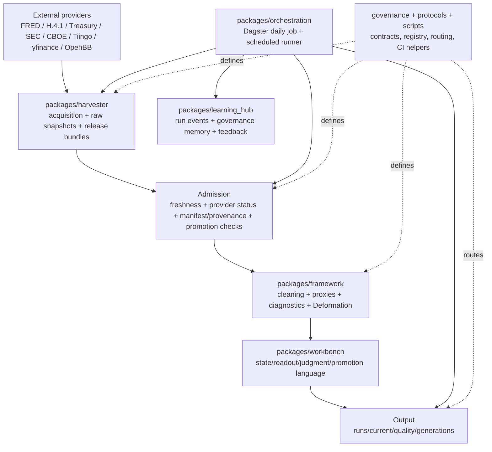

# System 项目：研究测量与运行可靠性全面审查总结

> 审查日期：2026-08-17
> 审查范围：`/Users/a1/System` 代码、配置、治理文件、CI、当前 Data/Output 状态与默认 scheduled path
> 工作方式：只读审查；本次只新增本文件，没有修改业务代码、数据、治理配置、现有输出或 Git 历史。
> 结论性质：这是当前证据下的审查结论，不等同于“所有外部 provider 已恢复”或“生产已通过验收”。

## 1. 先给结论

这个项目并不是“没有架构”。相反，它已经有相当完整的采集、冻结、准入、发布、治理和研究判断骨架；真正的底层问题是：

> **项目有很多成熟的局部状态机和门禁，但还没有一个贯穿 Source → Observation → Measurement → Evidence → Claim → Judgment 的统一观测/测量契约。**

因此当前会出现一种反复循环：

```text
provider/网络失败
    ↓
聚合层标记 partial 或 carry-forward
    ↓
旧行进入新 release，但没有足够明确的逐行 vintage/state
    ↓
quality report、Output/current、gate_report 的时间和语义不一致
    ↓
daily run 阻塞或发出告警
    ↓
第二天重复同一套失败路径
```

截至本次审查，不能把系统描述为“今天完全正常”：

- `cross_asset_daily_panel` 的 ETF 链路是当前最健康的部分：33 个 symbol、195,537 行、provider 状态为 `refreshed`、失败 0。
- `benchmark_panel` 仍是降级状态：280,841 行、65 个请求中 12 个成功、53 个失败，release 状态为 `reused_after_provider_failure`。这不是“刷新成功”，而是带有旧观测的可用性降级。
- `Output/current/framework_output.json` 最后修改时间为 2026-08-12；`Output/quality/freshness_report.json` 也为 2026-08-12，却报告 `PASS`，与当前 stale 事实冲突。
- `schedule_slots.sqlite3` 中 2026-08-12 至 2026-08-14 的 daily slot 均显示 `execution_status=FAILED`、`admission_verdict=BLOCK`、`publish_status=NOT_PUBLISHED`；当前数据库中没有看到更晚的成功发布记录。这个证据足以说明默认发布链没有闭环，但不能据此断言所有外部运行都不存在。
- `gate_report.json` 同时出现 `passed: true` 与 `promotion_allowed: false`。这可能分别代表“检查通过”和“不可晋级”，但当前命名容易被误读，已经构成运行决策风险。

所以最高优先级不是再加一个 provider，也不是把告警静音，而是先完成：

1. 统一观测/缺失/来源降级/证据类型契约；
2. 让 carry-forward、stale、delayed、source-down 在逐行和逐变量层面可见；
3. 让唯一的 admission/publish authority 与 `Output/current` 的实际内容一致；
4. 让默认 Dagster 路径在本地、CI、scheduled runtime 使用相同的解释器和验收语义。

---

## 2. 项目总体结构

### 2.1 业务定位

根目录 README 将 System 定义为 Structural Risk Workbench：

```text
外部公开数据/证据
        ↓
Harvester：采集、冻结、来源记录、release bundle
        ↓
admission：完整性、覆盖、freshness、provider status、promotion gate
        ↓
Framework：清洗、proxy/diagnostic、Deformation 研究框架
        ↓
Workbench：当前状态、judgment、readout、下一步动作
        ↓
Output：run package、report、current surface
        ↓
Learning Hub：运行事实、反馈、治理记忆和后续学习
```

它不是单纯的 BI 仪表盘，也不是只负责抓数的 data crawler；目标是把不完整的外部证据转换成可追溯、可审查、带限制条件的结构性风险判断。

### 2.2 目录和包的职责



| 区域 | 当前职责 | 关键事实 | 审查判断 |
|---|---|---|---|
| `packages/harvester` | provider 适配、raw 写入、series/panel、release、manifest/provenance | 有 immutable release bundle、`catalog.json`、digest、`.finalized` | **已有骨架；逐行状态和来源尝试链不统一** |
| `packages/framework` | 使用 admitted evidence，不负责抓 provider；proxy、diagnostic、Deformation | 有 M/D/K/X channel、snapshot、claim ceiling | **已有；Measurement 仍是隐含层** |
| `packages/workbench` | freshness、state、judgment、promotion language、readout | 有状态判断、claim ladder、promotion gate | **已有；状态词汇和 confidence 合成未统一** |
| `packages/orchestration` | Dagster default path、scheduled run、exit code、run outcome | Dagster 是默认入口，legacy 仅显式启用 | **已有；生产/CI/本地解释器漂移** |
| `governance` / `protocols` | 目录、代理语义、claim ladder、output routing、状态规则 | 治理密度高，已有多份规范 | **强；存在重复注册表和运行时/契约漂移** |
| `Data/harvester/exports` | canonical release data | `latest` 为 canonical release alias | **已有；需要保证 stale/carry-forward 的逐行语义** |
| `Output` | run/display/current/generation surface | `Output/current` 与 generation/legacy baseline 有 symlink 关系 | **风险集中；当前内容和质量报告时间不一致** |
| `Learning Hub` | 运行、反馈、治理记忆 | 可记录 runtime events | **已有；需要消费统一的 failure/missingness 事件** |
| `.github/workflows` | pre-commit、lint、types、packages、security、clean-room、merge-gate、nightly | merge-gate 结构完整 | **已有；未证明 live provider 和 branch protection 闭环** |

### 2.3 默认执行入口

默认 scheduled path 的真实链路是：

```text
launchd/com.system.daily-run.plist
  → scripts/run_daily_scheduled.sh
  → scripts/run_dagster_daily.sh
  → scripts/orchestrate.sh daily
  → python -m orchestration.cli daily
  → packages/orchestration/orchestration/daily_pipeline.py
  → scripts/daily_run.py
  → registry plan / admission / publish transaction / run outcome / alert / Learning Hub
```

`scripts/orchestrate.sh` 默认走 Dagster，只有 `SYSTEM_USE_LEGACY_DAILY_RUN=1` 才使用 legacy 路径；这项默认路径选择本身是清晰的。问题在于后面的 provider 状态、旧数据承接和 output publish 没有形成唯一、可验证的最终事实。

### 2.4 Data 与 Output 的边界

- `Data`：耐久、机器可读、可复用的 source of truth；release 应该 immutable。
- `Output`：运行结果、展示面、当前 generation、quality report、run package。
- `Data/harvester/exports/latest`：canonical release alias。
- `Output/current`：当前展示面，不应被当成任意旧 baseline 的静态快照。
- artifact 生命周期已有 `{sandbox, run_local, candidate, canonical, archived, deprecated}`。

这一边界设计是正确方向，但当前 `Output/live -> Output/generations/legacy_baseline_20260812_170057`，且 quality report 仍显示 `PASS`，说明“路径存在”不等于“路径已由最新成功 run 更新”。

---

## 3. 审查方法和结论分级

本次把用户给出的两组原则分成六个可执行审查面：

1. 文件系统、路径、工作目录、Git 和真实入口；
2. 状态/SSOT、接口契约、schema、事务和幂等；
3. Missingness、Source Ladder、Measurement、proxy 与 latent variable；
4. provenance、raw snapshot、schema drift、disclosure change；
5. confidence、Unknown、探索/验证/晋级模式；
6. 运行、测试、CI、发布、观察和恢复。

每一项使用四档标记：

- **已有**：代码或配置已有明确实现，且本次有证据；
- **部分已有**：局部路径已有，但缺少统一契约、默认路径闭环或下游约束；
- **缺口**：尚未看到可以在默认运行中强制执行的实现；
- **未证实**：可能存在，但当前证据不足，不能把它写成已完成。

---

## 4. 当前运行状态（证据快照）

### 4.1 数据与 release

当前 `realpath Data/harvester/exports/latest` 指向：

```text
/Users/a1/System/Data/harvester/exports/2026-08-14-r1
```

该 release 的事实：

| 数据集 | 规模/覆盖 | provider 结果 | 含义 |
|---|---:|---|---|
| `benchmark_panel` | 280,841 行；覆盖至 2026-08-17 | `reused_after_provider_failure`；65 次请求中 12 成功、53 失败 | 可作为降级/诊断输入，但不能当作完整 refreshed release |
| `cross_asset_daily_panel` | 195,537 行；33 symbols；覆盖至 2026-08-14 | `refreshed`；失败 0 | 当前最健康的采集链路 |
| `gate_report.json` | `passed=true`、`promotion_allowed=false` | 缺 `tot_pub_debt_out_amt`、`open_today_bal` | 说明检查结果与晋级结论语义没有统一 |

benchmark 失败列表的共同原因是 owned HTTP gateway 判定 outbound endpoint 解析到 forbidden IP。这说明当前问题不是简单地“再重试一次”就能解决；需要区分环境/网络不可达、provider 真实返回空、schema 变化、数据延迟和 provider 失败。

### 4.2 Output 与 freshness

| 项目 | 当前证据 | 风险 |
|---|---|---|
| `Output/current` | symlink 到 `Output/live/current`，最终落到 legacy baseline generation | 展示面可能不是最近一次成功发布 |
| `framework_output.json` | mtime 2026-08-12 13:03 | 当前研究输出明显可能过期 |
| `freshness_report.json` | mtime 2026-08-12 13:03，结果 `PASS` | 报告本身过期却仍能被读取为 PASS |
| runtime warning | `STALE: framework_output is 122.1h old`；`overall=DEGRADED_PARTIAL`；benchmark provider degraded | 运行时知道问题，但展示面没有把它变成唯一红灯 |

### 4.3 Daily run

`Output/runtime/schedule_slots.sqlite3` 中已观察到：

```text
execution_status=FAILED
admission_verdict=BLOCK
publish_status=NOT_PUBLISHED
exit_code=3
```

失败步骤包括 `harvester`、`refresh_cross_asset_panel`、`readme_first`、`shadow_outcomes`、`paper_sync`、`neutral_pressure` 等。当前有同日 retry 机制，但 retry 只是恢复瞬时故障的手段，不能替代 provider state、carry-forward 语义和最终 publish authority。

### 4.4 Git 和环境

- 审查时 `git status --porcelain` 有约 540 项变更，其中包括 1 个删除、97 个 untracked；因此当前工作区不能直接作为“干净历史版本”或发布证明。
- `pyproject.toml` 约束 Python `>=3.12,<3.14`；CI 使用 3.12/3.13；scheduled scripts 偏好 `/Library/Frameworks/Python.framework/Versions/3.14/bin/python3`；当前 shell 是 Python 3.14.3。
- 这是可复现性和默认运行一致性的 P1/P0 边界问题：应先决定“正式支持 3.14”还是“scheduled runtime 回到锁定的 3.12/3.13”，不能继续双轨运行。

---

## 5. 按用户提出的研究系统原则逐项审查

### 5.1 Missingness is data：**部分已有，未形成统一契约**

当前已有多个局部词汇：

- `workbench/freshness.py`：`fresh`、`acceptable_lag`、`stale`、`missing`、`retired_or_unavailable`；
- provider status matrix：`refreshed`、`reused_same_content`、`reused_after_provider_failure`、`partial_provider_success`、`provider_failed_no_acceptable_fallback`、`environmentally_blocked` 等；
- `official.py` quality flag：`observed`、`fallback`、`error`、`unknown`；
- derived/proxy 层：`synthetic_proxy`、`all_inputs_missing`、`input_missingness:*`、`derived`；
- `evidence_panel.schema.json` 的 series status 目前只有 `available` / `missing`。

问题不是完全没有状态，而是同一个事实在不同层被表达成不同词汇；逐行数据还不能稳定区分：

```text
AVAILABLE
STALE
DELAYED
MISSING
NOT_APPLICABLE
SOURCE_DOWN
SCHEMA_CHANGED
DISCONTINUED
UNKNOWN
```

应新增一版共享 `ObservationState`/`MissingnessReason` 契约，并让 release、panel、evidence、measurement、judgment 使用同一主状态，同时保留 provider-level outcome 作为另一维度。

### 5.2 Source Ladder：**ETF 链路已有，宏观 series 链路部分已有**

`cross_asset_panel.py` 已实现 Tiingo → Massive → yfinance，并记录：

- `providers_used`；
- `series_providers`；
- `series_attempts`；
- `provider_chain`；
- `fallback_used`。

这是项目里最接近成熟 Source Ladder 的实现，应作为模板保留。

`official.py` 的 macro series 也按 `provider_priority` 尝试，但当前主要序列化 aggregate `errors`、`succeeded_series`、`failed_series`，没有把每个 series 的逐次 provider attempt、失败原因、切换理由和 penalty 统一写入 release。于是 fallback 可能在面板数字层可见，却不一定能在研究 claim 层被准确解释。

目标应类似：

```yaml
variable: commissioned_capacity
preferred_source: utility_filings
current_source: company_disclosures
source_tier: 2
selection_reason: preferred_source_schema_changed
confidence_penalty: -0.12
```

重点是**不能偷偷切换**，也不能把 Tier 2 的结果伪装成 Tier 1 refreshed。

### 5.3 Latent variable 和 Measurement：**治理语义已有，运行实体缺失**

项目已有相当好的 latent/proxy 思维：

- `canonical_proxy_spec.yaml` 明确 M/D/K/X latent channel、proxy basket、排除项和 `awaiting_data`/`quarantined_drift`/`reassigned_to_pi_observable`；
- `proxy_observation_catalog.yaml` 描述每个 proxy 观察什么、何时失效、独立性和 replay case；
- `framework/research/schemas.py` 有 `FrontierVariable`、`ValidationQueueItem`、`observability_classification`；
- Framework README 明确没有“完美数据集”，研究链路是 raw → cleaned → proxies/diagnostics → wiki/paper。

缺口在于：这些语义没有被统一建模成第一类 `Measurement` 记录。当前系统缺少一个可 join 的对象来表达：

```text
latent_variable
observed_indicator
source
observation_window
measurement_method
evidence_kind
missingness_state
source_tier
confidence_components
claim_ceiling
```

没有这层，proxy governance 与 acquisition/release 之间仍靠不同文件和约定连接。

### 5.4 不自动填补：**部分已有，但 carry-forward 需要逐行透明化**

当前 `official.py:_carry_forward_missing_series()` 会从上一个 release 取缺失 series，拼入新 release，并把 aggregate provider status 改为 `reused_after_provider_failure`。这是比静默 forward-fill 更诚实的方向。

但 carried rows 保留旧的 observation date，且没有明确的 row-level `CARRIED_FORWARD`/`STALE` 状态和原始 vintage date。结果是：

- 内容时间（observation date）和抓取时间（retrieved/fetched at）可能被混淆；
- panel 看起来有数据，但本期是否更新不够直观；
- downstream 若只按“有值”判断，可能把旧值当成新观察；
- provider aggregate warning 不能替代每条数据的 provenance。

建议保留 carry-forward 作为降级能力，但强制增加：

```text
observation_date        原始观测期
retrieved_at            本次抓取时间
source_vintage_at       原 release/来源版本时间
state=STALE             本期未刷新
carry_forward=true
carry_forward_from_release
```

### 5.5 Observed / Estimated / Interpolated / Modeled / Proxy-derived / Assumed：**局部已有，未形成端到端 evidence kind**

现有 `quality_flag` 和 proxy state 能表达 observed/fallback/derived/synthetic，但尚没有所有 provider、row、measurement、claim 都必须携带的 `EvidenceKind`。应避免让：

```text
Observed = Estimated = Proxy-derived = Assumed
```

在 downstream 看起来一样。

任何插值或模型填补都应：

- 显式声明 method；
- 记录输入缺失范围；
- 降低 confidence；
- 默认不能越过 claim ceiling；
- 在报表中可筛选，不得隐藏在标准化数字里。

### 5.6 Confidence propagation：**有分层判断，缺少可审计合成**

`workbench/judgment/layer.py` 已有 `diagnostic_confidence`、`mechanism_confidence`、`trade_confidence`，并依据 measurement quality、CaseLab、HMM 和 gates 调整；`promotion_gate.py` 也能限制 operational language。

但它更像规则驱动的 categorical confidence，而不是一个可复核的：

```text
source confidence
  × measurement confidence
  × variable confidence
  × model confidence
  × conflict/recency penalties
  → claim confidence / claim ceiling
```

验收时不要求强行追求一个数学乘法公式，但必须能回答：

1. 这个 claim 使用了哪些观测和 proxy？
2. 每一项处于什么 source tier/evidence kind/state？
3. 哪些因素降低了 confidence？
4. 为什么最终只能是 `WATCH`、`WEAKLY_SUPPORTED` 或 `INSUFFICIENT_DATA`？

### 5.7 数据消失/披露变化是事件：**缺口**

当前有 schema、freshness、provider status 和 quality report，但没有看到统一的 `DisclosureChangeEvent`/`SchemaChangedEvent`/`DiscontinuedMetricEvent` 作为可供 CaseLab、Learning Hub、judgment 消费的第一类事件。

应把下列变化从普通错误中分离出来：

- 指标从具体数值变成空值或模糊描述；
- 字段名称、单位、频率或口径改变；
- 监管源延迟发布；
- source 仍可访问但指标永久停发；
- 过去稳定的字段突然只在 fallback source 出现。

### 5.8 Raw Evidence Store：**基础已有，完整可复现包仍不统一**

Harvester 已有 `Data/harvester/raw`、release manifest、SHA、provenance、coverage 和 provider source URL；这是正确的基础。

但并非所有 raw provider 都能证明包含同样的 envelope：

```text
raw bytes/snapshot
fetched_at
source URL / request parameters
content hash
parser version
schema fingerprint
normalized artifact hash
normalizer version
```

当前 manifest/provenance schema 对这些字段的强制程度不一致。应优先对关键 source 做 clean-room replay：用 raw snapshot 在没有网络的情况下重建 normalized release，并验证 hash/row count/coverage/quality state。

### 5.9 Unknown 与“搜索失败”：**概念存在，执行协议缺口**

项目已有 `INSUFFICIENT_DATA`、`UNOBSERVABLE`、`unknown`、`observability_classification` 等零散概念；但尚未发现一个统一的状态分层来区分：

```text
UNKNOWN
UNSEARCHED
UNOBSERVED
UNIDENTIFIABLE
UNAVAILABLE
FAILED
```

也没有强制的探索预算来证明系统至少尝试过：

1. direct source；
2. alternative source；
3. proxy/measurement route；
4. bounds/constraints；
5. historical evidence；
6. failure reason and recovery path。

目标不是禁止系统说“不知道”，而是让 `UNKNOWN` 成为有证据的结果，而不是执行器提前放弃的别名。对每个高价值研究变量，至少输出：

```text
best_current_judgment
evidence_for
evidence_against
what_was_not_observable
next_observation_needed
claim_ceiling
```

### 5.10 Discovery / Validation / Promotion：**概念已有，模式未统一**

`ClaimMaturityTag`、frontier research、validation queue、claim ladder 和 promotion gate 已经提供了很好的分层基础。需要再加一个显式执行模式：

| 模式 | 允许做什么 | 不允许做什么 |
|---|---|---|
| `DISCOVERY` | 生成 proxy、假设、替代 source、边界和反例 | 不得写入 canonical decision surface |
| `VALIDATION` | 重放、交叉核对、schema/freshness/coverage、冲突检查 | 不得绕过缺失和 provenance |
| `PROMOTION` | 只消费 admitted evidence 和通过门禁的 measurement | 不得把 fallback/estimate 伪装为 observed |

---

## 6. 工程基础审查

| 审查面 | 当前实现 | 评级 | 主要问题/影响 |
|---|---|---|---|
| 路径与目录 | `WorkspacePaths`、repo layout map、Data/Output policy、canonical `exports` | **已有** | 兼容 symlink 和 legacy surface 较多；必须用 `realpath`/`find -L` 解释真实文件 |
| SSOT | release、manifest、provenance、publish transaction、schedule slot | **部分已有** | 两套 source registry、`passed`/`promotion_allowed` 双语义、旧 output 仍可被读取 |
| 接口/schema | JSON Schema、dataclass、provider status matrix | **部分已有** | 没有共享 Observation/Measurement contract；schema drift 曾导致 release failure |
| 数据结构 | Parquet/JSON release、SQLite schedule slots、manifest | **已有** | 缺一个 Source→Observation→Claim 的统一可 join 关系模型 |
| 确定性/LLM 边界 | deterministic gates、claim ladder、K/X ceiling | **部分已有** | Discovery/Validation/Promotion 没有统一 mode contract |
| 测试 | CI 包测试、orchestration dry-run、security、clean-room、nightly | **部分已有** | 没有证明实时 provider 成功和当天 release freshness；测试绿不等于生产绿 |
| 失败处理 | retry、cooldown、fallback、carry-forward、PublishTransaction | **部分已有** | retry 不能处理语义漂移；carry-forward 行级信息不足 |
| 观察/日志 | runtime events、quality report、Learning Hub、run bundle | **部分已有** | stale report 仍可能 PASS；没有唯一 current status authority |
| 可复现性 | immutable release、digest、raw、provenance、generation | **部分已有** | parser/schema fingerprint 不统一；dirty worktree 破坏证据边界 |
| 依赖与解释器 | root constraints、CI matrix、uv/lock 结构 | **缺口/阻塞** | scheduled Python 3.14 与项目 `<3.14`、CI 3.12/3.13 漂移 |
| 幂等/事务 | schedule slot、provider cooldown、generation pointer、publish transaction | **已有** | 需要增加“无新 admitted release 不得更新 current”的硬约束 |
| CI/CD | merge-gate、nightly、weekly governance、SBOM/clean-room | **部分已有** | branch protection 是否真的 required 未证实；live acquisition 不在 merge gate |
| 安全边界 | owned HTTP gateway、HTTPS allowlist、DNS/IP 检查 | **已有但需验证** | HTTPX 是 transport，不是 SSRF policy；当前错误是 egress/gateway 环境失败，需要可观测分类 |

### 6.1 两个具体漂移点

1. **Provider registry 漂移**：`packages/harvester/configs/series_registry.yaml` 的 `provider_priority` 中出现 `fred_chicago_fed`、`openbb_if_available`、`synthetic_rates_vol_proxy`，但当前 provider definitions 未全部声明。应在 registry compile 阶段 fail closed，而不是等运行期失败。
2. **Schema/runtime 漂移**：`2026-08-14-r1.release_failed.json` 记录 `provider_outcome` 出现未被 manifest schema 接受的 `fallback_used`、`provider_chain`、`providers_used`、`series_attempts`、`series_providers`。这说明 provider 代码、manifest schema 和 release validator 没有在同一个契约版本上原子升级。

---

## 7. 底层根因树

```text
反复 Daily_run_failed / 数据问题反复到第二天
├─ A. 外部 source/egress 真实不稳定
│  ├─ gateway 对部分 endpoint 判为 forbidden IP
│  ├─ provider 失败原因与环境阻塞没有统一到 row/measurement 层
│  └─ retry 只能处理瞬时错误，不能恢复 schema/egress/停发
├─ B. 缺少统一 Observation/Measurement contract
│  ├─ available/missing、fresh/stale、fallback/error、unknown 词汇分裂
│  ├─ aggregate provider outcome 代替了逐条 measurement state
│  └─ carry-forward 旧 observation date 容易看起来像本期数据
├─ C. current/output authority 不唯一
│  ├─ release gate 的 passed 与 promotion_allowed 语义分裂
│  ├─ stale quality report 仍能显示 PASS
│  └─ Output/current 可能停留在 legacy baseline
├─ D. 配置和运行环境漂移
│  ├─ registry provider ID 未声明
│  ├─ manifest schema 与 provider outcome 字段不一致
│  └─ Python 3.14 scheduled runtime 不符合 root constraint
└─ E. 研究层对不完整数据的处理没有完全实体化
   ├─ latent variable/proxy 语义在 governance，但未进入统一 Measurement
   ├─ confidence 不能端到端解释
   ├─ disclosure/schema change 尚未成为事件
   └─ UNKNOWN 缺少最小探索预算与 best-current-judgment contract
```

**核心判断：** 这不是“某一个 API key 没配好”或“把 retry 次数调大”就能根治的问题。provider key/网络只是触发器；真正让问题每天重现的是，系统没有把“本期没有新观测”建模成一个可传递、可审计、可安全降级的 measurement state，并且没有让 current output 只能由一个明确的 admitted publish transaction 更新。

---

## 8. 依赖有序的执行方案与验收标准

下面按“先恢复事实边界，再增强能力”的顺序排列。每一阶段都列出非目标，避免一次性重写整个系统。

### E0 / P0：冻结证据边界和运行事实

**目标**：停止工作区、旧 output、临时 retry 互相污染，先建立可比较的基线。

**动作**

- 记录当前 Git SHA、dirty worktree manifest、Python/uv/lock 版本、当前 `realpath`、release catalog、Output symlink、schedule slots。
- 不清理、不 reset、不覆盖当前 Data/Output；把本次审查作为只读基线。
- 明确 `Data`、`Output`、`run-local`、`candidate`、`canonical`、`archived` 的写入权限。

**验收**

- 在干净 checkout 中能够复现同一份审计索引；
- 任何 current surface 都能反查到 generation、release、run ID 和 commit SHA；
- dirty worktree 不得被当成 release/production proof；
- 失败时保留完整 RunOutcome 和原始错误，不以 retry 覆盖首个根因。

**非目标**：不在这一阶段清理现有 540 项工作区变更，不做大规模目录迁移。

### P0-1：建立共享 Observation/Measurement 状态契约

**目标**：让“没有数据”不再统一成 null、error 或简单 missing。

**建议对象**

```yaml
observation_id: stable-key
variable_id: canonical-variable
series_id: source-series
state: AVAILABLE | STALE | DELAYED | MISSING | NOT_APPLICABLE | SOURCE_DOWN | SCHEMA_CHANGED | DISCONTINUED | UNKNOWN
evidence_kind: OBSERVED | ESTIMATED | INTERPOLATED | MODELED | PROXY_DERIVED | ASSUMED
observation_date: source period
retrieved_at: fetch timestamp
source_vintage_at: source/release vintage
source_id: provider/source
source_tier: 1..N
method: optional method identifier
confidence_components: structured object
provenance_ref: raw snapshot/release reference
```

**验收**

- `evidence_panel.schema.json` 和 release manifest 能接受并验证统一状态；
- 所有核心 series 至少输出 state、observation date、retrieved_at、source/provider；
- `available` 不再是唯一“可用”含义，`STALE` 不会被 fresh gate 当成 refreshed；
- `UNKNOWN`、`SOURCE_DOWN`、`NOT_APPLICABLE`、`DISCONTINUED` 可区分；
- downstream report 可以按 state/evidence_kind 筛选。

**非目标**：不要求一次性把所有历史数据重新计算成新 schema；可通过 versioned adapter 过渡。

### P0-2：把 Source Ladder 和 carry-forward 变成逐 series 可审计路径

**目标**：每个变量明确首选 source、备用 source、切换原因和置信度代价。

**验收**

- registry compile 失败时列出所有未声明、未解析或循环 provider；
- 每次 provider attempt 记录 provider、开始/结束、错误分类、HTTP/schema/empty/error 结果；
- fallback source 必须带 `source_tier` 和 `confidence_penalty`；
- carry-forward row 带 `STALE`/`CARRIED_FORWARD`、原 release、original observation date 和本次 retrieved_at；
- release-level status 与 row-level state 同时存在，不能互相替代；
- 一次 provider failure 不会让旧数据伪装成 refreshed。

**非目标**：不立即购买更多 provider 或把所有 source 换成一个商业 API。

### P0-3：收敛 admission、promotion、publish 的唯一权威

**目标**：解决 `passed=true` 但 `promotion_allowed=false` 和 stale report PASS 的歧义。

**建议语义**

```text
check_status       检查本身是否完成/通过
admission_verdict  该 release 是否允许进入下游
promotion_allowed  是否允许写 canonical/current
publish_status     是否真正提交了 current pointer
```

**验收**

- 所有报告从同一个 authoritative RunOutcome/AdmissionResult 生成；
- stale 的 quality report 自动标为 `STALE_REPORT`，不能继续显示 PASS；
- 没有新的 admitted release 时，`Output/current` 不得更新；
- `publish_status=NOT_PUBLISHED` 时，UI/通知明确显示阻塞而不是“完成”；
- 任何 current artifact 可反查 release/run/admission/publish transaction；
- 失败重试不会产生半提交 generation。

### P0-4：统一运行解释器和锁链

**目标**：消除 scheduled runtime、CI、开发环境之间的 Python/lock 漂移。

**必须先做的选择**

1. 正式支持 Python 3.14，并同步 `pyproject`、CI、uv lock、所有 wheel/build；或
2. 保持 `>=3.12,<3.14`，scheduled runtime 强制使用锁定的 3.12/3.13。

**验收**

- 本地、CI、scheduled path 打印同一个解释器版本和 lock fingerprint；
- clean-room checkout 可完成安装、schema compile、default dry-run；
- 不能出现“本地 3.14 能跑、CI 3.13 才是支持版本”的隐含双轨；
- root lock、workspace lock、CI install 命令只有一个 authoritative chain。

### P1：把 Measurement、Unknown 和 confidence 做成研究执行层

**目标**：让系统在缺失、异步、冲突数据下仍能给出诚实的最佳当前判断。

**动作**

- 为 latent variable 建立 `MeasurementSpec`：observed indicators、source ladder、proxy basket、失败条件、bounds、claim ceiling；
- 增加 `UnknownState`：`UNSEARCHED`、`UNOBSERVED`、`UNIDENTIFIABLE`、`UNAVAILABLE`、`FAILED`、`INSUFFICIENT_DATA`；
- 增加最小探索预算：direct / alternative / proxy / bounds / history / constraints 至少有记录；
- 输出 `best_current_judgment`、支持/反驳证据、未观测内容、下一观察需求；
- 将 source、measurement、variable、model、claim 的 confidence components 传递到 judgment；
- Discovery 产物只能进 sandbox/candidate；Validation 产物必须有 replay/冲突/覆盖证据；Promotion 只消费 admitted measurement。

**验收**

- 一个关键 latent variable 可展示完整测量链；
- 缺直接数据时，系统能明确进入 proxy/bounds/insufficient data，而非静默报错或伪造数字；
- claim 输出能够说明为什么是 `WATCH`/`WEAKLY_SUPPORTED`/`CONFLICTED`；
- 任何 estimated/interpolated/modeled/proxy-derived 值都不能越过其 claim ceiling；
- 没有“执行器未搜索就返回 UNKNOWN”的路径。

### P1：Raw snapshot、schema fingerprint、replay

**目标**：来源今天可用、明天 404 时，历史研究仍可复现。

**验收**

- 关键 provider 每次保存 raw bytes、URL/params、fetched_at、content hash、parser version、schema fingerprint、normalized hash/version；
- clean-room/no-network replay 能重建同一 normalized artifact 或给出明确版本差异；
- snapshot 不可被后续 run 原地覆盖；
- schema 变化触发 `SCHEMA_CHANGED` 事件和人工/规则路由，而不是普通 missing。

### P1：Disclosure/Schema/Discontinued 事件

**验收**

- 具体指标突然不披露、单位/频率变更、source 停发都会生成事件；
- 事件进入 Learning Hub/CaseLab 或等价的可追踪队列；
- 事件不会自动被 forward-fill 掩盖；
- 事件能反查受影响的 measurement、claim 和当前 report。

### P2：观察、恢复和运营界面

**目标**：让“每天报警”变成“当天知道哪个层坏了、下一步做什么”。

**建议指标**

- provider success / fallback / stale / source-down rate；
- release admission block rate；
- current artifact age；
- stale carried-forward age；
- disclosure/schema change count；
- retry recovery rate 与 repeated-failure rate；
- abstention/unknown rate；
- 从 source failure 到恢复或人工接管的时间。

**验收**

- 日报/通知能区分 provider outage、schema change、delayed release、stale carry-forward、publish block；
- 同一根因不会每天产生没有进展的新告警；
- 恢复后自动验证 current pointer、freshness、admission 和 report 时间一致。

---

## 9. 哪些成熟东西保留，哪些可以替代

| 现有选择 | 建议 | 理由/边界 |
|---|---|---|
| `uv` workspace + lock | **保留，但替换当前不一致的安装/锁链** | 适合 workspace、可复现安装；先解决 root/workspace/runtime 漂移 |
| JSON Schema + Pydantic/dataclass | **保留，补一份共享 Observation/Measurement contract** | 不需要为了换技术而重写现有边界；要做 schema versioning |
| owned HTTP gateway + HTTPX transport | **保留** | HTTPX 是传输层，不是 SSRF 控制；allowlist、DNS/IP、scheme policy 仍由 gateway 负责 |
| Parquet + immutable manifest/provenance | **保留** | 当前规模足够，适合 release/snapshot；需要 raw envelope/replay，不必立刻换平台 |
| DuckDB/Polars | **按需引入查询层** | 用于跨 release/measurement join，不替代 canonical release 和 gate |
| Dagster default path | **保留并强化** | 已有 job/asset/依赖能力；关键是只保留一个默认执行入口，并把 live admission 接入 gate |
| GitHub Actions merge-gate | **保留并验证 branch protection** | CI 结构已足够成熟；必须确认 GitHub branch rule 真正 required `merge-gate`，不能只写在 YAML 注释里 |
| DVC/本地 raw snapshot | **当前保留** | 对单机/私有研究仓库足够；团队规模、保留周期扩大后再考虑 object store/attestation |
| OpenTelemetry | **暂缓全量替换** | 先把状态、admission、current authority 统一；否则只是给语义不一致的事件换一套传输 |
| Great Expectations/Pandera 等额外质量平台 | **暂缓扩张** | JSON Schema、现有 quality rules、replay contract 足以先闭合核心问题；平台化应在契约稳定后再做 |
| 更多 provider/API key | **不是第一替代方案** | 若 source ladder、状态和 provenance 未闭合，换 provider 只会把失败移到下一层 |

---

## 10. 目标总体结构（完成后）

```text
Source Registry
  ├─ source identity / tier / endpoint policy / expected cadence
  └─ schema + parser + fallback contract
        ↓
Acquisition Attempt Log
  ├─ provider attempt / error class / egress or schema reason
  └─ raw immutable snapshot
        ↓
Observation Store
  ├─ observation_date / retrieved_at / source_vintage_at
  ├─ ObservationState
  ├─ EvidenceKind
  └─ row-level provenance + hash
        ↓
Measurement Layer
  ├─ latent variable / observed indicators / proxy basket
  ├─ source ladder / bounds / missingness interpretation
  └─ confidence components / claim ceiling
        ↓
Evidence & Admission
  ├─ freshness / coverage / conflict / schema drift
  ├─ release-level outcome
  └─ promotion_allowed / publish transaction
        ↓
Framework & Workbench
  ├─ diagnostic / mechanism / watch / claim ladder
  ├─ Discovery vs Validation vs Promotion mode
  └─ best current judgment + next observation
        ↓
Current Output
  ├─ only from admitted successful publish
  ├─ age and provenance visible
  └─ stale/blocked state cannot display as PASS
        ↓
Learning / CaseLab / Recovery
  ├─ repeated failure and recovery metrics
  ├─ DisclosureChange/SchemaChanged events
  └─ source/method/claim feedback
```

这个结构仍然保留现有 System 的主要包和文件边界，但把 `Measurement` 从治理文字提升为运行时第一类对象，并把 `Current Output` 从“一个 symlink”提升为“有 admission 和 publish 证明的状态”。

---

## 11. 不应该做的事情（红线）

- 不要只增加 retry 次数、延长 timeout 或静音 `Daily_run_failed`；这会隐藏 source-down/schema-drift，而不是恢复事实。
- 不要把 `reused_after_provider_failure` 改名成 `refreshed`。
- 不要把 carry-forward、interpolation、proxy-derived、model estimate 直接写入 observed 字段。
- 不要在 stale `Output/current` 上继续生成看似最新的研究结论。
- 不要在 dirty worktree 上声称 clean-room/release 已验证。
- 不要因为 provider A 失败就无日志地切换 provider B。
- 不要在 Measurement contract 还未统一前大规模引入新的观测平台、LLM 或 telemetry 平台。
- 不要把“没有直接数据”自动等同于“变量不存在”；先区分 unobserved、unidentifiable、unavailable 和 failed。

---

## 12. 最终优先级名单

### 最高优先级（现在就应作为主线）

1. **P0-1：统一 ObservationState + EvidenceKind + provenance。**
2. **P0-2：把 Source Ladder、provider attempts、carry-forward 逐 series 化。**
3. **P0-3：统一 admission/promotion/publish authority，修正 stale PASS。**
4. **P0-4：统一 Python/lock/runtime，消除 3.14 与项目约束漂移。**
5. **修复 registry/provider ID 与 manifest/schema 的编译期漂移。**

### 随后推进

6. 把 latent variable/proxy/unknown/exploration budget 做成 Measurement execution layer。
7. 为关键 provider 建立 raw snapshot + parser/schema fingerprint + no-network replay。
8. 让 disclosure/schema/discontinued 变成可追踪事件。
9. 建立 current artifact age、stale age、fallback、recovery、abstention 的运营面板。

### 暂不优先

10. 大规模替换编排器、全量 OpenTelemetry、引入新的质量平台、购买更多 provider 或把整个数据层迁移到新平台。

**一句话判断：** 这个项目应该继续沿现有 Harvester → Admission → Framework → Workbench → Output 的方向演进，不需要推倒重来；但必须先把 `Measurement` 和 `Missingness` 从“分散在多处的治理概念”提升为默认运行路径上的统一契约。这样 Daily run 才能从“每天报错、第二天重试”变成“当天可降级、可解释、可恢复、不可误判”。
