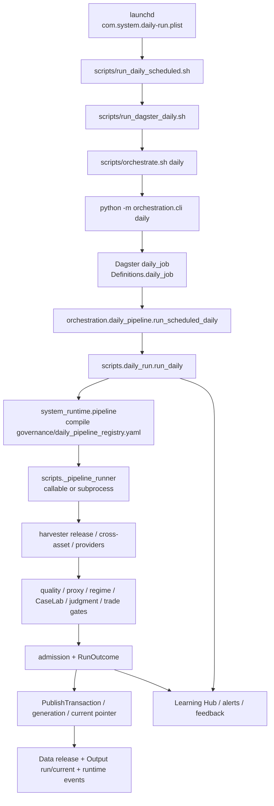

# System 技术架构与可替换性盘点

> 盘点日期：2026-08-17
> 盘点目标：在替换自研基础设施之前，建立技术栈、运行时、状态、数据规模、代码重量、领域资产和替换边界的事实基线。
> 工作方式：只读扫描与静态证据核对；本次只新增本文件，没有执行替换、迁移、删除、数据重算或清理工作区。
> 相关文件：[SYSTEM_RESEARCH_MEASUREMENT_AUDIT_SUMMARY.md](/Users/a1/System/SYSTEM_RESEARCH_MEASUREMENT_AUDIT_SUMMARY.md)

## 0. 先给判断

这不是一个“应该整体换平台”的项目，而是一个已经长出研究方法论资产、但基础设施仍处于混合演进状态的系统。

最重要的边界是：

> **Replace infrastructure, preserve epistemology.**
> 替换通用工程基础设施，保留研究测量语义、proxy 逻辑、claim ceiling、promotion semantics 和 judgment。

当前最值得做的不是马上换工具，而是先完成三件事：

1. 把当前自研实现按“领域逻辑 / 基础设施 / 兼容层 / 试验性代码”分层；
2. 把当前真实的状态源、runtime DAG、数据规模和依赖关系固定下来；
3. 对每个候选替换建立 shadow parity、回滚和删除旧代码的验收条件。

### 0.1 当前总体判断

| 结论 | 判断 |
|---|---|
| 是否需要推倒重来 | **不需要**；Harvester → Admission → Framework → Workbench → Output 主结构值得保留 |
| 是否存在早期自研基础设施过重 | **存在**；尤其是 pipeline runner、daily executor、状态/发布/报告周围的重复边界 |
| 是否已经完全由 Dagster 管理 | **没有**；Dagster 当前更像 outer job，内部仍委托 `scripts/daily_run.py` 和 registry step runner |
| 是否需要立刻换数据库 | **不需要**；当前规模适合 Parquet + DuckDB + Polars，且 DuckDB/Polars 已经在依赖中 |
| 是否需要立刻增加 provider | **不是首要动作**；先闭合 source ladder、缺失状态、carry-forward 和 admission 语义 |
| 最有价值的替换方向 | 收缩自研 orchestration plumbing；统一 DuckDB/Polars 查询层；保留自研研究语义 |
| 当前最大阻塞 | Python 3.14 scheduled runtime 与项目/CI `>=3.12,<3.14` 漂移；状态源和 schema 也有重复/漂移 |

### 0.2 证据边界

本盘点已取得的静态/本地事实：

- 根目录约 1,589 个非 Git 文件，约 1,521 个 tracked files；
- 892 个 Python 文件，约 166,377 行 Python（排除 `__pycache__`、测试缓存、build/dist）；
- Data 约 1.4 GB，Output 约 191 MB；
- Parquet 819 个、约 1.279 GB；JSON 6,960 个、约 102 MB；JSONL 615 个、约 41.6 MB；
- Harvester release 目录 164 个，raw 文件 179 个，release 文件约 2,568 个；
- Output run 目录 392 个，当前 generation 目录 1 个；
- `governance/daily_pipeline_registry.yaml` 有 83 个 step 定义：68 个 `active`、5 个 `experimental`、10 个 `archived`；静态编译视图中有 73 个非 archived/inactive 条目；
- JSON Schema 40 个；AST 扫描发现约 29 个 Pydantic model 类、123 个 dataclass 类、3 个 TypedDict 类、14 个 Enum 类；
- 测试目录中至少约 335 个 `test_*.py` 文件（root、各 workspace package、Qlib fixture 分开统计）。

尚未通过长时间或生产压测确认的项目：

- 平均/峰值 daily run 时长、峰值 RAM、CPU、网络请求数；
- provider live success rate；
- GitHub 仓库实际 branch protection 是否已把 `merge-gate` 设为 required；
- 所有历史 schema 是否都能在 clean-room replay 中重建；
- 所有模块的真实运行频率、业务拥有者和删除安全性。

---

## 1. Tech Stack

### 1.1 语言、打包和 workspace

| 层 | 当前实现 | 自研/第三方/混合 | 事实与风险 |
|---|---|---|---|
| 语言 | Python 为主，YAML/JSON/Markdown/SQL-like DuckDB 查询，少量 shell | 混合 | 研究、运行、治理和报告都主要由 Python 驱动 |
| root distribution | `structural-deformation-system` 0.2.0 | 自研 packaging + setuptools | `pyproject.toml` 约束 `>=3.12,<3.14` |
| workspace | uv workspace，成员为 framework/harvester/learning_hub/workbench/orchestration | 第三方工具 + 自研包边界 | workspace 结构是正确方向 |
| resolver/lock | `uv.lock` 为声明的 workspace authority；`requirements-dev.txt`、`requirements.lock.txt`、framework `requirements/lock.txt` 为兼容/迁移材料 | 混合 | 需避免任何脚本误用 legacy lock |
| build | setuptools + wheel，CI 使用 `uv build`、`--no-sources` clean-room build | 第三方工具 + 自研 manifest/SBOM | 已有 wheel/clean-room 证据链 |
| 解释器 | CI 3.12/3.13；项目 `<3.14`；本机当前 Python 3.14.3；scheduled scripts 偏好系统 Python 3.14 | **漂移** | 这是替换和发布前的阻塞项 |

### 1.2 主要依赖地图

| 能力 | 依赖 | 使用范围 | 判断 |
|---|---|---|---|
| 数值/表格 | NumPy、pandas、SciPy、scikit-learn | root/framework/workbench | 保留；核心研究计算依赖 |
| 列式数据 | PyArrow、Parquet、Polars | harvester/framework/workbench/learning hub | 保留；可统一查询约定 |
| 本地查询 | DuckDB | framework/harvester/learning hub，另有 runtime DB 文件 | **应提升为统一查询层** |
| 配置 | PyYAML、OmegaConf | governance、registry、package config | 保留，但 registry authority 要收敛 |
| schema | `jsonschema`、Pydantic、dataclass、少量 TypedDict、自研 validators | 全项目多边界 | 保留技术栈，减少重复对象 |
| orchestration | Dagster、Dagster Webserver | orchestration package | 保留，逐步收回内部 execution ownership |
| data quality | Pandera；Great Expectations optional（Python <3.14） | orchestration quality | Pandera 已是当前较可用路径；GE 不应成为强制阻塞依赖 |
| HTTP | HTTPX、HTTPCore；owned HTTP gateway | harvester/framework/workbench | 保留 HTTPX transport；gateway 继续拥有 SSRF/endpoint policy |
| provider adapter | FRED、H.4.1、Treasury、SEC、CBOE、OpenBB、Tiingo、Massive/yfinance 等 | harvester | provider 语义属于 System；网络传输不应重复自研 |
| ML/NLP | hmmlearn、sentence-transformers、BERTopic、Torch/torch-geometric optional、Anthropic optional | framework/workbench | 研究/实验层；不能越过 promotion gate |
| embedding store | LanceDB optional，`Data/caselab_context/lancedb` 已存在 | CaseLab context | 保留现有语义；不要与 canonical evidence store 混用 |
| observability | Python logging、JSONL/runtime events、Sentry optional、报告/通知脚本 | system_runtime/workbench/learning hub | 语义已有，transport/metrics 仍可成熟化 |
| release/data movement | DVC optional、filesystem generation、symlink、manifest/provenance | Data/Output | 当前规模足够；先修 current authority，再决定是否 lakeFS/object store |
| UI | Streamlit optional，HTML/Markdown report 生成 | framework/workbench | 展示层，不应拥有 admission 语义 |
| external benchmark | Qlib isolated runner、paper empirical interface | `ExternalTools/`、`paper-empirical-interface/` | 保持隔离边界，不进入核心 runtime |

### 1.3 依赖 authority

当前建议明确成：

```text
pyproject.toml + workspace member pyproject.toml
        ↓
uv.lock
        ↓
uv sync --locked --all-packages
        ↓
CI / clean-room / scheduled runtime 使用同一解释器
```

`requirements-dev.txt`、root `requirements.lock.txt` 和 framework `requirements/lock.txt` 当前被注释为历史/兼容用途，不能继续承担真实安装入口。若不修正，任何“替换组件”都会先被环境差异污染。

---

## 2. Repository / Package Map

### 2.1 总体目录

```text
/Users/a1/System
├── system_runtime/                 # workspace-wide paths, pipeline, publish, slots, events
├── system_cli/                     # root CLI facade
├── packages/
│   ├── harvester/                  # provider acquisition, raw, release, manifest, provenance
│   ├── framework/                  # Deformation research engine, data access, proxy, replay
│   ├── workbench/                  # evidence/readout/judgment/NLP/UI/harness
│   ├── orchestration/              # Dagster definitions, schedules, compiled graph adapters
│   └── learning_hub/               # governance memory, event ledger, recurrence/health
├── scripts/                        # daily executor, compatibility commands, reports, audits
├── governance/                     # authoritative policy/registry/routing/claim semantics
├── protocols/                      # cross-system JSON Schemas and envelopes
├── Config/                         # older/source-specific config and mappings
├── Data/                           # durable machine-readable source/research state
├── Output/                         # run/display/generation/current surfaces
├── ExternalTools/                  # isolated Qlib benchmark runner
├── paper-empirical-interface/      # separate paper/empirical package
├── caselab_context/                # context/index/graph/embedding runtime outside packages
├── caselab_runtime/                # small runtime/policy helpers
├── .github/workflows/              # CI/nightly/weekly governance
└── uv.lock / pyproject.toml        # dependency/build authority
```

### 2.2 包职责与替换边界

| 包/区域 | 当前职责 | 真正的资产 | 替换判断 |
|---|---|---|---|
| `packages/harvester` | 获取公开数据、provider chain、raw snapshot、release bundle、manifest/provenance、质量报告 | source ladder、release admission 的领域约束、数据 provenance | **保留语义；减少重复 provider plumbing；不直接换成通用 crawler** |
| `packages/framework` | 读取 admitted evidence，进行数据访问、proxy、Deformation、diagnostics、replay、ML | M/D/K/X、proxy basket、mechanism 和 structural measurement | **核心资产，保留；DuckDB/Polars 可成为其计算底座** |
| `packages/workbench` | evidence dashboard、freshness、NLP/CaseLab、judgment、claim/promotion gate、UI | claim ladder、claim ceiling、judgment 和 human decision boundary | **核心资产，保留；基础 lineage/logging 可外接成熟工具** |
| `packages/orchestration` | Dagster definitions/schedules/ops/assets、compiled graph bridge | 默认 path 的所有权设计 | **保留 Dagster，收缩 shell/subprocess/重复 runner** |
| `packages/learning_hub` | 运行事实、治理事件、ledger、recurrence、health、feedback | system learning/governance semantics | **保留事件语义；底层 ledger 查询可统一 DuckDB/Arrow** |
| `system_runtime` | workspace paths、pipeline compiler、publish transaction、admission、run outcome、slot store、events | cross-package control plane | **保留控制语义，逐项审计重复实现** |
| `scripts/` | 大量入口、兼容层、报告、审计、日常执行 | 一部分是领域报告，一部分是历史平台层 | **高优先级分层；能被 Dagster/包 API 收回的逐步退役** |
| `governance/` | registry/policy/authority/claim/output routing | 研究治理和执行约束 | **保留；重复 registry 要编译成一个 authority** |
| `Data/`/`Output/` | source of truth 与 run/display surface | 可追溯 artifact 边界 | **保留；不直接替换成数据库或对象存储** |

### 2.3 兼容和遗留面

当前存在兼容 symlink 和 legacy 路径，例如 `Structural Risk Harvester`、`System Learning Hub`、`Structural Research Harness`、`contracts` 等；`scripts/archive/` 也保留了历史 executor/report。它们不是“马上删除”的对象，应该先通过 import/entrypoint/output writer inventory 确认没有默认路径依赖。

---

## 3. Runtime DAG

### 3.1 真实默认路径



### 3.2 DAG 的实际形态

`governance/daily_pipeline_registry.yaml` 是当前顺序/输入/输出/失败策略的主要 compiler input，但执行并不是纯 Dagster graph：

- `packages/orchestration/orchestration/definitions.py` 的 `daily_job` 只有一个 `daily_job_entry` op；该 op 调用 `orchestration.daily_pipeline.run_scheduled_daily`。
- `daily_pipeline.py` 再调用 `scripts.daily_run.run_daily`。
- `scripts.daily_run` 按编译 registry 逐步执行。
- `scripts._pipeline_runner` 既支持直接 callable，也支持 subprocess；当前 registry 中同时存在两种 mode。
- `orchestration/runner.py` 另有动态生成 per-step Dagster graph (`build_daily_step_job`)，但它不是所有 scheduled invocation 的唯一语义 owner。
- `orchestration/assets/boundary_pilot.py` 有 `harvester_release`、`admitted_evidence`、`diagnostic_candidate`、`decision_current` 等资产，属于边界/试点路线。

这解释了为什么“已经用了 Dagster”并不等于“Dagster 已经拥有依赖、retry、materialization、lineage、backfill 和 run metadata 的全部执行语义”。当前更准确的名称是：

> **Dagster outer job + governance registry compiler + custom step executor + script estate。**

### 3.3 Registry 规模与关键 step

| step/组 | owner | 当前 mode | 输入/输出性质 | 失败策略 |
|---|---|---|---|---|
| `harvester` | Harvester | subprocess | external providers → `Data/harvester/exports/latest` | `block_core_judgment` |
| `etf_refresh` | Harvester | callable | panel → `Data/features/k_features_daily.csv` | `research_only`；配置明确记录该 artifact 自 2026-06-17 未维护 |
| `refresh_cross_asset_panel` | Harvester | subprocess | ETF panel refresh | `continue_with_warning` |
| `quality_validation` | Protocols | subprocess | current framework output → quality JSON | `block_promotion` |
| `measurement_quality_report` | Workbench | callable | K/X gates + catalog → measurement quality | `continue_with_warning` |
| `judgment_layer` | Workbench | callable | neutral pressure + CaseLab → judgment | `block_current_readout` |
| `judgment_promotion_gate` | Workbench | callable | judgment → promotion gate | `block_promotion` |
| `trade_decision` | Workbench | callable | judgment + gate → trade decision | `hold_flat` |
| `learning_hub_ingest` | Learning Hub | subprocess | runtime/events/checkpoints → ledgers/reports | `continue_with_warning` |

### 3.4 替换方向

Dagster 原生可以逐步承担：

- dependency graph；
- retry/backoff；
- materialization metadata；
- run tags/partition/backfill；
- asset checks；
- schedule/sensor；
- per-step logs and structured metadata。

但以下仍应由 System 拥有：

- `ObservationState`/`EvidenceKind`；
- source tier、fallback penalty、carry-forward 语义；
- admission/promotion/current authority；
- claim ceiling、judgment、human decision boundary。

---

## 4. Storage & State Map

### 4.1 存储面实测

| 存储面 | 当前规模/位置 | 当前用途 | 风险/判断 |
|---|---:|---|---|
| `Data/` | 约 1.4 GB | durable source/research state | 规模仍适合本地列式和文件 release |
| `Data/harvester` | 约 1.1 GB | raw、processed、exports、provenance、quality、provider state | 历史 release 多，重复 panel 占大头 |
| `Output/` | 约 191 MB | runs、current、generations、quality、reports、alerts | current/generation/symlink 语义必须单一 |
| Parquet | 819 个，约 1.279 GB | panel、features、ledger、snapshot、replay | 适合 Parquet + DuckDB/Polars；当前统计包含历史/重复 release |
| JSON | 6,960 个，约 102 MB | manifest、status、report、registry、artifact | 状态容易多份复制，需 authority map |
| JSONL | 615 个，约 41.6 MB | feedback/sample/event/ledger | 追加型事件适合保留，但要统一 envelope/id |
| YAML/YML | `governance`、`protocols`、`packages`、`Config` 扫描范围内约 100 个 | registry、governance、mapping、policy | registry duplicate/compatibility drift 风险高 |
| `Data/structural_lab/runtime/system.duckdb` | 约 48.2 MB | `cross_validations`、`fast_signals`、`proxy_readings`、`snapshots`、`structural_state` 等 | 当前有 4 个 DuckDB 文件，应明确 canonical DB |
| other DuckDB | 约 3.9 MB、1.85 MB、0.27 MB | legacy/cache/runtime variants | **多份同名 `system.duckdb` 是状态分叉风险** |
| SQLite | 4 个 sqlite3，约 65 KB（不含 `.codegraph`/mypy cache） | schedule slots、run domain journal | schedule store 与 run journal 分工明确，但 ID 需统一 |
| `Data/caselab_context/lancedb` | `Data/caselab_context` 约 108 MB，含 LanceDB 面 | document/embedding retrieval | 保留检索实现，不能当 canonical evidence store |
| DVC | `.dvc` 约 20 KB，Data 中有 DVC metadata/cache | pointer/retention/promotion 边界 | 当前是辅助层，不应与 publish authority 重复 |
| symlink | `Data/harvester/exports/latest`；`Output/current`；`Output/live` | current aliases | 必须通过 `realpath` 判断真实内容 |
| Git | 代码、治理、schema、文档的版本边界 | source/control | 当前工作区约 541 项 dirty，不能当 clean release proof |

### 4.2 状态存放位置

| 状态概念 | 主要存储 | 当前是否唯一 | 盘点判断 |
|---|---|---|---|
| release state | `Data/harvester/exports/<release_id>/catalog.json`、manifest、provenance、gate report、`.finalized` | **相对清晰** | release authority 基础较好 |
| provider state | release manifest/provider outcome、`Data/harvester/provider_state`、raw/provenance | **部分重复** | provider-level 与 row-level 还未统一 |
| schedule slot | `Output/runtime/schedule_slots.sqlite3` | **清晰** | 适合幂等 claim；可评估迁移到 Dagster instance/run tags |
| run outcome | `Output/runs/<run_id>/run_outcome.json`、runtime events | **部分重复** | 应由 `RunOutcome` 作为唯一决策对象 |
| current pointer | filesystem symlink、generation/current、DVC pointer/metadata | **不完全唯一** | 当前 stale output 与 gate 语义可能脱节 |
| admission | `gate_report.json`、Harvester promotion、system runtime admission、workbench gates | **不唯一** | 需要拆成 check/admission/promotion/publish 四个明确字段 |
| freshness | `Output/quality`、workbench freshness、runtime warnings、reports | **不唯一** | stale report 仍可能显示 PASS |
| research claim | judgment/promotion reports、protocol schemas、governance policy、Output | **部分重复** | claim ladder 语义应保留，但 authority map 要明确 |
| Learning Hub event | JSONL/runtime events、Parquet ledgers、DuckDB/outputs | **部分重复** | 事件语义保留，materialized views 可统一生成 |
| embedding/index state | LanceDB、JSON manifest、CaseLab context files | **部分重复** | 应明确 index rebuild/replay 规则 |

### 4.3 当前需要的统一 ID

盘点中能看到的对象已经很多，但尚未确认一个贯穿全链的强制 ID contract。建议固定：

```text
source_id
provider_attempt_id
series_id
observation_id
measurement_id
evidence_id
claim_id
run_id
release_id
artifact_id
event_id
```

其中 `run_id`、`release_id`、`artifact_id` 已有较强实践；`observation_id`、`measurement_id`、`evidence_id`、`claim_id` 需要在下一阶段统一，避免将来建 Claim/Evidence Graph 时重新迁移。

---

## 5. Schema / Contract Inventory

### 5.1 Schema 数量与类型

| 类型 | 实测规模 | 主要位置 | 判断 |
|---|---:|---|---|
| `*.schema.json` | 40 | `protocols/`、`governance/`、`packages/harvester/contracts`、`packages/workbench/contracts` | 覆盖面广，但核心对象可能跨域重复 |
| Pydantic model | 约 29 个 class（18 个文件） | Workbench NLP、Learning Hub、Framework API | 适合边界 DTO；不要把所有研究对象重复建一份 |
| dataclass | 约 123 个 class | runtime、framework、workbench、scripts | 运行值对象多；需要区分 wire contract 与 internal model |
| TypedDict | 3 个 class | orchestration quality contracts | 数量少，当前主要用于轻量结果字典 |
| Enum | 14 个 class | claim/pipeline/tier/proxy/transaction 等 | 局部状态机成熟，但状态词汇跨层不统一 |
| YAML contract/registry | 扫描范围内约 100 个 YAML/YML | governance、Config、package configs | 信息密度高，重复 authority 是主要风险 |

### 5.2 核心对象地图

| 对象 | 定义/契约位置 | 生产者 | 消费者 | 版本/重复情况 | 判断 |
|---|---|---|---|---|---|
| Provider result | `harvester/providers/base.py`、provider modules | provider adapters | official/cross-asset/release | Python object + manifest fields | **保留；补 attempt/state envelope** |
| Release catalog | `packages/harvester/contracts/catalog.schema.json` | Harvester exporter | downstream release discovery | schema version present | **较成熟** |
| Dataset manifest | `packages/harvester/contracts/dataset_manifest.schema.json` | Harvester | admission/framework | strict additionalProperties | **schema/runtime drift 曾导致失败** |
| Provenance | `packages/harvester/contracts/provenance.schema.json` | Harvester | audit/replay | strict schema | **需统一 parser/schema fingerprint** |
| Evidence panel | `packages/workbench/contracts/workbench/evidence_panel.schema.json` | evidence dashboard/adapter | Workbench | 当前 status enum 偏窄 | **需加入统一 ObservationState** |
| Framework output | `protocols/framework_output.schema.json`、`governance/framework_output.schema.json` | Framework/scripts | Workbench/current | 两个同名 schema surface | **高风险：需明确 canonical** |
| Event envelope | `protocols/event_envelope.schema.json`、`system_runtime/events.py` | runtime/Hub | Learning Hub/alerts | schema + Python class | **可作为统一事件底座** |
| RunOutcome | `system_runtime/run_outcome.py`、run outcome JSON | daily run | admission/publish/notify | Python/dataclass/dict adapters | **应成为唯一运行决策对象** |
| AdmissionResult | `system_runtime/publish_admission.py`、Harvester promotion/gates | release/runtime/workbench | publish/current | 多层 gate 叠加 | **需拆语义而不是再加一份 schema** |
| Claim ladder | `protocols/claim_ladder_state.schema.json`、`governance/claim_ladder_policy.yaml`、Workbench judgment | judgment/promotion | readout/trade gate | policy + Python models | **核心领域资产，保留** |
| Measurement | proxy spec/catalog/quality report/research schemas | Framework/Workbench/scripts | judgment/report | no single record schema | **最大结构性缺口** |
| Provider registry | `packages/harvester/configs/series_registry.yaml`、`Config/data_source_registry.yaml` | config/compiler | Harvester/Workbench | duplicate catalog | **应编译并 fail closed** |
| Daily pipeline | `governance/daily_pipeline_registry.yaml`、`docs/daily_pipeline_registry.yaml`、generated views | governance compiler | executor/Dagster | authoritative + compatibility views | **保留一个 authority** |

### 5.3 重点重复定义

替换前必须先确认以下重复不是同一概念的不同层，而是有意设计：

- `protocols/framework_output.schema.json` 与 `governance/framework_output.schema.json`；
- `packages/harvester/configs/series_registry.yaml` 与 `Config/data_source_registry.yaml`；
- `governance/daily_pipeline_registry.yaml` 与 `docs/daily_pipeline_registry.yaml`/generated views；
- Workbench contracts、protocols 和 Python dataclass 对 Evidence/Provider/Run 的边界；
- `Data/structural_lab/*/runtime/system.duckdb` 多份同名数据库；
- `Output/current`、`Output/live/current`、generation/current、DVC metadata pointer；
- `freshness`、`quality_report`、`gate_report`、runtime warnings 对“当前是否可用”的不同表示。

---

## 6. Custom Infrastructure Inventory

下面只列“不是研究公式本身、而是让系统运行/验证/发布/记账”的主要自研基础设施。LOC 为静态文件行数，不等于有效复杂度；tests 栏表示已看到的相关测试入口，不表示完整覆盖。

| component | purpose / location / LOC | criticality / maturity | tests / known issue | external dependencies | why custom / possible replacement | migration |
|---|---|---|---|---|---|---|
| Pipeline compiler | `system_runtime/pipeline.py`，约 504 LOC；读取 `governance/daily_pipeline_registry.yaml`，编译 order/input/output/failure/authority | Critical / **较成熟** | `tests/test_pipeline_sequence_sync.py`、daily execution tests；registry/provider drift 仍可能漏到运行期 | PyYAML、WorkspacePaths | 研究治理需要自有 execution metadata；Dagster 可承接执行图，但不能替代 failure/claim semantics | 高 |
| Daily executor | `scripts/daily_run.py`，约 1,668 LOC；schedule、steps、warnings、admission、publish、alerts、Learning Hub | Critical / **过重** | root daily tests、orchestration tests；功能集中度很高 | subprocess、runtime、registry、filesystem | 早期快速演进产物；应逐步拆成 Dagster assets/ops + RunOutcome adapter | 高 |
| Step runner | `scripts/_pipeline_runner.py`，约 302 LOC；callable/subprocess 双模式、环境、structured outcome | Critical / **过渡态** | orchestration compiled-plan tests | Python inspect/subprocess | 兼容迁移所需；Dagster native op/resource/retry 可收回大部分 | 中高 |
| Schedule slot store | `system_runtime/schedule_slots.py`，约 331 LOC；SQLite slot claim/idempotency | High / **清晰** | daily run tests | sqlite3 | 解决 launchd 重复触发；可评估 Dagster run key/instance storage | 中 |
| Publish transaction | `system_runtime/publish_transaction.py`，约 720 LOC；generation、current pointer、commit/rollback/recovery | Critical / **领域控制层** | refresh/output/archive tests | filesystem、hash/json | transaction semantics 属于 System；不能直接交给普通 artifact tool | 高 |
| Admission/promotion gates | `system_runtime/publish_admission.py` 约 369 LOC；`scripts/_admission_gate.py` 约 262 LOC；Harvester/Workbench 另有 gate | Critical / **多份实现** | gate/quality/promotion tests | JSON/YAML schemas | gate semantic 体现研究治理；可借 Pandera/asset checks 做输入检查，不能替代 policy | 高 |
| RunOutcome/event envelope | `run_outcome.py` 224、`events.py` 203、`observability.py` 227 LOC | High / **部分成熟** | runtime/event/learning hub tests | JSONL/filesystem/Sentry optional | 运行事实对象应保留；transport 可接 OTel/Sentry | 中 |
| Provider registry/compiler | `harvester/registry.py` 236 LOC、`official.py` 1,392 LOC | Critical / **领域+基础设施混合** | official/provider/registry tests | pandas/httpx/PyYAML | source ladder、series semantics 自研；通用 provider HTTP/retry 可收敛 | 高 |
| ETF provider chain | `cross_asset_panel.py` 586、`providers/etf_market_data.py` 等 | High / **局部成熟** | ETF chain/yfinance resilience tests | Tiingo/Massive/yfinance/OpenBB | 已有最成熟 source ladder；应作为 macro series attempt contract 模板 | 中 |
| HTTP gateway | `harvester/http_gateway.py` 489 LOC；allowlist、HTTPS、DNS/IP、pinned resolution | Critical / **安全边界成熟** | Harvester/framework SSRF/http gateway tests | HTTPX/httpcore/socket | SSRF policy 是自有边界；HTTPX 只能替代 transport，不能替代 policy | 高 |
| Manifest/provenance | `core/manifest.py` 115、`core/provenance.py` 153、exporter/catalog | Critical / **较成熟** | manifest/catalog/export immutability tests | JSON Schema、hash、PyArrow | release/replay 语义需保留；可向 OpenLineage 导出，不应先换掉 | 中 |
| Snapshot/evidence stores | framework `snapshot_store.py` 668、`runtime/evidence_store.py` 246、harvester snapshot store | High / **重复较多** | snapshot/freeze/boundary tests | Parquet/JSON/DuckDB | immutable evidence semantics 是核心；底层可统一 Parquet/DuckDB/DVC/lakeFS | 高 |
| DataHubLite/contracts | `data/gateway/data_hub_lite.py` 893、`data/contracts.py` 637 | High / **偏重且夹杂 legacy** | data hub/boundary/ingestion tests | pandas/httpx/provider adapters | 查询/连接器可交给 DuckDB/Polars；domain request/evidence contract 保留 | 中高 |
| Freshness/quality validators | `workbench/freshness.py` 513、`scripts/freshness_validator.py` 679、orchestration quality | High / **多处重复** | freshness/provider/content clock tests | Pandera、JSON Schema、optional GE | fresh/stale/decision semantics 自研；结构检查可统一 Pandera/JSON Schema | 中高 |
| Artifact/run bundle | `scripts/run_bundle.py` 663、`system_runtime/artifacts.py` | High / **有价值但重复** | artifact/provenance/current tests | filesystem/hash/JSON | 研究 artifact boundary 保留；Dagster metadata/MLflow 可作为附加索引 | 中 |
| Authority graph | `scripts/_authority_graph.py` 633、governance authority graph | Medium/High / **治理资产** | governance/authority tests | 可用 NetworkX 做图计算 | authority semantics 自研；图算法可用 NetworkX | 中 |
| Replay registry/transforms | `scripts/_replay_registry.py` 1,630、`_replay_transforms.py` | High / **过重** | replay/structural tests | pandas/Parquet/JSON | replay protocol 是研究资产；registry plumbing 应拆小并统一 ID | 高 |
| Proxy state machine | `scripts/_proxy_state.py` 148、proxy quality/governance | Critical for research / **领域成熟** | proxy lifecycle/quality tests | YAML/JSON | 不是通用基础设施，保留；可用 pydantic/JSON Schema 规范 wire format | 低 |
| Learning Hub ledger | `system_learning/schema.py` 256、ledger store 55、runtime/pipeline | High / **正在成形** | ledger/runtime/recurrence tests | Pydantic、Parquet、DuckDB | event/recurrence/governance semantics 保留；materialization 可统一 Arrow/DuckDB | 中 |
| Custom logging/notification | runtime events、`scripts/_notify.py`、alert state | Medium / **分散** | notification/runtime tests | stdlib logging、JSONL、launchd | 可逐步接 structured logging/OTel/Sentry；不要丢失 local evidence | 中 |
| Workspace path adapters | `system_runtime/paths.py` 102、framework/workbench paths、scripts `_runtime_io` | High / **必要但重复** | architecture/data boundary tests | pathlib/os | 需要一个 canonical paths API；淘汰兼容 path wrapper | 中 |
| Research/UI run helpers | current/report/exporter/UI runtime | Medium / **混合** | UI/current/export tests | Streamlit/HTML/Markdown | UI 可替换；readout/claim semantics 保留 | 中 |

### 6.1 自研基础设施的首批处理建议

**优先收缩/替换：**

- `scripts/daily_run.py` 中通用执行、重试、环境、step plumbing；
- `scripts/_pipeline_runner.py` 的 subprocess/callable 双轨；
- 多份 freshness/quality/report 状态生成器；
- DataHubLite 中通用查询和 connector glue；
- `_authority_graph.py` 中图算法部分；
- replay registry 中重复的 artifact/ID/manifest glue。

**暂时保留并硬化：**

- `PublishTransaction`、admission/promotion、provider ladder、raw snapshot、manifest/provenance；
- `ObservationState`/`Measurement`（完成统一契约后）；
- proxy state、claim ladder、judgment、CaseLab linkage。

**不要以“替换成熟库”为名直接删除：**

- claim ceiling；
- promotion language；
- proxy eligibility；
- discovery/validation/promotion boundary；
- research judgment 和 trade/risk gate。

---

## 7. Domain Logic Inventory

这些是项目真正的研究方法论资产，不应因为换基础设施而被稀释。

| domain logic | 位置 | 当前价值 | 建议 |
|---|---|---|---|
| Structural Deformation model | `packages/framework/src/core/`、`dynamics/`、`mechanisms/`、`operators/` | 将外部事实转成结构性风险状态 | **KEEP**；只替换计算/存储底座 |
| M/D/K/X channel semantics | `governance/canonical_proxy_spec.yaml`、framework proxy modules | 明确 latent variable、proxy basket、channel ceiling | **KEEP**；变成第一类 MeasurementSpec |
| Proxy lifecycle | `scripts/_proxy_state.py`、`governance/proxy_quality_rules.yaml` | DECLARED → BUILDABLE → ELIGIBLE → EMITTED → CONSUMED | **KEEP + HARDEN**；统一 schema/version |
| Claim ladder | `governance/claim_ladder_policy.yaml`、`protocols/claim_ladder_state.schema.json`、Workbench judgment | 防止研究结论越过证据能力 | **KEEP** |
| Promotion semantics | Workbench promotion gate、system admission、trade/risk gates | 将 WATCH/diagnostic 与 operational language 分开 | **KEEP + unify authority** |
| Measurement quality | K/X gates、measurement quality report、observation integrity | 判断数据是否足以支持某层 claim | **KEEP + first-class contract** |
| Source ladder and fallback penalty | harvester ETF chain、official provider priorities、proxy catalog | 允许降级但不伪装 refreshed | **KEEP + generalize from ETF to all series** |
| Evidence/provenance semantics | Harvester release/provenance、Framework admitted evidence | 可复现、可审查、可追溯 | **KEEP**；可导出 OpenLineage |
| CaseLab linkage | Workbench NLP/CaseLab bridge、caselab_context | 将文本/案例/机制连接到当前研究判断 | **KEEP**；向成熟 vector/search engine 迁移只换底层 |
| Discovery/validation/promotion | research schemas、validation queue、claim maturity、harness | 防止实验结果直接进入当前判断 | **KEEP + explicit execution mode** |
| Judgment layer | `workbench/judgment/layer.py`、`scripts/judgment_layer.py` | source/measurement/case/model → current readout | **KEEP** |
| Calibration/feedback | Learning Hub、feedback samples、claim ladder tracker | 评估判断是否改善，而非只记一次结果 | **KEEP**；底层 ledger 可成熟化 |
| Failure meaning | `failure_behavior`、provider status matrix、hold-flat/block/warn | 将失败转成安全行为 | **KEEP + unify ObservationState** |

---

## 8. Data Scale & Performance

### 8.1 已测规模

| 指标 | 当前快照 | 解释 |
|---|---:|---|
| Data 总大小 | 约 1.4 GB | 包含历史/缓存/raw/processed/registry 等 |
| Harvester | 约 1.1 GB | 历史 release panel 重复较多 |
| Output 总大小 | 约 191 MB | runs 约 95 MB，archive 约 29 MB，其他 report/validation 分散 |
| Parquet | 819 个，约 1.279 GB | 逻辑行会重复计算历史 release/输出副本 |
| Parquet metadata rows | 约 68.6M（Data/Output 扫描合计） | 仅是物理文件行数，不是去重后的业务 observation 数 |
| 最大单个 Parquet | cross-asset panel 约 12.6 MB | 单个文件不大，适合本地 DuckDB/Polars |
| JSON | 6,960 个，约 102 MB | status/manifest/report/registry 较多 |
| JSONL | 615 个，约 41.6 MB | feedback/event/sample 等追加数据 |
| Harvester releases | 164 个目录 | 约 2026-05 至 2026-08 的历史 release/重试/调试产物 |
| Harvester raw | 179 个文件 | provider raw snapshot 面存在，但 envelope 需统一 |
| Release files | 约 2,568 个 | 每个 release 含 data/manifests/provenance/quality/catalog |
| Output run dirs | 392 个 | 说明实际运行/重试次数明显高于 current generation 数量 |
| Output generation dirs | 1 个 | 当前 generation surface 很窄，legacy baseline 仍重要 |
| DuckDB | 4 个，最大约 48.2 MB | 同名 runtime DB 多份，需 canonical 化 |
| SQLite | 4 个 sqlite3，最大约 28.7 KB | schedule/domain journals，不是主要数据仓库 |
| LanceDB | `Data/caselab_context` 约 108 MB | embedding/context store |
| Structural lab DB 表 | 最大 DB：`proxy_readings` 4,056 行、`snapshots`/`structural_state` 各 1,014 行 | 目前并非大规模数据库瓶颈 |

### 8.2 当前还未测的性能指标

不能从静态代码或文件大小可靠推导：

- 一次 daily run 平均/ P95/P99 时长；
- provider 请求数、重试数、并发度、限流等待；
- 峰值 RAM/CPU；
- 单次 release 写入量和 snapshot 速度；
- DuckDB/Polars 与 pandas 的实际查询差异；
- LanceDB rebuild 时长；
- 失败恢复平均时间。

建议在任何大规模替换前添加一个离线 benchmark harness，固定相同 release/snapshot 输入，比较：正确性、峰值内存、墙钟时间、写入字节、失败语义和可重放性。

### 8.3 规模对应的技术判断

当前规模仍然明显低于需要 Kafka/Spark/Kubernetes/Postgres 分布式集群的阈值。更成熟、低风险的组合是：

```text
immutable Parquet release
        + DuckDB query/join
        + Polars columnar transforms
        + JSON Schema/Pydantic boundary
        + filesystem/DVC snapshot policy
```

除非出现以下变化，否则不建议平台跃迁：

- 多用户并发写入同一 canonical store；
- release/ledger 达到数百 GB～TB；
- 需要远程多机 backfill/partition；
- 需要跨团队实时消费和长期对象存储；
- 当前本地 benchmark 已证明 DuckDB/Parquet 是瓶颈。

---

## 9. Testing / CI / Observability

### 9.1 测试布局

| 区域 | test files | 约 LOC | 主要覆盖 |
|---|---:|---:|---|
| root `tests/` | 203 | 27,244 | governance、runtime、pipeline、boundary、integration |
| framework | 72 | 10,825 | architecture/data/ML/replay/UI/diagnostics |
| harvester | 27 | 5,193 | provider、manifest、release、HTTP、carry-forward |
| learning hub | 11 | 1,200 | ledger、governance、runtime、recurrence |
| orchestration | 8 | 761 | Dagster、quality、provider release、secrets |
| workbench | 13 | 2,736 | current、contract、NLP/ML/governance |
| Qlib external fixture | 1 | 142 | isolated benchmark runner |

root `pyproject.toml` 默认排除 `operator`、`network`、`external_repo`、`slow` markers；CI 另外运行包测试、security regression、Semgrep、clean-room build/SBOM、Dagster default-path dry-run 和 merge-gate。

### 9.2 CI 现状

`.github/workflows/ci.yml` 已有：

- pre-commit；
- Ruff root/package lint；
- `uv lock --check` 和 exact sync；
- package type boundaries；
- wheel integrity 和 clean-room release；
- SAST/Semgrep、security boundary regression；
- workbench/framework/harvester/learning hub package tests；
- orchestration default-path dry-run；
- root contract/integration；
- merge-gate 汇总。

`.github/workflows/nightly.yml` 和 `weekly-governance.yml` 继续做 nightly package/integration/dry-run/architecture/freshness/governance 检查。

**重要限制：** 这些 CI 主要验证代码、契约和 dry-run，不等价于 live provider 采集成功，也不证明 scheduled machine 的外部 egress 正常。分支保护实际 required check 仍需在 GitHub 控制面核实。

### 9.3 Observability 现状

已有：

- Python logging 和 step stdout/stderr tail；
- `RunOutcome`、runtime events、JSONL event store；
- alert/notification state；
- Learning Hub event/ledger/recurrence reports；
- freshness/provider status/quality reports；
- Sentry optional dependency；
- clean-room release/SBOM evidence。

尚未形成的统一层：

- provider attempt metrics；
- observation/measurement state metrics；
- retry recovery / repeated-failure metrics；
- current artifact age 的唯一 dashboard；
- trace/span linking `run_id → release_id → artifact_id → claim_id`；
- OTel/Prometheus 等标准化 transport。

建议先稳定事件与 ID 语义，再引入 OpenTelemetry；否则会把多套不一致状态发送到一个更复杂的系统。

---

## 10. Replaceability Matrix

评分说明：`KEEP`=保留核心实现；`KEEP + HARDEN`=保留语义并收缩边界；`ADOPT LIBRARY`=成熟库承担通用部分；`REPLACE`=有清晰迁移目标；`DEPRECATE`=确认无默认消费者后退役；`UNKNOWN`=证据不足，先不动。

| 组件/问题 | 当前自研实现 | 建议 | 成熟候选/组合 | 迁移难度 | 必须满足的退出条件 |
|---|---|---|---|---|---|
| Workflow execution | Dagster 外层 + registry compiler + `daily_run.py` + step runner | **KEEP Dagster + REPLACE/收缩内部 plumbing** | Dagster assets/ops、resources、retry、partitions、run metadata | 高 | default scheduled path 不再需要 shell 套 shell；每个 step 有原生 materialization 和 parity replay |
| Scheduler dedup | SQLite `schedule_slots` | **KEEP + EVALUATE** | Dagster run key/tags/instance storage | 中 | Dagster 能覆盖 launchd 重复、同日 slot、恢复和审计；否则保留 SQLite |
| Retry/backoff | provider/runner 各自实现 | **KEEP domain policy + ADOPT primitive** | provider-specific policy + `tenacity`/HTTP transport retry（仅作 primitive） | 中 | 不改变 source ladder、failure class、idempotency 和 alert semantics |
| Provider chain | ETF chain、official priority | **KEEP + GENERALIZE** | 保留自有 source ladder；可复用 provider SDK | 中 | 每 series 有 attempt log、tier、reason、penalty、carry-forward state |
| HTTP transport | HTTPX/HTTPCore | **KEEP** | HTTPX | 低 | owned gateway 继续做 HTTPS allowlist、DNS/IP/scheme/timeout policy |
| SSRF/egress boundary | `harvester/http_gateway.py` | **KEEP** | 无通用库可直接替代 policy；HTTPX 只负责 transport | 高 | 正向/负向 SSRF tests、环境阻塞分类、无 caller-supplied arbitrary URL |
| Data query/joins | pandas + 部分 DuckDB/Polars | **ADOPT LIBRARY / CONSOLIDATE** | DuckDB + Polars，pandas 仅在边界适配 | 中 | 固定输入 parity、结果 hash、时间/内存 benchmark、删除重复 query helper |
| Data storage | Parquet/JSON/SQLite/DuckDB | **KEEP + HARDEN** | Parquet + DuckDB；SQLite 只存 control-plane state | 中 | canonical DB/release 明确，历史 release/replay 不受影响 |
| Artifact store | filesystem、symlink、generation、DVC metadata | **KEEP + HARDEN** | 可选 DVC/lakeFS/object store | 高 | current 只能由 admitted publish transaction 更新；rollback/replay 证明完整 |
| Schema validation | JSON Schema、Pydantic、dataclass、Pandera | **KEEP + CONSOLIDATE** | JSON Schema/Pydantic/Pandera；GE 暂不强制 | 中 | 每个 core object 一份 canonical schema；schema/runtime 同步升级 |
| Lineage/provenance | custom manifest/provenance/raw metadata | **KEEP semantics + OPTIONAL EXPORT** | OpenLineage/Marquez 作为旁路导出 | 中高 | `run/release/source/observation/artifact` 可完整反查；导出不能改变 admission |
| Structured logging/events | JSONL/runtime event/Learning Hub | **KEEP event contract + ADOPT transport later** | stdlib logging + OTel/Sentry/Prometheus | 中 | event envelope/IDs/states 固定；事件不会丢在 transport migration 中 |
| Metrics/alerts | scripts reports/notification state | **ADOPT LIBRARY later** | OTel metrics/Prometheus/Sentry | 中 | 指标来源统一；不会把 stale report 伪装 PASS |
| Run tracking | `RunOutcome`、run bundle、domain journal | **KEEP decision run; ADOPT optional ML tracking** | MLflow/W&B 仅用于实验，不取代 RunOutcome | 中 | experiment artifact 与 decision artifact 分离 |
| Authority graph | custom graph builder | **KEEP semantics + ADOPT algorithm** | NetworkX；必要时 Graphviz render | 中 | authority edges/provenance semantics parity |
| Experiment/replay registry | `_replay_registry.py`、run helpers | **KEEP research protocol + REFACTOR plumbing** | MLflow/DVC 可存实验物；不能取代 replay contract | 高 | replay output hash/claim ceiling/negative cases parity |
| Embedding/vector store | LanceDB + custom CaseLab context | **KEEP current** | LanceDB 已足够；后续才评估 Qdrant/pgvector | 中 | index rebuild/retrieval parity、source snapshot 可追溯 |
| Configuration registry | YAML registries + OmegaConf | **KEEP + COMPILE** | 不急于换工具；可用 Pydantic settings 做边界 | 中 | source/entrypoint/pipeline registry 无重复 authority |
| Quality checks | freshness/quality scripts、Pandera、GE-shaped payload | **KEEP semantics + CONSOLIDATE** | Pandera/JSON Schema；GE 延后 | 中 | check/admission/promotion/publish 分开，不同状态可反查 |
| CaseLab/NLP extraction | custom bridge/LLM boundary | **KEEP domain boundary** | 模型/embedding 组件可替换 | 中高 | Discovery 产物不可直接进入 canonical claim |
| UI/readout | Streamlit/HTML/Markdown | **REPLACEABLE at presentation layer** | Streamlit/other frontend later | 中 | readout consumes canonical state，不拥有 state |
| External Qlib runner | isolated custom wrapper | **KEEP isolated** | Qlib upstream + local adapter | 低 | 外部依赖仍不污染 core runtime |

### 10.1 推荐的替换顺序

```text
1. 统一 Python/lock/runtime
2. 统一 Observation/Measurement/RunOutcome/Admission IDs and schemas
3. 用固定 release/snapshot 做 parity fixtures
4. 将查询和 join 收敛到 DuckDB/Polars
5. 把 Dagster 从 outer wrapper 扩展为真正 step/materialization owner
6. 旁路导出 OpenLineage/OTel/Sentry metrics
7. 删除已无消费者的 compatibility runner/duplicate validator
```

---

## 11. 模块重量表

### 11.1 Python 总量

| 区域 | Python files | LOC（约） |
|---|---:|---:|
| `system_runtime` | 18 | 4,939 |
| `system_cli` | 3 | 442 |
| `caselab_context` | 22 | 2,617 |
| `caselab_runtime` | 10 | 297 |
| `packages/framework` | 324 | 46,639 |
| `packages/harvester` | 61 | 14,592 |
| `packages/learning_hub` | 61 | 6,580 |
| `packages/workbench` | 182 | 34,429 |
| `packages/orchestration` | 31 | 3,521 |
| `scripts` | 180 | 52,321 |
| **合计** | **892（排除 build/dist/cache 复制树）** | **约 166,377** |

### 11.2 最大模块（静态 LOC）

| LOC | 模块 | 初步判断 |
|---:|---|---|
| 1,668 | `scripts/daily_run.py` | 平台/编排/发布/告警过度集中，首要拆分候选 |
| 1,630 | `scripts/_replay_registry.py` | replay 领域重要，但 plumbing 过重 |
| 1,606 | `packages/framework/tests/test_data_hub_lite.py` | 测试重量大，说明 data access boundary 复杂 |
| 1,392 | `packages/harvester/src/harvester/official.py` | provider/release/quality/carry-forward 集中 |
| 1,373 | `packages/framework/src/_legacy/data/data_sources.py` | legacy adapter，明确退役边界 |
| 1,265 | `scripts/structural_replay_v2.py` | 研究 replay 核心，需拆 domain/protocol/IO |
| 1,105 | `scripts/caselab_daily_signal.py` | CaseLab daily bridge，需确认是否核心默认路径 |
| 1,067 | `scripts/professional_methods.py` | 研究/方法脚本，需明确 owner 和 promotion boundary |
| 940 | `scripts/build_signal_card.py` | readout/report 逻辑较重 |
| 921 | `packages/framework/src/ui/components/paper_dashboard.py` | 展示层可替换/拆分 |
| 893 | `packages/framework/src/data/gateway/data_hub_lite.py` | 通用查询/连接器与 domain contract 混合 |
| 868 | `scripts/bridge_replay_to_current.py` | current bridge 高风险，需强 provenance |
| 847 | `scripts/commands/weekly/claim_ladder_tracker.py` | 领域治理资产，不能按 LOC 简单替换 |
| 819 | `scripts/strategy_lab/paper_portfolio.py` | 研究/策略实验，不应进入 core daily path |
| 777 | `packages/workbench/src/workbench/workspace/promote_snapshot.py` | 发布/快照边界，需与 PublishTransaction 对齐 |
| 722 | `packages/framework/src/_legacy/data/public_adapters.py` | legacy provider adapter，候选退役 |
| 720 | `system_runtime/publish_transaction.py` | 核心控制层，保留并测试 |
| 713 | `scripts/commands/weekly/architecture_reality_audit.py` | 治理审计，保留但不应影响 daily critical path |
| 692 | `packages/workbench/src/workbench/c005_morphology_replay.py` | case/replay 研究逻辑 |
| 681 | `packages/workbench/src/workbench/current.py` | current readout，需唯一 authority |
| 679 | `scripts/freshness_validator.py` | freshness 逻辑重复/可收敛 |

### 11.3 历史变更重量（Git 全历史静态聚合）

当前 Git 历史中改动量较大的文件包括：

- `scripts/structural_replay_v2.py`：约 7,071 add+delete；
- `governance/daily_pipeline_registry.yaml`：约 5,756；
- `governance/entrypoint_registry.yaml`：约 2,854；
- `scripts/daily_run.py`：约 2,654；
- `governance/governance_freeze_manifest.yaml`：约 2,152；
- `scripts/_replay_registry.py`：约 1,646；
- `scripts/caselab_daily_signal.py`：约 1,612；
- `packages/harvester/src/harvester/official.py`：约 1,328；
- `scripts/freshness_validator.py`：约 1,011。

这不是“代码质量评分”，但说明 pipeline registry、daily executor、replay registry、official acquisition 和 freshness 是演进最重的区域，应优先建立接口和 shadow parity，再谈替换。

---

## 12. 替换前的执行与验收门槛

### 12.1 每个替换候选必须补齐的记录

```yaml
component:
owner:
current_locations: []
domain_or_infrastructure: domain | infrastructure | mixed | legacy
current_consumers: []
inputs_outputs:
state_and_side_effects: []
schema_ids: []
test_ids: []
known_failure_modes: []
current_metrics:
replacement_candidate:
why_replace:
why_not_replace:
shadow_plan:
parity_fixture:
rollback_plan:
deletion_condition:
```

### 12.2 替换的四道验收门

**Gate 1 — 语义 parity**

- 同一个 immutable release/snapshot 输入；
- 输出 schema、row count、coverage、state、hash 可比较；
- fallback/carry-forward/blocked/hold-flat 语义一致；
- claim ceiling/promotion 结果不被工具替换改变。

**Gate 2 — 运行 parity**

- default scheduled path、manual path、dry-run path 都跑同一实现；
- retry、timeout、idempotency、partial failure、rollback 都有 negative tests；
- no-network replay 能重建相同 artifact；
- 失败时 `RunOutcome`、event、alert、current pointer 一致。

**Gate 3 — 性能和维护收益**

- 与旧实现比较 wall-clock、峰值 RAM、IO bytes、网络请求和失败恢复时间；
- 新依赖没有引入解释器/lock/平台漂移；
- 删除的代码量、减少的 owner surface、减少的重复状态源可量化；
- 新库的升级/许可证/安全扫描可通过。

**Gate 4 — 可回滚和退役**

- feature flag 或双写/shadow 能在一个 run 内切回旧实现；
- 至少保留一个 release 的旧/新 parity evidence；
- 旧实现只有在 `rg`/entrypoint/writer inventory 确认无消费者后删除；
- current/canonical Data/Output 不因迁移失败被覆盖。

### 12.3 第一批推荐任务（只做盘点后的安全收敛）

1. 决定 Python 3.14 是正式支持还是退出 scheduled runtime，并统一 CI/lock。
2. 编译 `series_registry` 和 `Config/data_source_registry` 的差异报告；未声明 provider ID 直接 fail closed。
3. 建立 `ObservationState`、`EvidenceKind`、`AttemptRecord`、`MeasurementSpec` 的 canonical schema 草案。
4. 把 ETF chain 的 attempt/provenance 记录能力推广到 official macro series。
5. 以当前 2026-08-14 release 和一个已知失败 release 建 parity fixtures。
6. 将 DuckDB/Polars query layer 作为 framework/harvester 的唯一跨 release 查询入口，暂不迁移存储。
7. 把 Dagster compiled step graph 与 `scripts.daily_run` 做 shadow comparison，先不删除旧 executor。
8. 给 current/publish 做一条硬规则：没有新的 admitted publish transaction 就不能更新 current。

---

## 13. 最终建议

### 立即保留

- Harvester release/provenance/raw snapshot；
- Data/Output 分层和 immutable release；
- Dagster 作为默认 orchestration 方向；
- JSON Schema/Pydantic/dataclass 组合；
- Parquet + DuckDB + Polars；
- claim ladder、proxy lifecycle、measurement semantics、promotion gate、judgment、CaseLab boundary；
- owned HTTP gateway 的安全边界；
- Learning Hub 的事件/recurrence/governance 语义。

### 立即收缩

- `scripts/daily_run.py` 的平台职责；
- callable/subprocess 双轨执行；
- duplicate freshness/quality/gate/report generators；
- duplicate provider/source registry；
- legacy data adapters 和长期不维护的 feature step；
- current/output 兼容 surface 的隐式写入。

### 先不换

- 不换整个 orchestration 平台；
- 不换整个数据库；
- 不把 claim/evidence/measurement semantics 交给通用工具；
- 不因 provider 失败就盲目增加 provider；
- 不在统一 Observation/Measurement contract 之前全量引入 OTel、GE、MLflow 或对象存储。

**最终判断：** 这个项目已经到了“从自研平台骨架转向成熟基础设施组合”的阶段，但顺序必须是：先盘点和统一事实，再 shadow 替换，最后删除重复实现。最优架构不是把 System 变成一堆第三方服务，而是让成熟工具负责 execution/query/transport/telemetry，让 System 继续拥有测量、证据、晋级和判断的 epistemology。
