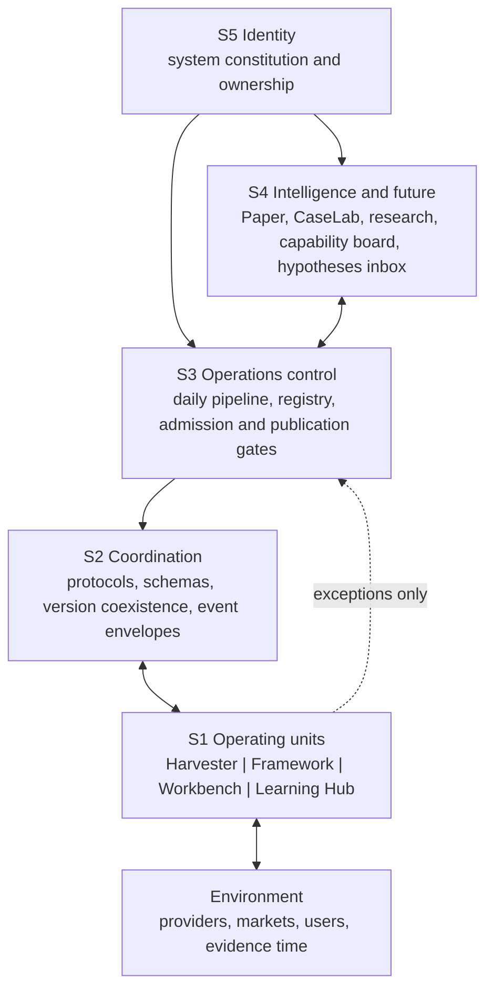

# Viable System Model — one-page health check

The May failure mode was an oversized S3: more central checks and registries
reduced S1's ability to regulate itself. The target state is distributed
regulation: each S1 unit owns its assertions and tests; S2 owns only the shared
shape; S3 admits, blocks and aggregates exception heartbeats; S4 runs reversible
probes; S5 changes rarely.

Before a governance change, answer four questions:

1. Which system is being fed: S1, S2, S3, S4 or S5?
2. Is S3 absorbing logic that belongs to an S1 owner?
3. Does normal operation stay silent while deviations remain traceable?
4. Can the affected S1 unit detect the injected failure without a global path oracle?

Do not approve an S3 addition unless it removes at least as much central logic,
or it is a true cross-module admission/publication boundary.
