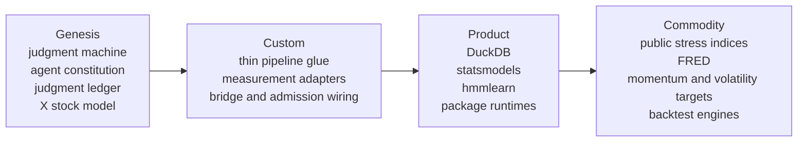

# Wardley map — build only where evolution has not already won

Evolution runs left to right. Investment runs left: concentrate design effort
on judgment, constitutional boundaries, ledgers and genuinely new state models.
Keep adapters thin. Use products as libraries. Consume commodities through
replaceable providers; never rebuild them.

The build rule is one sentence: before deciding to build X, place X on this
map; if it is in Product or Commodity, do not build it. Record the placement in
the routing decision for any non-trivial build.

Redraw quarterly. A component moving right is a deletion or replacement signal,
not a reason to defend sunk cost. Measurement is presumed to drift right unless
evidence shows that its semantics remain system-specific.
