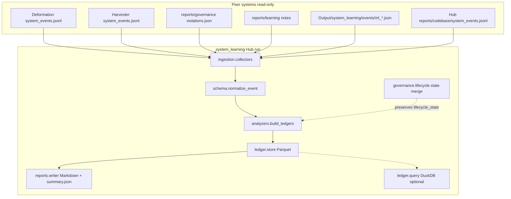
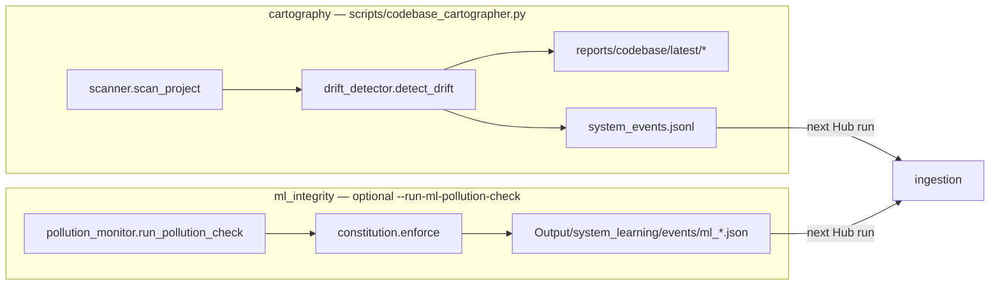

# System Learning Hub

System Learning Hub is the **sole recorder** of workspace governance memory.
It sits beside `Workbench` and `Structural Deformation Research System` as a
sibling repo; it does not import peer Python packages.

Peer modules must **not** embed learning sensors. They record observations through
the Hub runtime log API and **read** Hub-derived reports/ledgers. See
`governance/runtime_log_contract.md` in the workspace root.

The Hub collects normalized runtime records, learns recurrence patterns,
preserves manual governance decisions, and coordinates improvement proposals.
It does not fetch market data, compute proxies, write paper claims, or modify
subsystem code.

## Layout

```text
System Learning Hub/
  src/system_learning/
    ingestion/       # ingest Hub runtime log + legacy paths (migration)
  runtime/         # append-only runtime log API + Hub run orchestration
    schema.py        # typed system_event normalization
    analyzers/       # recurrence, violations, improvement queue
    ledger/          # Parquet writes and DuckDB queries
    reports/         # Markdown + summary.json from ledgers
    governance/      # improvement lifecycle; re-exports ML policy checks
    cartography/     # codebase structure sensor (standalone script)
    ml_integrity/    # ML contamination rules and pollution monitor
```

## Architecture

Two entry points share the same `system_event` contract (`schema.py`) but serve different roles:

| Entry | Command | Role |
| --- | --- | --- |
| **Hub run** | `python -m system_learning run` | Ingest runtime log → analyze → ledger → reports |
| **Record** | `python -m system_learning record` | Append one runtime log line (peer modules use this) |
| **Codebase cartographer** | `make codebase-report` | Scan repo → drift report → `system_events.jsonl` (later ingested by Hub) |

### Main Hub pipeline



`cli.main()` sequence:

```text
optional run_pollution_check  (--run-ml-pollution-check)
  → collect_events(system_root)
  → read_existing_improvement_queue(ledger_dir)
  → build_ledgers(events, existing)
  → write_ledgers(ledger_dir)
  → write_reports(report_dir)
```

### Sensors (side paths)



### Ledgers produced by analyzers

| Parquet | Built from |
| --- | --- |
| `system_event_ledger` | Normalized events (deduped) |
| `violation_ledger` | Events grouped by `issue_family` + subsystem + `event_type` |
| `improvement_queue` | Violations → proposed actions; merges prior lifecycle/owner |
| `subsystem_health` | Per-subsystem scores from event/violation severity |

## System Roles

- Workbench Data Providers learn source reliability.
- Structural Deformation Research System learns model validity.
- System Learning Hub learns cross-system reliability and governance patterns.

## Boundaries

The Hub is read-only with respect to peer systems. It may propose, prioritize, and track improvements, but it must not directly modify:

- Deformation
- Harvester
- paper or claim text
- wiki content
- config files
- manifests
- subsystem code

The Hub reads only standardized event and report files from shared locations such as:

- `Output/deformation_runs/*/system_events.jsonl`
- `Data/harvester/exports/*/system_events.jsonl`
- `**/reports/governance/*/violations.json`
- `**/reports/learning/*`
- `Output/system_learning/events/ml_*.json` (ML integrity checks)

## Standard `system_event` Schema

Each event is normalized to these fields:

- `event_id`
- `timestamp`
- `subsystem`
- `event_type`
- `severity`
- `source_tool`
- `context_type`
- `confidence`
- `boundary_type`
- `target_subsystem`
- `related_paths`
- `governance_mode`
- `run_id`
- `bundle_id`
- `payload`
- `recommended_action`
- `source_report_path`
- `requires_manual_review`

Events may include extra fields in source files; unknown fields are preserved inside `payload`.

Governance signal fields let external tools act as sensors while the Hub keeps the interpretation layer:

- `source_tool`: producer such as `pytest`, `ruff`, `pyright`, `import_linter`, `tach`, `great_expectations`, `openlineage`, or `codebase_cartographer`.
- `context_type`: `production_code`, `test_code`, `script`, `archive`, `generated_file`, `documentation`, or `unknown`.
- `confidence`: `low`, `medium`, or `high`.
- `boundary_type`: examples include `import_boundary`, `data_contract`, `schema_drift`, `runtime_failure`, `report_quality`, `architecture_drift`, `test_regression`, and `lineage_gap`.
- `governance_mode`: `observe_only`, `manual_review_required`, `proposal_required`, `auto_check_allowed`, or `blocker`.

## Ledgers

Running the Hub writes Parquet ledgers under `Data/system_learning/ledgers`:

- `system_event_ledger.parquet`
- `violation_ledger.parquet`
- `improvement_queue.parquet`
- `subsystem_health.parquet`

All improvement items require manual approval before implementation. Improvement items track this lifecycle:

`proposed -> approved -> implemented -> verified / failed`

Newly proposed items start as `proposed`. Existing lifecycle states are preserved across runs when the improvement ledger already exists.

The improvement queue is the lifecycle memory for governance work. In addition to the proposed action, it stores ownership and approval fields, verification criteria, evidence paths, impact level, governance mode, boundary type, and systemic risk tags such as `layer_collapse`, `schema_instability`, `feedback_loop_missing`, `evidence_gap`, and `manual_override_risk`.

## Technical Direction

The Hub is intentionally a rule-first governance system. It favors typed schemas, auditable ledgers, reproducible reports, and explicit human approval over opaque model decisions.

Current foundation:

- Python for ingestion, analysis, and report generation.
- Pydantic for typed `system_event` normalization.
- Pandas and PyArrow for Parquet ledger writes.
- DuckDB for querying Parquet ledgers without introducing a server database.

Planned additions should stay incremental:

- Add stricter data quality checks before accepting new event producers.
- Add a small API or UI only after the ledger lifecycle is stable.
- Use lightweight anomaly detection or embeddings only after enough historical events exist.
- Avoid deep learning for core governance decisions; explainable rules and review evidence matter more here.

## Reports

Running the Hub writes Markdown reports under `Output/system_learning/latest`:

- `system_health_report.md`
- `improvement_queue.md`
- `recurrence_report.md`
- `learning_summary.md`

## Usage

From this project directory:

```bash
PYTHONPATH=src python3 -m system_learning
```

## Codebase Cartography

Codebase cartography is a read-only Hub capability under `system_learning.cartography`. It scans Python, config, docs, and tests; counts files, lines, classes, functions, and imports; builds local dependency edges; checks architecture layer rules; detects oversized files and abnormal module growth; and emits Learning Hub events.

Run:

```bash
make codebase-report
```

Outputs:

- `reports/codebase/latest/codebase_structure_report.md`
- `reports/codebase/latest/module_metrics.csv`
- `reports/codebase/latest/dependency_edges.csv`
- `reports/codebase/latest/layer_violations.json`
- `reports/codebase/latest/complexity_hotspots.csv`
- `reports/codebase/latest/architecture_drift.md`
- `reports/codebase/latest/system_events.jsonl`
- `data/structural_lab/codebase_metrics/history.parquet` → workspace `Data/system_learning/structural_lab/codebase_metrics/history.parquet`

Or:

```bash
PYTHONPATH=src python3 run_hub.py
```

Preferred module entry point:

```bash
PYTHONPATH=src python3 -m system_learning
```

Or after installation:

```bash
system-learning-hub
```

Optional arguments:

```bash
PYTHONPATH=src python3 -m system_learning --system-root /Users/a1/Verity
PYTHONPATH=src python3 -m system_learning --ledger-dir /Users/a1/Verity/Data/system_learning/ledgers
PYTHONPATH=src python3 -m system_learning --report-dir /Users/a1/Verity/Output/system_learning/latest
PYTHONPATH=src python3 -m system_learning --run-ml-pollution-check
```

ML integrity events under `Output/system_learning/events/ml_*.json` are ingested automatically. Use `--run-ml-pollution-check` to scan `Output/state/ml_signals/` and `Output/deformation_runs/` before collection.
